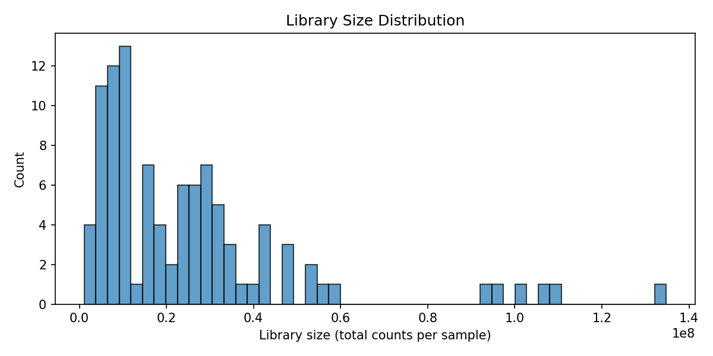
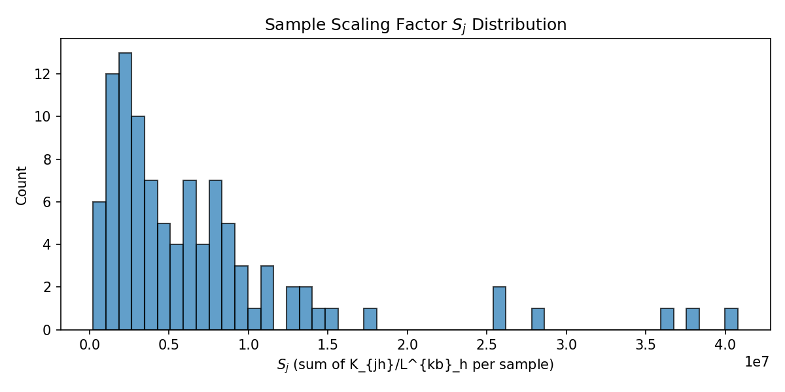
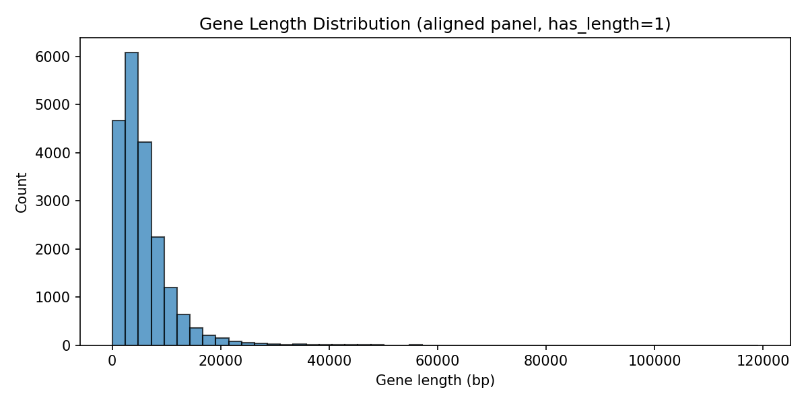
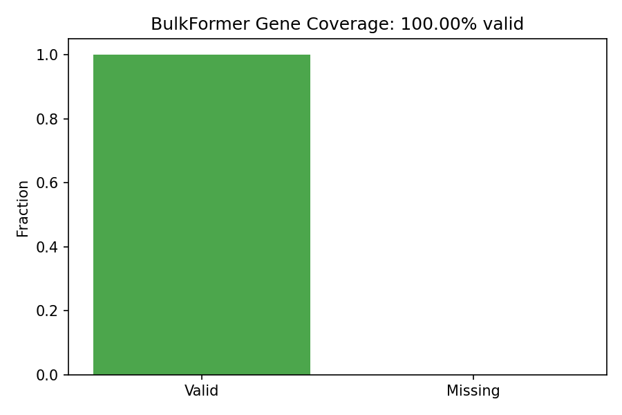

# Step Two: Preprocess Counts QC Report

This report documents the preprocessing outputs required for NB tests: aligned counts, gene lengths, sample scaling, and QC diagnostics.

## Artifacts

| Artifact | Description |
|----------|-------------|
| `aligned_counts.tsv` | Samples × BulkFormer gene panel; missing genes = 0 (flagged invalid) |
| `aligned_tpm.tsv` | TPM aligned to BulkFormer panel |
| `gene_lengths_aligned.tsv` | BulkFormer panel with length_kb and has_length |
| `sample_scaling.tsv` | S_j = Σ K_{jh}/L^{kb}_h per sample |
| `valid_gene_mask.tsv` | is_valid per gene (NB tests use is_valid==1 only) |

## QC Plots

## Sanity Check Table (5 random valid genes, first sample)

| ensg_id | counts | TPM | log1p_TPM | length_kb | S_j | expected_count_mapping |
|---------|--------|-----|-----------|-----------|-----|------------------------|
| ENSG00000186377 | 18.0 | 1.91 | 1.0676 | 2.447 | 3854606.90 | 18.00 |
| ENSG00000147041 | 52.0 | 2.80 | 1.3347 | 4.820 | 3854606.90 | 52.00 |
| ENSG00000172738 | 7.0 | 0.54 | 0.4334 | 3.348 | 3854606.90 | 7.00 |
| ENSG00000088899 | 603.0 | 29.23 | 3.4088 | 5.352 | 3854606.90 | 603.00 |
| ENSG00000146021 | 265.0 | 5.80 | 1.9169 | 11.853 | 3854606.90 | 265.00 |

The `expected_count_mapping` column shows TPM × S_j/10⁶ × L_kb, the formula for mapping predicted TPM to expected counts in NB tests.