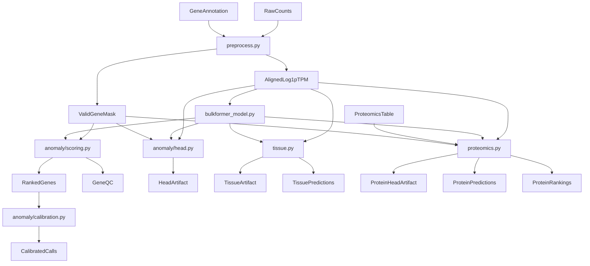

# Diagnostics Architecture

This document describes how the `bulkformer_dx` package is organized and how data moves through the
RNA anomaly, tissue, and proteomics workflows.

## Package Layout

### Entry Points

- `bulkformer_dx/cli.py`: top-level CLI entrypoint
- `bulkformer_dx/__main__.py`: enables `python -m bulkformer_dx`
- `bulkformer_dx/anomaly/cli.py`: anomaly subcommands

### Core Modules

- `bulkformer_dx/preprocess.py`
  - loads raw counts into a sample-by-gene matrix
  - normalizes Ensembl IDs by trimming version suffixes
  - derives gene lengths from an explicit length column or from `start`/`end`
  - converts counts -> TPM -> `log1p(TPM)`
  - aligns the matrix to the BulkFormer gene panel with `-10` for missing genes

- `bulkformer_dx/bulkformer_model.py`
  - resolves the checkpoint plus graph, graph weights, gene embeddings, and gene panel assets
  - normalizes checkpoint keys such as `module.*`
  - builds the `SparseTensor` graph expected by the original BulkFormer implementation
  - exposes reusable helpers for expression prediction, gene embeddings, and sample embeddings

- `bulkformer_dx/anomaly/scoring.py`
  - generates Monte Carlo masking plans over valid genes only
  - runs masked BulkFormer reconstruction
  - aggregates residual-based anomaly rankings per sample and QC summaries per gene/cohort

- `bulkformer_dx/anomaly/head.py`
  - trains the preferred `sigma_nll` uncertainty head on frozen gene embeddings
  - optionally trains the synthetic `injected_outlier` classifier
  - serializes small head checkpoints and compact training metrics

- `bulkformer_dx/anomaly/calibration.py`
  - loads ranked gene tables from anomaly scoring
  - computes empirical per-gene cohort-tail p-values
  - applies per-sample Benjamini-Yekutieli correction
  - optionally adds a TPM-derived negative-binomial approximation

- `bulkformer_dx/tissue.py`
  - extracts sample embeddings from BulkFormer
  - optionally applies PCA
  - trains or predicts with a `RandomForestClassifier`
  - saves model artifacts with the gene-selection and BulkFormer-contract metadata required for reuse

- `bulkformer_dx/proteomics.py`
  - aligns RNA and proteomics samples
  - transforms protein targets into the training space
  - fits a frozen-backbone linear or MLP protein head with masked loss
  - writes predictions, residuals, per-sample ranked proteins, and optional BY-adjusted calls

## Data Contracts

### RNA Inputs

- Raw counts can be `genes-by-samples` or `samples-by-genes`
- Gene IDs may contain Ensembl version suffixes such as `ENSG00000123456.12`
- After preprocessing, all downstream workflows expect a BulkFormer-aligned sample-by-gene matrix

### Mask Semantics

- BulkFormer uses `-10` as the mask token for missing or intentionally masked genes
- `valid_gene_mask.tsv` distinguishes genes observed in the user data from genes inserted only to
  match the pretrained BulkFormer vocabulary

### Proteomics Inputs

- First column must be `sample_id`
- Remaining columns are proteins
- Missing values are allowed and are excluded through masked loss and masked residual summaries

## End-To-End Flow

## Original BulkFormer Reuse

The diagnostics toolkit does not reimplement the backbone. It reuses:

- `utils/BulkFormer.py`
- `utils/BulkFormer_block.py`
- `utils/Rope.py`
- `model/config.py`

That keeps the diagnostics code focused on preprocessing, orchestration, residual logic, and shallow
heads rather than forking the pretrained model.

## Validation Strategy In Code

- Unit tests cover TPM math, mask semantics, CLI parsing, calibration, tissue workflows, and
  proteomics workflows
- The heaviest model smoke test stays opt-in so fresh checkouts do not require local model assets
- Real-data runtime validation was performed against the external RNA counts and Gencode v29
  annotation paths without committing those files
