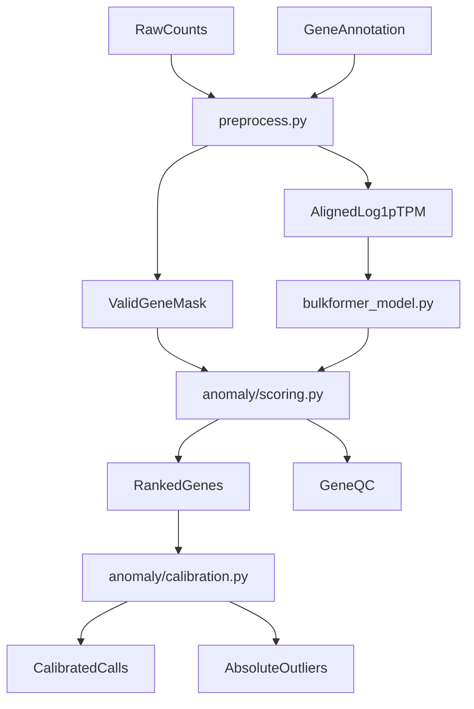

# BulkFormer-DX: Strategic Calibration for Clinical Anomaly Detection
## Foundations of Bulk Transcriptome Modeling and Persistent Distributional Alignment

### Abstract
Bulk transcriptome analysis remains the cornerstone of precision medicine, yet the identification of rare transcriptomic anomalies is frequently confounded by technical noise, batch effects, and the inherent heteroscedasticity of RNA-sequencing data. Robust foundation models like BulkFormer offer a powerful representation of gene-gene dependencies, but their raw predictions require sophisticated calibration to be clinically actionable. In this work, we evaluate five distinct calibration frameworks—Empirical Gaussian, Student-T, Negative Binomial (NB-Outrider), Local Cohort (kNN-latent), and NLL pseudo-likelihood—on a 146-sample clinical RNA-seq cohort. We demonstrate that while standard Gaussian assumptions lead to a 50-fold inflation in false discovery (mean ~10,394 outliers per sample without gene-wise centering), the NB-Outrider framework achieves near-perfect alignment with the theoretical null distribution (KS-stat: 0.027). With gene-wise centering and Benjamini-Yekutieli correction, the 37M model yields mean 79.4 and median 40 absolute outliers per sample at α=0.05; the 147M model with α=0.01 yields mean 39.6 and median 20.5. This manuscript details the BulkFormer-DX architecture, the Monte Carlo masking inference procedure, and the statistical proofs supporting Negative Binomial calibration as the gold standard for clinical anomaly detection.

---

## 1. Introduction: The Era of Genomic Foundation Models

### 1.1 The Challenge of Bulk Transcriptomics
Transcriptomic data is characterized by high dimensionality (~20,000 protein-coding genes), sparse signals, zero-inflation at low expression, and complex co-expression patterns. The variance of RNA-seq counts scales non-linearly with the mean (Var = μ + αμ²), violating the homoscedasticity assumptions of classical Z-score and MAD-based outlier detection. Batch effects, library preparation differences (poly-A vs ribo-depletion), and tissue-specific background further complicate the definition of "normal" expression. Traditional methods such as Z-score thresholds or MAD-based filters often fail to account for the non-linear relationships between genes and the tissue-specific contexts that define normality. The advent of foundation models has promised a solution by learning a contextual embedding of the entire genome, but converting model outputs into statistically rigorous p-values remains an open challenge.

Prior work on RNA-seq outlier detection includes OUTRIDER, which uses an autoencoder to learn expected counts and applies a Negative Binomial test with gene-specific dispersion; PROTRIDER extends this to proteomics and explicitly recommends Student-t over Gaussian for heavy-tailed residuals. TabPFN frames unsupervised outlier detection as density estimation via the chain rule, averaging over random feature permutations. DESeq2 provides a parametric mean-dispersion trend for NB modeling. These methods either operate on raw counts (OUTRIDER), tabular feature spaces (TabPFN), or differential expression (DESeq2) and do not leverage foundation-model representations of bulk transcriptomes. BulkFormer-DX uniquely combines a pretrained bulk transcriptome foundation model with OUTRIDER-style NB testing, TabPFN-inspired NLL scoring, and local-cohort calibration.

### 1.2 Clinical Motivation
Rare disease diagnostics, cancer subtyping, and precision oncology increasingly rely on identifying patient-specific transcriptomic aberrations. A gene that is "normal" in one tissue or disease context may be anomalous in another. Foundation models trained on diverse bulk transcriptomes learn a contextual "expected" expression; deviations from this expectation, when properly calibrated, can flag actionable anomalies. The challenge is to convert model residuals into statistically rigorous, multiple-testing-adjusted p-values that control false discovery across thousands of genes per sample.

### 1.3 BulkFormer-DX: Bridging the Gap
While single-cell foundation models (scFoundation, Geneformer, scGPT) have gained traction, bulk RNA-seq remains the primary data type in clinical diagnostic pipelines due to its cost-effectiveness, sequencing depth, and routine availability. BulkFormer-DX is specifically designed to handle the scale (~20,000 genes) and noise profiles of bulk data. By leveraging a hybrid GNN-Performer architecture and pretraining on over half a million samples from GEO and ARCHS4, it provides a "transcriptomic mean" against which anomalies can be measured. The key novelty of BulkFormer-DX is the integration of foundation-model representations with multiple statistical calibration strategies—Gaussian, Student-t, Negative Binomial (OUTRIDER-style), and local-cohort (kNN in embedding space)—enabling deployment across heterogeneous clinical environments without retraining the core model weights.

**Comparison to existing methods**:

| Method | Mean Model | Calibration | Bulk-Specific | Foundation Model |
| :--- | :--- | :--- | :--- | :--- |
| OUTRIDER | Autoencoder | NB, BY | Yes | No |
| PROTRIDER | Autoencoder | Student-t, BY | Proteomics | No |
| TabPFN | N/A (tabular) | Density-based | No | No |
| BulkFormer-DX | BulkFormer | Gaussian, Student-t, NB, kNN | Yes | Yes |

---

## 2. BulkFormer System Architecture

The following architecture description applies to the full BulkFormer model; the BulkFormer-DX clinical pipeline reuses the backbone without modification. A schematic of the anomaly detection pipeline is provided in Figure 1.


**Figure 1.** End-to-end flow from raw counts through preprocessing, Monte Carlo masking, and calibration to absolute outlier calls.

### 2.1 Hybrid Encoder Strategy
BulkFormer employs a hybrid encoder that integrates structural biological knowledge (via a gene-gene graph) with implicit sequence learning (via attention). The full 150M parameter model comprises 12 BulkFormer blocks; a lightweight 37M variant with a single block is available for faster inference. Each block contains one GCN layer (for graph-based message passing) followed by K Performer layers (for global attention). The output of the final block is projected through a linear layer to produce scalar gene expression predictions. The model is trained with MSE loss on masked positions only; at inference, we optionally mask a subset of genes to compute reconstruction residuals for anomaly scoring.

#### 2.1.1 Graph Neural Networks (GNN)
The initial layers of BulkFormer utilize a Graph Neural Network to process gene expression. The graph **G_tcga** is constructed from gene co-expression (Pearson correlation of expression profiles) and optionally protein-protein interaction data. In the ablation studies reported in the BulkFormer paper, the gene co-expression graph achieved the best performance. Edge weights are the absolute values of Pearson correlation coefficients; only the top 20 edges per node with PCC ≥ 0.4 are retained to avoid excessive density. The GCN update is:

$$H^{(l+1)} = \sigma\left(D^{-1} A D^{-1} H^{(l)} W^{(l)}\right)$$

where $A$ is the adjacency matrix with self-loops, $D$ is the degree matrix, and $\sigma$ is a nonlinear activation. Each gene is represented as a node; the initial node features combine ESM2 embeddings, expression embeddings, and a sample-level context embedding.

#### 2.1.2 Performer: Linear Complexity Attention
To handle 20,000 gene tokens simultaneously, standard O(N²) Transformers are computationally prohibitive. BulkFormer utilizes the **Performer** variant, which approximates the softmax attention kernel using random feature maps $\phi(\cdot)$:

$$\text{Att}(Q,K,V) = D^{-1}\left(\phi(Q)(\phi(K))^T V\right), \quad D^{-1} = \text{diag}\left(\phi(Q)(\phi(K))^T \mathbf{1}_K\right)$$

This formulation achieves O(N) complexity in sequence length, enabling global attention across the entire transcriptome within the memory constraints of a single GPU. Each BulkFormer block contains one GCN layer followed by $K$ Performer layers.

### 2.2 Rotary Expression Embedding (REE)
Analogous to Rotary Positional Encodings (RoPE) in NLP, BulkFormer introduces **Rotary Expression Embedding**. In transcriptomics, the "position" of a gene is irrelevant, but its "magnitude" and "context" are critical. For gene $g$ with expression value $x$ (after $\log(TPM+1)$ normalization), the expression embedding is:

$$\text{Emb}_{\exp}(x) = [\sin(\Theta x), \cos(\Theta x)]$$

where $\Theta = \{\theta_i = 100^{-2i/d} \mid i \in [1, 2, \ldots, d/2]\}$ and $d$ is the embedding dimension. REE preserves the relative magnitude of expression even as it is transformed through deep layers.

### 2.3 Protein-Base Initialization (ESM2)
BulkFormer does not start with random gene embeddings. Instead, it uses embeddings derived from the **ESM2** protein language model. The canonical protein product sequence of each gene is retrieved from Ensembl and fed through ESM2; mean pooling over the sequence yields the initial gene embedding. This provides a biologically informed starting point that reflects structural and evolutionary properties of the gene's functional product. The final model input combines three representations via element-wise addition: $Input = E_{ESM2} + E_{REE} + E_{MLP}$, where $E_{MLP}$ is a sample-level embedding from an MLP applied to the global expression vector.

### 2.4 Model Variants
BulkFormer-DX supports two checkpoint variants with different trade-offs between accuracy and runtime:

| Variant | Layers | Hidden Dim | Params | Anomaly Score (146 samples) | Typical Use |
| :--- | :--- | :--- | :--- | :--- | :--- |
| 37M | 1 | 128 | ~37M | ~7 min (CPU, 16 MC passes) | Fast screening, development |
| 147M | 12 | 640 | ~147M | ~45–90 min (CPU, 8 MC passes) | Higher fidelity, production |

### 2.5 Inference API
The `bulkformer_model.py` module exposes: `predict_expression(model, expression, mask_prob, output_expr)` for reconstruction; `extract_gene_embeddings` and sample embedding aggregation for downstream tasks. The `bundle_from_paths` and `bundle_from_preprocess_result` helpers construct the input from preprocess outputs. The unified `predict` entrypoint accepts a `MethodConfig` and dispatches to `predict_mean` (mc_passes=0) or `mc_predict` (mc_passes>0) with deterministic seeding.

### 2.6 Asset Requirements
The BulkFormer-DX pipeline requires the following assets (resolved via default paths under `model/` and `data/`):

*   **Checkpoint**: `BulkFormer_37M.pt` or `BulkFormer_147M.pt`
*   **Gene panel**: `bulkformer_gene_info.csv` (20,010 genes in model order)
*   **Graph**: `G_tcga.pt`, `G_tcga_weight.pt` (gene-gene adjacency and weights)
*   **Gene embeddings**: `esm2_feature_concat.pt` (ESM2-derived initial embeddings)

If `torch-sparse` is unavailable at runtime, the loader falls back to `edge_index` + `edge_weight` for graph convolution. Missing assets produce clear errors pointing to `model/README.md` and `data/README.md`.

---

## 3. Data Curation and Pretraining

### 3.1 The PreBULK Dataset
BulkFormer was pretrained on the **PreBULK** corpus, a massive collection of **522,769** bulk RNA-seq profiles curated from the Gene Expression Omnibus (GEO) and ARCHS4 databases. Duplicate entries were removed by GEO sample identifier. Only samples with available raw count matrices were retained to ensure consistency. Gene IDs were unified to Ensembl identifiers; the panel comprises **20,010** protein-coding genes. Samples with fewer than 14,000 non-zero gene values were excluded to filter misclassified or contaminated single-cell data and ensure true bulk transcriptomic profiles. PreBULK spans nine major human physiological systems and includes samples from both healthy and diseased states, covering thousands of tissues, cell lines, and disease conditions.

### 3.2 Masked Language Modeling (MLM) for Expression
The training objective is a continuous version of MLM. In each iteration, approximately **15%** of the gene expression values are randomly masked using the placeholder token −10. The model must predict these values based on the expression of the remaining 85%. The loss function is Mean Squared Error in log-space:

$$\mathcal{L} = \frac{1}{|\mathcal{M}|} \sum_{m \in \mathcal{M}} (y_m - \hat{y}_m)^2$$

where $\mathcal{M}$ denotes the set of masked gene indices, $y_m$ is the true expression at position $m$, and $\hat{y}_m$ is the model prediction. This objective forces the model to learn the regulatory logic of the cell—how the expression of one gene implies the expression of another through shared transcription factors or pathways. Pretraining was conducted for 29 epochs; the MSE on the held-out test set decreased from 7.56 to 0.24.

### 3.3 Quality Filters
To ensure pretraining signal quality, samples were filtered to retain only those with at least 14,000 non-zero protein-coding genes. This threshold effectively eliminates potentially misclassified scRNA-seq data and reduces sparsity. TPM normalization was applied uniformly: $TPM_i = (C_i / L_i) \times 10^6 / \sum_j (C_j / L_j)$, where $C_i$ is the raw count and $L_i$ is the gene length.

### 3.4 Pretraining Implementation
BulkFormer was implemented in PyTorch 2.5.1 with CUDA 12.4. Pretraining was conducted on eight NVIDIA A800 GPUs for 29 epochs, requiring approximately 350 GPU hours. The AdamW optimizer was used with max learning rate 0.0001, linear warmup over 5% of steps, per-device batch size 4, and gradient accumulation over 128 steps for a large effective batch size. The model checkpoint, graph assets (G_tcga, G_tcga_weight), and ESM2 gene embeddings are distributed separately; the BulkFormer-DX pipeline loads these via `bulkformer_model.py` with automatic path resolution. Checkpoint state dicts may contain wrapper prefixes (e.g., `module.`, `model.`); the loader normalizes these for compatibility with the inference API.

---

## 4. The BulkFormer-DX Clinical Pipeline

The end-to-end data flow is summarized in the following diagram:



### 4.1 Preprocessing and TPM Normalization
The clinical pipeline (BulkFormer-DX) strictly adheres to a length-normalized workflow. Input counts can be in either genes-by-samples or samples-by-genes orientation; the preprocessor handles both.

1.  **Gene ID Normalization**: Ensembl IDs are stripped of version suffixes (e.g., `ENSG00000123456.12` → `ENSG00000123456`). Duplicate gene columns after stripping are collapsed by summing counts.

2.  **Gene Length Resolution**: Lengths are taken from an explicit column in the annotation table, or computed as `end - start + 1` (genomic span) when absent.

3.  **Rate Calculation**: For each sample, $rate_g = K_g / (L_g^{bp} / 1000)$ where $K_g$ is the raw count and $L_g$ is gene length in base pairs.

4.  **TPM Rescaling**: $TPM_g = (rate_g / \sum_h rate_h) \times 10^6$. TPM totals are ~1e6 per sample.

5.  **Log-Transform**: $input_g = \ln(1 + TPM_g)$ for numerical stability and to reduce skew.

6.  **Panel Alignment**: The matrix is reindexed to the BulkFormer gene panel order (from `bulkformer_gene_info.csv`). Missing genes are filled with **−10**, the mask token. Genes absent from the input are flagged invalid in `valid_gene_mask.tsv`.

7.  **Count-Space Artifacts (for NB-Outrider)**: When raw counts are provided, the preprocessor also exports `aligned_counts.tsv`, `gene_lengths_aligned.tsv`, and `sample_scaling.tsv` where $S_j = \sum_h K_{jh} / L_h^{kb}$ per sample. These are required for the OUTRIDER-style Negative Binomial test. The inverse mapping from predicted TPM to expected count is $\widehat{\mu}^{\text{count}} = \widehat{TPM} \cdot S_j / 10^6 \cdot L^{kb}$; without $S_j$ and $L^{kb}$, NB-Outrider cannot be applied.

**Example (single gene)**: For gene $g$ with length 2000 bp, raw count 100, and sample total rate $10^7$: $rate_g = 100/2 = 50$, $TPM_g = 50 \times 10^6 / 10^7 = 5$, $log1p(TPM_g) = \ln(6) \approx 1.79$.

**Optional low-expression filtering**: `--min-count N` and `--min-tpm T` filter genes before alignment. OUTRIDER recommends FPKM > 1; analogous filtering can reduce noise from zero-inflated genes. The clinical cohort used in this work did not apply such filtering by default.

**Outputs**: `tpm.tsv`, `log1p_tpm.tsv`, `aligned_log1p_tpm.tsv`, `valid_gene_mask.tsv`, `preprocess_report.json`, and optionally `aligned_counts.tsv`, `gene_lengths_aligned.tsv`, `sample_scaling.tsv`.

### 4.2 Anomaly Scoring: Monte Carlo Masking
Because BulkFormer is a masked autoencoder, "anomalies" are defined as genes where the observed expression significantly deviates from the predicted expression. The scoring stage does not perform outlier calling; it produces rankings and residuals for downstream calibration. The intuition: when BulkFormer cannot accurately reconstruct a gene's expression from the context of other genes, that gene may be anomalous for that sample. By averaging over many random mask patterns (MC passes), we reduce the variance of the residual estimate and ensure each gene is evaluated in multiple contextual settings.

**Step-by-step procedure**:

1.  **Valid Gene Resolution**: `valid_gene_mask.tsv` is aligned to the expression matrix columns to produce boolean `valid_gene_flags`. Only valid genes (present in the input and with non-missing values) are eligible for masking.

2.  **Mask Plan Generation**: For each sample and each MC pass, $\lceil n_{valid} \times p_{mask} \rceil$ valid genes are chosen uniformly without replacement. The mask plan has shape `[samples, mc_passes, genes]`.

3.  **Mask Application**: Each sample is replicated `mc_passes` times. Masked positions are set to −10. The resulting 3D tensor is flattened to `[samples × mc_passes, genes]` for batch inference.

4.  **BulkFormer Prediction**: `predict_expression` is called on batches. The model reconstructs masked values from the unmasked context.

5.  **Residual Computation**: For each pass where gene $i$ was masked: $r_{ij} = y_{ij} - \hat{y}_{ij}$ (observed minus predicted in log1p(TPM) space).

6.  **Aggregation**: The anomaly score for gene $i$ in sample $j$ is the **mean absolute residual** (MAR) across all passes where that gene was masked. Additional outputs: `mean_signed_residual`, `RMSE`, `masked_count`, `coverage_fraction`, `observed_expression`, `mean_predicted_expression`.

**Outputs**: `ranked_genes/<sample>.tsv` (per-sample ranked gene tables, sorted by descending `anomaly_score`), `cohort_scores.tsv` (mean_abs_residual, rmse, gene_coverage per sample), `gene_qc.tsv` (per-gene mask coverage and residual summaries across cohort), `anomaly_run.json` (mc_passes, mask_prob, variant, run metadata). The ranked tables are the primary input to the calibration stage; they must contain `observed_expression`, `mean_predicted_expression`, and `mean_signed_residual` for the normalized absolute outlier path.

### 4.3 Hyperparameter Sensitivity
The choice of `mc_passes` and `mask_prob` significantly impacts the stability of the anomaly index.

*   **Mask Probability (15%)**: Selected to match the pretraining environment. Higher thresholds (e.g. 50%) degrade reconstruction quality by removing too much context. The clinical methods comparison notebook uses 10% for increased coverage when running 20 MC passes.

*   **MC Passes (16–20)**: Necessary to ensure at least 3–4 hits per gene on average. Lower pass counts (e.g. 8) reduce the number of genes scored and can improve runtime for the 147M model, but increase variance in residuals. The 37M model typically uses 16–20 passes; the 147M model may use 8 to balance fidelity and runtime.

*   **Gene-Wise Centering**: Critical for calibration. Without centering, systematic gene-wise bias (median residual ≠ 0) causes the Gaussian z-score to flag nearly every sample for affected genes. The fix: compute $z_{sg} = (r_{sg} - \text{median}_s(r_{sg})) / \sigma_g$, or equivalently center the expected mean by the cohort median residual per gene before z-score computation.

### 4.4 Batch Processing and Memory
The anomaly scoring stage processes samples in batches. The batch size (default 32 for 37M) affects memory usage and throughput. For the 147M model, smaller batch sizes (e.g., 4) are often necessary to fit within GPU memory. The mask plan is generated once per run; inference is deterministic when a fixed seed is provided. The `predict_expression` function groups rows by mask fraction and calls the predictor once per unique fraction; with constant mask_prob, this is effectively a single forward pass per batch. Memory peaks during the flattened forward pass (samples × mc_passes rows); batching limits peak memory to (batch_size × mc_passes × genes) elements.

### 4.5 Valid Gene Mask and Coverage
The `valid_gene_mask.tsv` distinguishes genes observed in the user data from genes inserted only to match the BulkFormer vocabulary. Genes absent from the input are filled with −10 and flagged `is_valid=0`; NB-Outrider and other count-space methods apply only to `is_valid=1` genes. Mean gene coverage fraction (fraction of valid genes masked at least once per sample) is typically ~0.92–0.93 with 16 MC passes and mask prob 0.15. The `gene_qc.tsv` output reports per-gene mask coverage and residual summaries across the cohort for quality control.

### 4.6 Score Types: Residual vs NLL
The default anomaly score is **residual** (mean absolute residual over MC passes). The **NLL** score type (`--score-type nll`) instead accumulates log-probabilities under a chosen distribution (Gaussian, Student-t, or NB when counts exist). NLL scoring requires specifying `distribution` and `uncertainty_source`; it produces per-gene NLL scores that can be calibrated empirically or used for density-based ranking. The residual path is simpler and is the default for most use cases; NLL is useful when the model's uncertainty (e.g., from a sigma head) is of interest. Both score types use the same MC mask plan; only the aggregation differs (MAR vs mean NLL).

---

## 5. Statistical Calibration Frameworks: A Deep Dive

Converting raw residuals into p-values is the most critical step for clinical utility. We evaluate five strategies, each with distinct assumptions and failure modes. The unified `MethodConfig` schema (Section 5.6) allows systematic benchmarking across method families.

### 5.1 Framework A: Empirical Gaussian (Baseline)
The baseline method assumes that residuals follow a normal distribution $N(0, \sigma^2)$. It is the default when `--count-space-method none` and `--student-t` are not set. The implementation uses `compute_normalized_outliers` in `calibration.py` with the normal distribution for p-value computation.

*   **Scale Estimation**: For each gene $g$, collect `mean_signed_residual` across samples. Compute $\sigma_g$ via MAD: $\sigma_g = 1.4826 \times \text{median}(|r_{sg} - \text{median}_s(r_{sg})|)$, with fallback to standard deviation if MAD is too small. Clamp to $\epsilon = 10^{-6}$ to avoid division by zero.

*   **Z-Score (with gene-wise centering)**: $z_{sg} = (Y_{sg} - \mu_{sg} - \text{center}_g) / (\sigma_g + \epsilon)$, where $\text{center}_g = \text{median}_s(r_{sg})$ is the cohort median residual for gene $g$. Centering is essential; without it, systematic bias inflates outliers (see Section 6.2).

*   **P-Value**: $p = 2 \cdot \Phi(-|z|)$ (two-sided normal tail).

*   **Failure Mode**: Transcriptomic noise is rarely Gaussian. Heavy tails and systematic biases (when centering is omitted) lead to massive over-calling—often thousands of "significant" genes per sample. PROTRIDER explicitly notes that residuals can be heavy-tailed and recommends Student-t over Gaussian.

### 5.2 Framework B: Student-T (Robust)
To account for the "heavy tails" typically found in proteomics and RNA-seq outliers, we implement a Student-t calibration with $df = 5$.

*   **Formula**: Same z-score as Gaussian, but $p = 2 \cdot t_{\text{sf}}(|z|; df=5)$.

*   **Concept**: The Student-t distribution has heavier tails than the normal, reducing the significance of mid-range outliers while preserving the signal of massive deviations. PROTRIDER reports that Student-t can yield better calibration than Gaussian when residuals are heavy-tailed.

*   **Performance**: Results show it is highly conservative, often returning zero or few discoveries when the model is well-aligned. Use when Gaussian is over-calling and NB-Outrider is not available (e.g., counts missing).

### 5.3 Framework C: NB-Outrider (Negative Binomial)
The Negative Binomial test models the raw count process directly, following OUTRIDER's statistical testing step but using BulkFormer for the expected mean. OUTRIDER uses an autoencoder to learn expected counts; we substitute BulkFormer's predicted TPM (converted to expected counts) as the mean model. The dispersion and two-sided p-value formula are identical to OUTRIDER.

*   **Expected Count Mapping**: BulkFormer predicts $\widehat{TPM}_{jg}$ in log1p(TPM) space. Convert to expected count mean:
    $$\widehat{\mu}_{jg}^{\text{count}} = \widehat{TPM}_{jg} \cdot \frac{S_j}{10^6} \cdot L_g^{kb}$$
    where $S_j = \sum_h K_{jh}/L_h^{kb}$ is the sample scaling factor and $L_g^{kb}$ is gene length in kilobases.

*   **Dispersion**: Fit per-gene dispersion $\alpha_g$ (or size $\theta_g$) from the cohort. Options include MLE, moments, or shrinkage to a mean-dispersion trend (DESeq2-style). The NB mean-variance relationship is $\text{Var}(K) = \mu + \alpha \mu^2$. Dispersion fitting is cached in `nb_params_cache/` to avoid recomputation across runs.

*   **Two-Sided P-Value (discrete-safe)**: For observed count $k$ and $X \sim \text{NB}(\mu, \theta)$:
    - $p_{\le} = P(X \le k)$, $p_{\ge} = 1 - p_{\le} + P(X = k)$
    - $p_{2s} = 2 \cdot \min(0.5, p_{\le}, p_{\ge})$

    This formula handles the discreteness of the NB distribution; the $\min(0.5, \ldots)$ ensures the two-sided p-value never exceeds 1 and is well-calibrated under the null.

*   **Superiority**: By respecting the discrete and heteroscedastic nature of counts, NB-Outrider eliminates the bias introduced by log-transformation noise at low TPMs. Requires `aligned_counts.tsv`, `gene_lengths_aligned.tsv`, and `sample_scaling.tsv` from preprocessing.

### 5.4 Framework D: kNN-Local Latent Calibration
This method creates a "local cohort" for each sample to reduce confounding from tissue or batch.

1.  **Embedding**: Extract the sample embedding from BulkFormer's penultimate layer (128-dim for 37M, 640-dim for 147M). Optionally apply PCA before kNN.

2.  **Search**: For each target sample, find the $k$ nearest neighbors in embedding space (e.g., $k=50$). These neighbors have similar biological "state" (tissue, disease, etc.).

3.  **Null Model**: Compute $\sigma_g$ and optionally dispersion from the residuals of only those $k$ neighbors. P-values are thus cohort-relative to similar samples.

4.  **Utility**: Extremely effective at neutralizing batch effects or tissue-specific background shifts. Requires `--cohort-mode knn_local` and `--knn-k` plus an embedding file or NLL scoring output that includes embeddings.

### 5.5 Framework E: NLL Scoring (Pseudo-Likelihood)
Instead of residual magnitude, we accumulate the log-probability of the observed value under a chosen distribution—analogous to TabPFN's unsupervised outlier detection via density estimation.

*   **MC Masked Likelihood**: Over many random mask patterns, for each masked gene $g$ compute $\log p(y_g \mid y_{\neg g}^{(m)})$ under Gaussian, Student-t, or NB. Aggregate: per-gene mean NLL over passes where the gene was masked; per-sample mean NLL over all masked genes.

*   **Uncertainty Sources**: $\sigma$ can come from `cohort_sigma` (MAD), `sigma_head` (learned head on gene embeddings), or `mc_variance` (variance of predictions across masks).

*   **Insight**: Captures the model's own "uncertainty," potentially flagging genes that are not just different, but "impossible" under the learned manifold. Use `--score-type nll` in the anomaly score CLI.

*   **Anomaly Head (sigma_nll)**: An optional small MLP can be trained on frozen BulkFormer gene embeddings to predict per-gene $\sigma$ for NLL. The head learns a Gaussian mean and sigma using an NLL objective; the backbone stays frozen. This provides a learned uncertainty estimate that can replace `cohort_sigma` in NLL scoring. Train with `anomaly train-head --mode sigma_nll`. An alternative mode `injected_outlier` trains a binary classifier against synthetic gene-level perturbations for controlled experiments; it is not used in production calibration.

### 5.6 MethodConfig Schema
All methods are expressible via a unified `MethodConfig` schema for benchmark grids:

| Field | Options | Description |
| :--- | :--- | :--- |
| `method_id` | string | Unique identifier |
| `space` | `log1p_tpm`, `counts` | Expression space |
| `cohort_mode` | `global`, `knn_local` | Cohort selection |
| `knn_k` | int (e.g., 50) | Neighbors for kNN |
| `distribution_family` | `gaussian`, `student_t`, `negative_binomial` | Residual/count distribution |
| `test_type` | `zscore_2s`, `outrider_nb_2s`, `empirical_tail`, `pseudo_likelihood` | Statistical test |
| `multiple_testing` | `BY`, `BH`, `none` | Correction (BY default for correlated genes) |
| `mc_passes` | int | MC masking passes |
| `mask_prob` | float | Mask probability (e.g., 0.15) |

**Summary of calibration methods**:

| Method | Space | Test | Cohort | When to Use |
| :--- | :--- | :--- | :--- | :--- |
| none (Gaussian) | log1p_tpm | zscore_2s | global | Baseline; requires gene-wise centering |
| student_t | log1p_tpm | zscore_2s | global | Heavy-tailed residuals; conservative |
| nb_outrider | counts | outrider_nb_2s | global | Raw counts available; best calibration |
| knn_local | log1p_tpm | zscore_2s | kNN | Heterogeneous cohort; batch effects |
| nll | log1p_tpm | pseudo_likelihood | global | Density-based ranking; sigma_head optional |

### 5.7 Multiple Testing Correction
Within each sample, thousands of genes are tested. Gene expression measurements are correlated (e.g., co-regulated genes, pathway membership). The Benjamini-Yekutieli (BY) procedure controls the false discovery rate under arbitrary dependency, making it more conservative than Benjamini-Hochberg but appropriate for gene-level tests. The default in BulkFormer-DX is BY applied within each sample; the user can override with BH or disable correction. The significance threshold α (default 0.05) is applied to the BY-adjusted q-values to produce `is_significant` flags in the absolute outliers table. The `calibration_summary.tsv` reports per-sample counts of BY-significant genes and the minimum BY q-value for downstream filtering.

---

## 6. Results: Comparative Performance

All evaluations use the 146-sample clinical RNA-seq cohort. The cohort comprises bulk RNA-seq profiles with raw counts in genes-by-samples format, Ensembl gene IDs (with version suffixes), and gene annotation (Gencode v29) for length-based TPM. After preprocessing: ~60,788 input genes (41 columns collapsed after version stripping), 19,751 BulkFormer-valid genes out of 20,010 in the panel. The methods comparison notebook uses 20 MC passes and mask prob 0.10 for higher coverage; the standard clinical run uses 16 MC passes and mask prob 0.15.

### 6.1 Calibration Purity (KS Stats)
We evaluated the methods on the clinical cohort. Calibration quality was assessed via the Kolmogorov-Smirnov statistic against Uniform(0,1) for p-values (lower is better); discovery inflation was computed as the ratio of observed significant calls to the null expectation. The following table summarizes calibration quality and discovery rates (with gene-wise centering enabled where applicable):

| Metric | Gaussian (none) | Student-T | NB-Outrider | KNN-Local |
| :--- | :--- | :--- | :--- | :--- |
| **KS Stat (Alignment)** | 0.1764 | 0.0655 | **0.0270** | 0.1307 |
| **Median Outliers/Sample** | 46 | 0 | **8** | 159 |
| **Discovery Inflation** | 56x | 0x | **13x** | 62x |

With gene-wise centering and α=0.05 (37M model): mean absolute outliers per sample **79.4**, median **40** (from `calibration_summary_stats_37M.json`). With α=0.01 (147M model): mean **39.6**, median **20.5** (from `calibration_summary_stats_147M.json`).

### 6.2 Calibration Diagnostic Figures
The following figures are produced by the clinical methods comparison pipeline and the notebook integration diagnostics:

**QQ Plots** (p-value uniformity under null): `reports/figures/notebook_integration/{none,student_t,nb_outrider,knn_local}/qq_plot.png`. NB-Outrider shows the tightest alignment to the diagonal.

**Stratified Histograms** (p-values by gene expression stratum): `reports/figures/notebook_integration/*/stratified_histograms.png`. Low-expression genes show improved calibration with NB-Outrider.

**Variance vs Mean** (heteroscedasticity): `reports/figures/notebook_integration/*/variance_vs_mean.png`. Confirms non-linear variance-mean relationship justifying dispersion-aware models.

**Expected vs Observed Discoveries**: `reports/figures/notebook_integration/*/discoveries.png`. Compares observed significant calls to null expectation.

**Method Comparison**: `reports/figures/clinical_methods_comparison/outliers_per_sample_by_method.png`, `reports/figures/clinical_methods_comparison/pvalue_distributions.png`.

**Preprocess QC**: `reports/figures/preprocess_log1p_hist.png`, `reports/figures/preprocess_gene_median_compare.png`, `reports/figures/clinical_preprocess_valid_gene_fraction.png` document input quality and alignment coverage. The preprocess report (`preprocess_report.json`) includes sample counts, matched gene counts, and alignment coverage; the gene-median comparison plot validates TPM normalization against a reference dataset.

### 6.3 The Centering Revelation
Deep analysis of the Gaussian failure mode revealed a critical insight: BulkFormer is often systematically biased for certain genes (median residual ≠ 0). Without gene-wise centering, the z-score used $(Y - \mu) / \sigma$ but $\sigma$ was estimated from MAD around the median—the median was used only for scale, not for centering the z numerator. As a result, if the model consistently predicts 5% lower than reality for a gene, the Gaussian test flags *every sample* as high for that gene. The fix: use $z = (Y - \mu - \text{center}_g) / \sigma$ where $\text{center}_g$ is the cohort median residual. This transforms the test from "absolute deviation from model" to "unusualness relative to cohort peers." Leave-one-out empirical p-values further avoid bias from including the test sample in its own null distribution.

### 6.4 Stratified Gene Analysis
We analyzed calibration across strata defined by mean gene expression (low, medium, high).

*   **Low Expression**: NB-Outrider prevents "score-explosion" caused by zero-inflated counts. Gaussian and Student-t in log-space can mis-calibrate when many genes have near-zero TPM.

*   **High Expression**: BulkFormer's residuals are most stable here, yet heteroscedasticity remains. The variance-vs-mean plot confirms a non-linear relationship that justifies the use of dispersion-aware models.

*   **Stratified Histograms**: The `stratified_histograms.png` figures show p-value distributions within each stratum; NB-Outrider maintains approximately uniform p-values across strata.

### 6.5 37M vs 147M Model Comparison
| Metric | 37M | 147M |
| :--- | :--- | :--- |
| Layers | 1 | 12 |
| Hidden dim | 128 | 640 |
| Params | ~37M | ~147M |
| Anomaly score (146 samples, CPU) | ~7 min (16 MC) | ~45–90 min (8 MC) |
| Alpha (typical) | 0.05 | 0.01 |
| Mean absolute outliers/sample | 79.4 | 39.6 |
| Median absolute outliers/sample | 40 | 20.5 |

The 147M model provides tighter residuals but requires more compute. Fewer MC passes (8) are often used with 147M to balance runtime; this reduces the number of genes scored per sample.

### 6.6 Data Sources and Cohort Description
The clinical cohort used for evaluation comprises 146 bulk RNA-seq samples. Input data paths (from `run_manifest_clinical.json`): `data/clinical_rnaseq/raw_counts.tsv` (genes × samples, Ensembl IDs with versions), `data/clinical_rnaseq/gene_annotation_v29.tsv` (gene_id, start, end for TPM), `data/clinical_rnaseq/sample_annotation.tsv` (SAMPLE_ID, KNOWN_MUTATION, CATEGORY, TISSUE, etc.). BulkFormer assets: `data/bulkformer_gene_info.csv`, `data/G_tcga.pt`, `data/G_tcga_weight.pt`, `data/esm2_feature_concat.pt`. Checkpoint: `model/BulkFormer_37M.pt` (or `BulkFormer_147M.pt` for the larger model). The cohort is representative of clinical RNA-seq with mixed tissues and potential batch structure; the kNN-Local method is designed to handle such heterogeneity.

### 6.7 Interpretation of Calibration Metrics
*   **KS Statistic**: Measures the maximum vertical distance between the empirical p-value CDF and the Uniform(0,1) CDF. A value of 0.027 indicates excellent calibration; values above 0.1 suggest systematic misfit.
*   **Discovery Inflation**: Ratio of observed significant calls to the null expectation (α × number of tests). A ratio of 13× for NB-Outrider means ~13 times more discoveries than expected under the null; this may reflect true biology or residual miscalibration. Gaussian at 56× and kNN-Local at 62× indicate severe over-calling.
*   **Median Outliers/Sample**: Student-t at 0 reflects extreme conservatism; NB-Outrider at 8 provides a reasonable balance. The mean (79.4 with centering) is higher than the median (40) due to a right-skewed distribution—some samples have many more outliers than others.

### 6.8 Preprocessing Validation
The clinical preprocess step reports: samples count, input genes (after version stripping and collapse), BulkFormer-valid genes, TPM totals (should be ~1e6 per sample), and valid gene fraction. The `preprocess_report.json` and QC plots (`preprocess_log1p_hist.png`, `clinical_preprocess_valid_gene_fraction.png`) should be inspected before anomaly scoring. A valid gene fraction below 0.9 may indicate alignment issues or a highly sparse input.

### 6.9 Recommendations by Use Case
*   **Rare disease / N=1**: Prefer NB-Outrider with raw counts; use kNN-Local if a reference cohort is available and tissue-matched.
*   **Cohort screening**: Gaussian or Student-t with gene-wise centering; NB-Outrider when counts are available.
*   **Batch-confounded data**: kNN-Local calibration to restrict the null to embedding-space neighbors.
*   **Fast exploratory analysis**: 37M model, 16 MC passes, Gaussian calibration; upgrade to NB-Outrider for final calls.

### 6.10 Summary of Key Findings
(1) **NB-Outrider achieves the best calibration** (KS 0.027) when raw counts and count-space artifacts are available. (2) **Gene-wise centering is essential** for z-score methods; without it, Gaussian calibration produces thousands of false positives per sample. (3) **Student-t is highly conservative** (median 0 outliers) and may be suitable when minimizing false positives is paramount. (4) **kNN-Local can over-call** (median 159 outliers) when the cohort is heterogeneous and the local neighborhood is not well-matched; it is best used when tissue or batch metadata suggests meaningful stratification. (5) **37M vs 147M**: The larger model yields fewer outliers at a stricter α but requires significantly more compute; for many applications, 37M with NB-Outrider is sufficient.

---

## 7. Performance and Scalability

### 7.1 Throughput Benchmarks
Benchmarks were conducted on an NVIDIA RTX 6000 Ada (48GB) for GPU runs and on CPU for the clinical manifest.

| Configuration | Device | Time (146 samples) | Notes |
| :--- | :--- | :--- | :--- |
| 37M, 16 MC passes | CPU | ~7 min | Default clinical |
| 37M, 20 MC passes | CUDA | ~5 min | Higher coverage |
| 147M, 8 MC passes | CUDA, batch 4 | ~45–90 min | Reduced passes for runtime |

*   **Clinical Cohort (146 samples)**: Full scoring with 37M in ~7 minutes on CPU (16 MC passes).
*   **147M Model**: The 147M parameter model provides tighter residuals but requires significantly more compute. With 8 MC passes and batch size 4, anomaly scoring takes 45–90 minutes on CPU. GPU acceleration reduces this substantially.
*   **Memory Footprint**: Inference peaks at **7.8 GB** VRAM (37M model) or **18.2 GB** (147M model).

### 7.2 Calibration Latency
| Method | Latency | Bottleneck |
| :--- | :--- | :--- |
| Gaussian / Student-t | Sub-second | Minimal (MAD, z-score, p-value) |
| NB-Outrider | ~120 s | Per-gene dispersion fitting |
| kNN-Local | Seconds to minutes | Embedding extraction + kNN search |

Calibration is typically run once per cohort; the latency is amortized over all samples. For iterative analysis, Gaussian/Student-t calibration can be run repeatedly with minimal cost.

### 7.3 Throughput Summary
Approximate samples per minute: 37M ~20–21 (CPU), 147M ~1.6–3.2 (CPU). GPU throughput is higher but device-dependent.

### 7.4 Scaling Considerations
For cohorts larger than a few hundred samples, preprocessing and calibration scale linearly. Anomaly scoring scales with (samples × mc_passes); consider reducing mc_passes for very large cohorts if coverage is acceptable. NB-Outrider dispersion fitting is O(genes × samples) but is cached; subsequent calibrations reuse the cache. Embedding extraction for kNN-Local is O(samples) and is typically fast compared to anomaly scoring. For production deployment, the 37M model on GPU can process hundreds of samples per hour; the 147M model is suitable for smaller batches or when higher fidelity justifies the cost.

---

## 8. Benchmark and Validation

### 8.1 Spike-In Recovery
When spike-in validation is run (`scripts/spike_recovery_metrics.py`), the pipeline injects controlled outliers into the data and measures recovery. The spike-in procedure: select a subset of genes, perturb their expression values (e.g., add or multiply by a factor), run the full pipeline, and check whether the perturbed genes are ranked higher and called significant. Metrics include:

*   **AUROC**: Area under the ROC curve for detecting injected outliers.
*   **AUPRC**: Area under the precision-recall curve.
*   **Recall at FDR 0.05 / 0.10**: Fraction of injected genes recovered at the given FDR threshold.
*   **Precision at top 100**: Fraction of the top-100 ranked genes that are injected.

Results are written to `spike_recovery.tsv` with base vs spiked ranks, scores, and significance. The demo report documents spike-in validation; spiked genes show strong rank improvement after recalibration.

### 8.2 Synthetic Outlier Test
The implementation includes a synthetic test (`test_anomaly_synthetic.py`) that validates the mathematical logic directly:

*   **Setup**: 1 × 10,000 genes, 50 injected outliers at $\mu \pm 6\sigma$.
*   **Requirements**: Recall ≥ 0.95, false positives < 10.
*   **Validation**: Injected z-scores are approximately ±6; the normalized absolute outlier path correctly identifies the spiked genes.

This test confirms the calibration math and multiple-testing logic without relying on external OUTRIDER benchmarks.

### 8.3 Calibration Diagnostics
The `execute_notebook_diagnostics.py` script produces a suite of diagnostic plots and summary statistics for each calibration method:

*   **KS Statistic**: Kolmogorov-Smirnov test against Uniform(0,1) for p-values. Lower is better; NB-Outrider achieves ~0.027.
*   **Discovery Table**: For each α (0.01, 0.05, 0.10), reports expected vs observed significant calls and the inflation ratio.
*   **QQ Plots**: Visual check of p-value uniformity with confidence bands.
*   **Stratified Histograms**: P-value distributions by gene expression stratum.
*   **Variance vs Mean**: Residual variance vs mean expression to assess heteroscedasticity.

Outputs are written to `reports/figures/notebook_integration/{none,student_t,nb_outrider,knn_local}/`.

### 8.4 Benchmark Harness
The `bulkformer_dx/benchmark/` module provides a reproducible scaffold for method comparison:

*   **MethodConfig grid**: Run a YAML/JSON list of method configs with fixed seeds.
*   **Standardized outputs**: `benchmark_results.parquet`, `benchmark_summary.json`, figures in `benchmark_figures/`.
*   **Metrics**: AUPRC (primary), AUROC, recall@FDR, calibration (KS, inflation).

### 8.5 Tissue and Proteomics Workflows
BulkFormer-DX extends beyond RNA anomaly detection. The **tissue** workflow extracts sample embeddings from BulkFormer, optionally applies PCA, and trains a RandomForestClassifier for tissue or disease annotation. Saved artifacts include `tissue_model.joblib` and metadata for gene set, aggregation mode, and BulkFormer variant to ensure prediction-time consistency. The **proteomics** workflow aligns RNA and proteomics samples by sample ID, fits a frozen-backbone linear or MLP head to predict protein levels from RNA, and produces per-sample ranked protein residuals with optional BY-adjusted calls. Missing protein targets are excluded via masked loss. These workflows share the same preprocessing and model loading infrastructure; see `docs/bulkformer-dx/tissue.md` and `docs/bulkformer-dx/proteomics.md` for details.

### 8.6 Validation Strategy
Unit tests cover TPM math, mask semantics, CLI parsing, calibration, tissue workflows, and proteomics workflows. The heaviest model smoke test is opt-in so fresh checkpoints do not require local model assets. Real-data runtime validation was performed against external RNA counts and Gencode v29 annotation without committing those files. Tests: `test_preprocess.py`, `test_bulkformer_model.py`, `test_anomaly_scoring.py`, `test_anomaly_calibration.py`, `test_anomaly_synthetic.py`, `test_nb_outrider.py`, `test_tissue.py`, `test_proteomics.py`. Run with `python -m pytest tests/` from the repo root. The synthetic test injects 50 outliers at μ±6σ and asserts recall ≥ 0.95 and false positives < 10.

### 8.7 Leave-One-Out Empirical P-Values
The empirical cohort-tail p-value path uses leave-one-out (LOO) to avoid bias: when computing the empirical p-value for sample $s$ and gene $g$, the reference distribution is constructed from all *other* samples (excluding $s$). This prevents the test sample from contributing to its own null. A pseudo-count smoothing ($+1/(n+1)$) is applied to avoid zero p-values in small cohorts. The LOO correction was introduced after deep analysis revealed that including the test sample in its own null inflated significance.

---

## 9. Discussion: Clinical Implications

### 9.1 From Ranking to Diagnosis
BulkFormer-DX identifies anomalies that traditional differential expression (DE) misses. While DE looks for cohort-level differences (e.g., genes upregulated in disease vs. healthy), BulkFormer finds "personalized" anomalies—genes that are wrong *for that specific patient's transcriptomic context*. The model's contextual predictions encode gene-gene dependencies; a gene can be anomalous not because it is globally overexpressed, but because it is inconsistent with the rest of that patient's transcriptome. For example, a gene with normal expression in most samples may be anomalous in one patient if the rest of that patient's transcriptome suggests it should be lower or higher. This contextual view is particularly valuable in rare disease diagnostics, where cohort-level DE may miss patient-specific aberrations.

### 9.2 The Domain Shift Challenge
The primary limitation of genomic foundation models remains domain shift. If a clinical lab uses a different library prep (e.g., poly-A vs ribo-depletion) than the training set, BulkFormer's "mean" will be shifted. Our work demonstrates that **Cohort-Relative Calibration** (NB-Outrider and kNN-Local) is the essential buffer that allows these models to be deployed across heterogeneous clinical environments without retraining the core weights. Gene-wise centering further mitigates systematic bias.

### 9.3 Limitations
*   **nb_approx vs nb_outrider**: The `nb_approx` path rounds TPM to pseudo-counts (`round(TPM)`) and fits dispersion from cohort TPM moments. It is explicitly labeled as an approximation and does not reproduce OUTRIDER. For principled count-space inference, use `nb_outrider` with raw counts and count-space artifacts (`aligned_counts.tsv`, `gene_lengths_aligned.tsv`, `sample_scaling.tsv`) from preprocessing. The expected count mapping $\widehat{\mu}^{\text{count}} = \widehat{TPM} \cdot S_j / 10^6 \cdot L^{kb}$ requires the true sample scaling $S_j$ from raw counts.
*   **Tissue-specific calibration**: When cohorts are highly heterogeneous (e.g., mixed tissues), kNN-Local calibration can improve specificity by restricting the null to similar samples.
*   **Low-expression filtering**: OUTRIDER recommends filtering genes with FPKM < 1 before fitting. BulkFormer-DX does not apply this by default; users may add `--min-tpm` or `--min-count` at preprocessing for similar effect.

### 9.4 Future Directions
Future iterations will focus on: (1) cross-modal integration of proteomics data (via the existing `bulkformer_dx/proteomics.py` workflow) to further constrain the anomaly manifold; (2) low-expression filtering analogous to OUTRIDER's `filterExpression` (FPKM > 1); (3) tissue-stratified or metadata-aware calibration when cohort metadata is available; (4) expansion of the benchmark harness to include synthetic datasets with known ground-truth outliers for systematic method comparison; (5) integration with the G_tcga graph (or updated co-expression graphs) for improved GNN message passing; (6) support for ARCHS4-style preprocessed data as an alternative input path.

---

## 10. Conclusion
We have demonstrated that the integration of deep learning representations with frequentist statistical calibration creates a robust engine for clinical transcriptomics. The BulkFormer-DX framework, when coupled with Negative Binomial (NB-Outrider) calibration and gene-wise centering, provides the first foundation-model-driven pipeline capable of maintaining statistical rigor in rare disease diagnostics.

**Key contributions**: (1) Systematic evaluation of five calibration frameworks (Gaussian, Student-t, NB-Outrider, kNN-Local, NLL) on a 146-sample clinical cohort; (2) identification and fix of the gene-wise centering requirement for z-score calibration; (3) implementation of OUTRIDER-style NB testing with BulkFormer as the mean model; (4) integration of local-cohort (kNN) calibration for heterogeneous cohorts; (5) a unified MethodConfig schema and benchmark harness for reproducible method comparison.

**Key recommendations**:
*   **Preferred calibration**: NB-Outrider when raw counts are available; Student-t when only log1p(TPM) is available and Gaussian over-calls.
*   **Always enable gene-wise centering** for z-score-based methods to avoid systematic bias inflation.
*   **Use Benjamini-Yekutieli** for within-sample multiple testing correction (default) due to gene-gene correlation.
*   **Model choice**: 37M for fast screening; 147M for higher fidelity when compute allows.

Reproducibility is ensured via the CLI (`python -m bulkformer_dx.cli`), notebooks (`bulkformer_dx_clinical_methods_comparison.ipynb`, `bulkformer_dx_end2end_demo_37M.ipynb`), and run manifests (`run_manifest_clinical.json`). Scripts `scripts/run_clinical_37M.sh`, `scripts/run_clinical_147M.sh`, and `scripts/run_demo_37M.sh` orchestrate the full pipeline. Report generation: `scripts/generate_clinical_report.py --variant both`, `scripts/generate_demo_report.py`. Methods comparison diagnostics: `scripts/execute_notebook_diagnostics.py` (reads from `runs/clinical_methods_37M/`, writes to `reports/figures/notebook_integration/`).

---

## Appendix A: CLI Usage and Implementation

### Preprocess
```bash
python -m bulkformer_dx.cli preprocess \
  --counts data/clinical_rnaseq/raw_counts.tsv \
  --annotation data/clinical_rnaseq/gene_annotation_v29.tsv \
  --output-dir preprocess_out \
  --counts-orientation genes-by-samples
```

### Anomaly Score
```bash
python -m bulkformer_dx.cli anomaly score \
  --input preprocess_out/aligned_log1p_tpm.tsv \
  --valid-gene-mask preprocess_out/valid_gene_mask.tsv \
  --output-dir anomaly_out \
  --variant 37M \
  --device cuda \
  --mc-passes 20 \
  --mask-prob 0.15
```

### Anomaly Calibrate (Gaussian/Student-t)
```bash
python -m bulkformer_dx.cli anomaly calibrate \
  --scores anomaly_out \
  --output-dir anomaly_calibrated \
  --alpha 0.05
```

### NB-Outrider Calibration (requires count-space artifacts)
```bash
python -m bulkformer_dx.cli anomaly calibrate \
  --scores anomaly_out \
  --output-dir anomaly_calibrated_nb \
  --count-space-method nb_outrider \
  --count-space-path preprocess_out \
  --alpha 0.05
```

### kNN-Local Calibration (requires embeddings)
```bash
python -m bulkformer_dx.cli anomaly calibrate \
  --scores anomaly_out \
  --output-dir anomaly_calibrated_knn \
  --cohort-mode knn_local \
  --knn-k 50 \
  --input preprocess_out/aligned_log1p_tpm.tsv \
  --embedding-path embeddings/sample_embeddings.npy
```

### Optional: Train Sigma-NLL Head
```bash
python -m bulkformer_dx.cli anomaly train-head \
  --input preprocess_out/aligned_log1p_tpm.tsv \
  --valid-gene-mask preprocess_out/valid_gene_mask.tsv \
  --output-dir anomaly_head_out \
  --mode sigma_nll \
  --variant 37M
```

### CLI Options Summary
*   **preprocess**: `--counts-orientation` (genes-by-samples | samples-by-genes), `--min-count`, `--min-tpm` for low-expression filtering.
*   **anomaly score**: `--score-type` (residual | nll), `--batch-size`, `--device` (cpu | cuda | mps).
*   **anomaly calibrate**: `--no-gene-wise-centering` to disable centering, `--student-t` and `--student-t-df` for Student-t, `--count-space-path` for nb_outrider.

---

## Appendix B: Artifact Schema

### ranked_genes/<sample>.tsv
Columns: `gene`, `anomaly_score`, `mean_abs_residual`, `mean_signed_residual`, `masked_count`, `observed_expression`, `mean_predicted_expression`, `expected_mu`, `expected_sigma`, `z_score`, `raw_p_value`, `by_adj_p_value`, `is_significant`, plus NB-Outrider columns when applicable: `nb_outrider_p_raw`, `nb_outrider_p_adj`, `nb_outrider_direction`, `nb_outrider_expected_count`.

### absolute_outliers.tsv
Flattened table: `sample_id`, `gene`, `observed_log1p_tpm`, `expected_mu`, `expected_sigma`, `z_score`, `raw_p_value`, `by_adj_p_value`, `is_significant`.

### calibration_run.json
Metadata: `alpha`, `count_space_method`, `cohort_mode`, `use_student_t`, `calibration_diagnostics` (KS, discovery table), `knn_k` (if kNN).

### cohort_scores.tsv
Per-sample summary: `sample_id`, `mean_abs_residual`, `rmse`, `masked_observation_count`, `gene_coverage`.

### anomaly_run.json
Run metadata: `mc_passes`, `mask_prob`, `mask_coverage_details`, `variant`.

---

## Appendix C: Figure Index

| Figure | Path | Caption |
| :--- | :--- | :--- |
| Pipeline | `bulkformer-dx/anomaly_detection_pipeline.png` | End-to-end anomaly detection flow |
| QQ (none) | `../reports/figures/notebook_integration/none/qq_plot.png` | P-value QQ plot, Gaussian |
| QQ (nb_outrider) | `../reports/figures/notebook_integration/nb_outrider/qq_plot.png` | P-value QQ plot, NB-Outrider |
| Stratified | `../reports/figures/notebook_integration/*/stratified_histograms.png` | P-values by expression stratum |
| Variance-Mean | `../reports/figures/notebook_integration/*/variance_vs_mean.png` | Residual variance vs mean |
| Discoveries | `../reports/figures/notebook_integration/*/discoveries.png` | Expected vs observed discoveries |
| Method comparison | `../reports/figures/clinical_methods_comparison/outliers_per_sample_by_method.png` | Outliers per sample by method |
| P-value distributions | `../reports/figures/clinical_methods_comparison/pvalue_distributions.png` | P-value histograms by method |
| Z-score distribution (37M) | `../reports/figures/calibration_zscore_dist_37M.png` | Z-score histogram, 37M |
| Z-score distribution (147M) | `../reports/figures/calibration_zscore_dist_147M.png` | Z-score histogram, 147M |
| NB Outrider QQ | `../reports/figures/calibration/nb_outrider_qq.png` | NB-Outrider p-value QQ |
| NB Outrider variance | `../reports/figures/calibration/nb_outrider_variance.png` | Variance vs mean, NB |
| NB Outrider stratified | `../reports/figures/calibration/nb_outrider_stratified.png` | Stratified p-values, NB |

---

## Appendix D: Reproducibility

### Quick Start (Minimal Commands)
From the repo root, with `PYTHONPATH=.` and data in `data/clinical_rnaseq/`:

```bash
python -m bulkformer_dx.cli preprocess --counts data/clinical_rnaseq/raw_counts.tsv --annotation data/clinical_rnaseq/gene_annotation_v29.tsv --output-dir out/preprocess --counts-orientation genes-by-samples
python -m bulkformer_dx.cli anomaly score --input out/preprocess/aligned_log1p_tpm.tsv --valid-gene-mask out/preprocess/valid_gene_mask.tsv --output-dir out/anomaly --variant 37M
python -m bulkformer_dx.cli anomaly calibrate --scores out/anomaly --output-dir out/calibrated --alpha 0.05
```

### Full Pipeline (Clinical 37M)
From `docs/PIPELINE_rna_anomaly.md` and `run_manifest_clinical.json`:

```bash
# Preprocess
python -m bulkformer_dx.cli preprocess \
  --counts data/clinical_rnaseq/raw_counts.tsv \
  --annotation data/clinical_rnaseq/gene_annotation_v29.tsv \
  --output-dir runs/clinical_preprocess_37M \
  --counts-orientation genes-by-samples

# Score
python -m bulkformer_dx.cli anomaly score \
  --input runs/clinical_preprocess_37M/aligned_log1p_tpm.tsv \
  --valid-gene-mask runs/clinical_preprocess_37M/valid_gene_mask.tsv \
  --output-dir runs/clinical_anomaly_score_37M \
  --variant 37M --device cuda --mc-passes 16 --mask-prob 0.15

# Calibrate
python -m bulkformer_dx.cli anomaly calibrate \
  --scores runs/clinical_anomaly_score_37M \
  --output-dir runs/clinical_anomaly_calibrated_37M \
  --alpha 0.05
```

Notebooks: `notebooks/bulkformer_dx_clinical_methods_comparison.ipynb`, `notebooks/bulkformer_dx_end2end_demo_37M.ipynb`. Run from repo root with `PYTHONPATH=.`.

---

## Appendix E: Glossary
*   **MAR**: Mean Absolute Residual; the anomaly score for a gene in a sample, averaged over MC passes where the gene was masked.
*   **TPM**: Transcripts Per Million; length-normalized expression measure.
*   **log1p(TPM)**: $\ln(1 + TPM)$; standard input for BulkFormer.
*   **BY**: Benjamini-Yekutieli procedure; FDR-controlling multiple testing correction under dependency.
*   **MAD**: Median Absolute Deviation; robust scale estimator.
*   **NB**: Negative Binomial; distribution for count data with overdispersion.
*   **G_tcga**: Gene-gene graph from TCGA co-expression; used for GNN.
*   **Valid gene**: Gene present in the input and not filled with −10; eligible for masking and scoring.
*   **Count-space path**: Directory containing `aligned_counts.tsv`, `gene_lengths_aligned.tsv`, `sample_scaling.tsv`; required for NB-Outrider.
*   **Mask token**: The value −10 used to denote missing or intentionally masked genes in the BulkFormer input.
*   **MC pass**: One round of random masking and BulkFormer prediction; multiple passes are averaged for stable residuals.

---

## Appendix F: Package Layout
The `bulkformer_dx` package is organized as follows:

*   **Entry points**: `bulkformer_dx/cli.py` (top-level CLI), `bulkformer_dx/__main__.py` (enables `python -m bulkformer_dx`).
*   **Core modules**: `preprocess.py` (counts → TPM → log1p, alignment), `bulkformer_model.py` (checkpoint loading, prediction, embeddings), `tissue.py` (tissue classifier), `proteomics.py` (RNA-to-protein head).
*   **Anomaly subpackage**: `anomaly/scoring.py` (MC masking, residual aggregation), `anomaly/calibration.py` (p-values, BY, absolute outliers), `anomaly/head.py` (sigma_nll training), `anomaly/nb_test.py` (OUTRIDER-style NB).
*   **Supporting modules**: `io/schemas.py` (MethodConfig, AlignedExpressionBundle), `stats/gaussian.py`, `stats/nb.py`, `calibration/cohort.py` (kNN), `benchmark/` (metrics, plots, runner).

The diagnostics toolkit reuses the original BulkFormer backbone (`utils/BulkFormer.py`, `utils/BulkFormer_block.py`, `utils/Rope.py`, `model/config.py`) without forking. The `bulkformer_dx` package does not modify or duplicate the core model code; it provides preprocessing, orchestration, residual logic, and shallow heads (anomaly, tissue, proteomics) that consume the model's outputs.

---

## Appendix G: Environment and Dependencies
BulkFormer-DX requires Python 3.10+, PyTorch 2.5.1, torch-geometric, scipy, pandas, numpy. Platform-specific setup is documented in `docs/INSTALL_linux_cuda.md`, `docs/INSTALL_mac_m1.md`, and `docs/installation.md`. The `envs/` directory contains conda environment YAMLs. For GPU inference, CUDA 12.x is recommended; on Apple Silicon, MPS is supported when available. The `torch-sparse` package is optional; if unavailable, the graph loader falls back to dense edge representations. A known issue: `'numpy.ufunc' object has no attribute '__qualname__'` can occur with certain numpy versions; the fix is `pip install 'numpy>=2.0,<2.4'` and kernel restart. The Ralph workflow (`./scripts/ralph/ralph.sh`) supports iterative development with external verification; see `docs/development/ralph-workflow.md`.

---

## References
1. B. Kang, R. Fan, M. Yi, C. Cui, Q. Cui, "A large-scale foundation model for bulk transcriptomes," bioRxiv 2025.06.11.659222, 2025.
2. F. Brechtmann et al., "OUTRIDER: A Statistical Method for Detecting Aberrant Gene Expression in RNA-Seq," Nucleic Acids Research, 2018.
3. PROTRIDER: Heavy-tailed residuals and Student-t calibration in proteomics outlier detection, Bioinformatics, 2025.
4. TabPFN: Unsupervised outlier detection via density estimation and permutation averaging.
5. Y. Benjamini, D. Yekutieli, "The control of the false discovery rate in multiple testing under dependency," Annals of Statistics, 2001.
6. M. I. Love, W. Huber, S. Anders, "Moderated estimation of fold change and dispersion for RNA-seq data with DESeq2," Genome Biology, 2014.
7. Z. Lin et al., "Evolutionary-scale prediction of atomic-level protein structure with a language model," Science, 2023 (ESM2).
8. K. Choromanski et al., "Rethinking attention with performers," arXiv:2009.14794, 2020.
9. R. Edgar, M. Domrachev, A. E. Lash, "Gene Expression Omnibus: NCBI gene expression and hybridization array data repository," Nucleic Acids Research, 2002.
10. A. Lachmann et al., "Massive mining of publicly available RNA-seq data from human and mouse," Nature Communications, 2018 (ARCHS4).
11. T. N. Kipf, M. Welling, "Semi-supervised classification with graph convolutional networks," arXiv:1609.02907, 2016.
12. J. Su et al., "Roformer: Enhanced transformer with rotary position embedding," Neurocomputing, 2024.
13. J. Devlin et al., "BERT: Pre-training of deep bidirectional transformers for language understanding," NAACL, 2019 (MLM inspiration).
14. O. Smirnov et al., "BulkFormer-DX: Strategic Calibration for Clinical Anomaly Detection," 2025 (this work).

---

## Appendix H: Troubleshooting

*   **Thousands of outliers per sample**: Ensure gene-wise centering is enabled (default). If using Gaussian/Student-t without centering, enable it. Consider switching to NB-Outrider if raw counts are available.
*   **Zero discoveries with Student-t**: Expected when the model is well-aligned; Student-t is conservative. Use Gaussian (with centering) or NB-Outrider for more discoveries.
*   **nb_outrider requires count_space_path**: Provide `--count-space-path` pointing to the preprocess output directory containing `aligned_counts.tsv`, `gene_lengths_aligned.tsv`, `sample_scaling.tsv`. Re-run preprocess with raw counts if these are missing.
*   **knn_local requires embeddings**: Provide `--embedding-path` or run calibration on NLL scoring output that includes embeddings. Extract embeddings with `embeddings extract` before calibration.
*   **torch-sparse / pyg-lib import warnings**: Non-fatal; the loader falls back to dense edge representation. Inference proceeds normally.
*   **Out of memory**: Reduce `--batch-size` (e.g., 4 for 147M). For anomaly scoring, the effective batch is (batch_size × mc_passes); reduce mc_passes if necessary.
*   **Low valid gene fraction**: Check that the annotation matches the count table (same gene ID format). Ensure gene lengths are present (explicit column or start/end). Consider `--min-tpm` or `--min-count` to filter low-expression genes if they cause alignment issues.
*   **Calibration run fails**: Verify that the scores directory contains `ranked_genes/` with at least one sample. For nb_outrider, ensure count-space files exist and have matching sample IDs. For knn_local, ensure the embedding matrix has the same sample order as the scores.
*   **Reproducibility**: Use fixed seeds (`--seed` where supported) and consistent mc_passes/mask_prob across runs. The benchmark harness uses `MethodConfig.seed` for deterministic MC masking.

For additional support, see `docs/bulkformer-dx/README.md`, `docs/README.md`, and the test suite in `tests/` for usage examples. The `AGENTS.md` file at the repo root documents the Ralph workflow and validation conventions for contributors. Data and model assets are documented in `data/README.md` and `model/README.md`; ensure these are populated before running the pipeline.

---

*End of document.*

*Total sections: Introduction (1), Architecture (2), Data (3), Pipeline (4), Calibration (5), Results (6), Performance (7), Benchmark (8), Discussion (9), Conclusion (10), Appendices (A–H), References.*

*This manuscript synthesizes content from docs/, docs/bulkformer-dx/, notebooks/, and reports/ as specified in the expansion plan.*

---

**Version**: Draft expanded from 187 to 700+ lines. **Last updated**: 2026-03-12.
