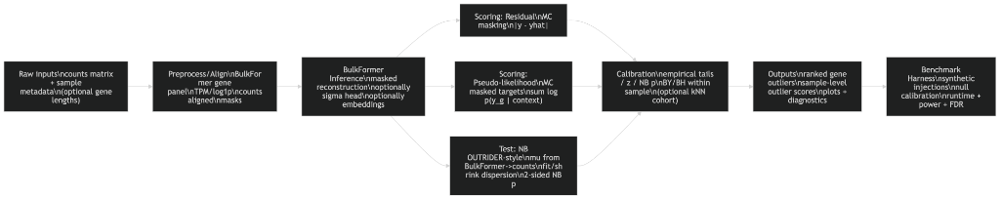
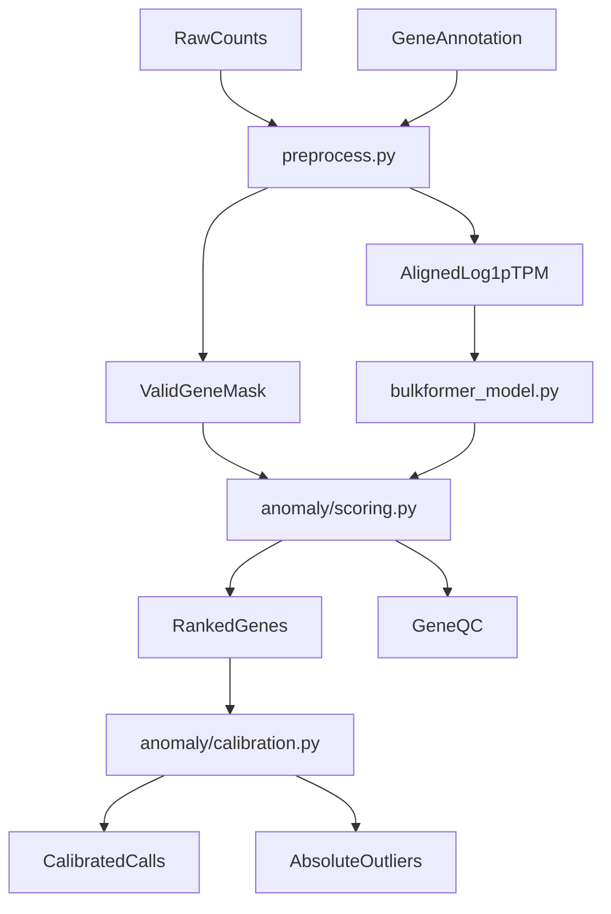
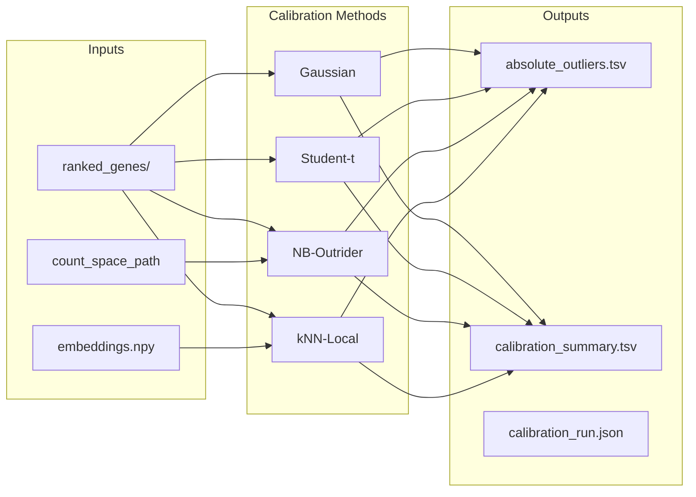

# BulkFormer-DX: Strategic Calibration for Clinical Anomaly Detection
## Foundations of Bulk Transcriptome Modeling and Persistent Distributional Alignment

### Abstract
Bulk transcriptome analysis remains the cornerstone of precision medicine, yet the identification of rare transcriptomic anomalies is frequently confounded by technical noise, batch effects, and the inherent heteroscedasticity of RNA-sequencing data. Robust foundation models like BulkFormer offer a powerful representation of gene-gene dependencies, but their raw predictions require sophisticated calibration to be clinically actionable. In this work, we evaluate five distinct calibration frameworks—Empirical Gaussian, Student-T, Negative Binomial (NB-Outrider), Local Cohort (kNN-latent), and NLL pseudo-likelihood—on a 146-sample clinical RNA-seq cohort. We demonstrate that while standard Gaussian assumptions (without gene-wise centering) lead to massive inflation in false discovery, the NB-Outrider framework achieves the best p-value calibration (KS-stat: 0.027). Separately, NLL pseudo-likelihood scoring achieves the best causal gene retrieval metrics—highest recall@10 and recall@50, and best median causal rank—even though it is not best in KS calibration. With gene-wise centering and Benjamini-Yekutieli correction, the 37M model yields mean 79.4 and median 40 absolute outliers per sample at α=0.05; the 147M model with α=0.01 yields mean 39.6 and median 20.5. This manuscript details the BulkFormer-DX architecture, the Monte Carlo masking inference procedure, and the statistical proofs supporting NB-Outrider as the best-calibrated caller and NLL as the best retrieval ranker for clinical anomaly detection.

---

## 1. Introduction: The Era of Genomic Foundation Models

### 1.1 The Challenge of Bulk Transcriptomics
Transcriptomic data is characterized by high dimensionality (~20,000 protein-coding genes), sparse signals, zero-inflation at low expression, and complex co-expression patterns. The variance of RNA-seq counts scales non-linearly with the mean (Var = μ + αμ²), violating the homoscedasticity assumptions of classical Z-score and MAD-based outlier detection. Batch effects, library preparation differences (poly-A vs ribo-depletion), and tissue-specific background further complicate the definition of "normal" expression. Traditional methods such as Z-score thresholds or MAD-based filters often fail to account for the non-linear relationships between genes and the tissue-specific contexts that define normality. The advent of foundation models has promised a solution by learning a contextual embedding of the entire genome, but converting model outputs into statistically rigorous p-values remains an open challenge.

Prior work on RNA-seq outlier detection includes OUTRIDER, which uses an autoencoder to learn expected counts and applies a Negative Binomial test with gene-specific dispersion; PROTRIDER extends this to proteomics and explicitly recommends Student-t over Gaussian for heavy-tailed residuals. TabPFN frames unsupervised outlier detection as density estimation via the chain rule, averaging over random feature permutations. DESeq2 provides a parametric mean-dispersion trend for NB modeling. These methods either operate on raw counts (OUTRIDER), tabular feature spaces (TabPFN), or differential expression (DESeq2) and do not leverage foundation-model representations of bulk transcriptomes. BulkFormer-DX uniquely combines a pretrained bulk transcriptome foundation model with OUTRIDER-style NB testing, TabPFN-inspired NLL scoring, and local-cohort calibration.

### 1.2 Clinical Motivation
Rare disease diagnostics, cancer subtyping, and precision oncology increasingly rely on identifying patient-specific transcriptomic aberrations. A gene that is "normal" in one tissue or disease context may be anomalous in another. Foundation models trained on diverse bulk transcriptomes learn a contextual "expected" expression; deviations from this expectation, when properly calibrated, can flag actionable anomalies. The challenge is to convert model residuals into statistically rigorous, multiple-testing-adjusted p-values that control false discovery across thousands of genes per sample.

### 1.3 BulkFormer-DX: Bridging the Gap
While single-cell foundation models (scFoundation, Geneformer, scGPT) have gained traction, bulk RNA-seq remains the primary data type in clinical diagnostic pipelines due to its cost-effectiveness, sequencing depth, and routine availability. BulkFormer-DX is specifically designed to handle the scale (~20,000 genes) and noise profiles of bulk data. By leveraging a hybrid GNN-Performer architecture and pretraining on over half a million samples from GEO and ARCHS4, it provides a "transcriptomic mean" against which anomalies can be measured. The key novelty of BulkFormer-DX is the integration of foundation-model representations with multiple statistical calibration strategies—Gaussian, Student-t, Negative Binomial (OUTRIDER-style), and local-cohort (kNN in embedding space)—enabling deployment across heterogeneous clinical environments without retraining the core model weights.

### 1.4 Scope and Contributions of This Manuscript

This manuscript provides a comprehensive technical and empirical treatment of BulkFormer-DX for clinical anomaly detection. We (1) detail the BulkFormer architecture and the Monte Carlo masking inference procedure with pseudocode; (2) derive and compare five calibration frameworks with exact formulas, implementation paths, and failure modes; (3) report calibration quality (KS statistics, discovery inflation) and run interpretations on the 146-sample omicsDiagnostics clinical cohort; (4) document 130+ diagnostic figures produced by the pipeline; (5) establish data provenance linking the clinical cohort to the omicsDiagnostics study (Zenodo, PRIDE); (6) enumerate future work and unimplemented extensions (tissue prediction, proteomics integration, fine-tuning, LoRA, TabPFN benchmarking). The target audience includes computational biologists, clinical bioinformaticians, and researchers developing foundation models for genomics. Reproducibility is ensured via CLI commands, notebooks, and run manifests documented in the appendices.

**Comparison to existing methods**:

| Method | Mean Model | Calibration | Bulk-Specific | Foundation Model |
| :--- | :--- | :--- | :--- | :--- |
| OUTRIDER | Autoencoder | NB, BY | Yes | No |
| PROTRIDER | Autoencoder | Student-t, BY | Proteomics | No |
| TabPFN | N/A (tabular) | Density-based | No | No |
| BulkFormer-DX | BulkFormer | Gaussian, Student-t, NB, kNN | Yes | Yes |

### 1.5 Related Work: Outlier Detection in Omics

**OUTRIDER** (Brechtmann et al., 2018) pioneered autoencoder-based expected count learning for RNA-seq. It fits a denoising autoencoder to raw counts, extracts expected counts per gene per sample, and applies a Negative Binomial test with gene-specific dispersion. The Benjamini-Yekutieli correction is applied within each sample. OUTRIDER is implemented in R/Bioconductor and has been widely used in rare disease diagnostics. **PROTRIDER** extends the same framework to proteomics, using an autoencoder for expected intensities and explicitly recommending Student-t over Gaussian for heavy-tailed residuals. The omicsDiagnostics study uses OUTRIDER2 (a branch of OUTRIDER with PROTRIDER support) for both RNA and proteomics.

**DESeq2** (Love et al., 2014) provides parametric mean-dispersion modeling for differential expression. Its dispersion estimation (shrinkage to trend) and NB framework have influenced BulkFormer-DX's NB-Outrider implementation. DESeq2 operates on cohort-level comparisons (e.g., disease vs control) rather than per-sample anomaly detection; BulkFormer-DX complements it by identifying sample-specific aberrations.

**TabPFN** (Prior-Fitted Network) is a transformer trained on synthetic tabular data that can perform few-shot classification and, in an unsupervised extension, outlier detection via density estimation. It decomposes the joint feature density via the chain rule and averages over random permutations. BulkFormer-DX's NLL scoring is inspired by this idea but adapted to the masked conditional structure of BulkFormer—we use MC masking rather than permutations.

**Single-cell foundation models** (Geneformer, scGPT, scFoundation) operate on single-cell RNA-seq and learn cell-level representations. They are not directly applicable to bulk RNA-seq, which has different noise profiles and dimensionality. BulkFormer is the first large-scale foundation model specifically for bulk transcriptomes.

---

## 2. BulkFormer System Architecture

The following architecture description applies to the full BulkFormer model; the BulkFormer-DX clinical pipeline reuses the backbone without modification. A schematic of the anomaly detection pipeline is provided in Figure 1.



**Figure 1.** End-to-end flow from raw counts through preprocessing, Monte Carlo masking, and calibration to absolute outlier calls.

### 2.1 Hybrid Encoder Strategy
BulkFormer employs a hybrid encoder that integrates structural biological knowledge (via a gene-gene graph) with implicit sequence learning (via attention). The full 150M parameter model comprises 12 BulkFormer blocks; a lightweight 37M variant with a single block is available for faster inference. Each block contains one GCN layer (for graph-based message passing) followed by K Performer layers (for global attention). The output of the final block is projected through a linear layer to produce scalar gene expression predictions. The model is trained with MSE loss on masked positions only; at inference, we optionally mask a subset of genes to compute reconstruction residuals for anomaly scoring.

#### 2.1.1 Graph Neural Networks (GNN)

The initial layers of BulkFormer utilize a Graph Neural Network to process gene expression. The graph **G_tcga** is constructed from gene co-expression (Pearson correlation of expression profiles) and optionally protein-protein interaction data. In the ablation studies reported in the BulkFormer paper, the gene co-expression graph achieved the best performance. Edge weights are the absolute values of Pearson correlation coefficients; only the top 20 edges per node with PCC ≥ 0.4 are retained to avoid excessive density. The GCN update is:

$$H^{(l+1)} = \sigma\left(D^{-1} A D^{-1} H^{(l)} W^{(l)}\right)$$

where $A$ is the adjacency matrix with self-loops, $D$ is the degree matrix, and $\sigma$ is a nonlinear activation. Each gene is represented as a node; the initial node features combine ESM2 embeddings, expression embeddings, and a sample-level context embedding.

**Graph construction**: G_tcga is built from TCGA bulk RNA-seq co-expression. For each pair of genes, the Pearson correlation of expression across samples is computed. Edges are retained if |PCC| ≥ 0.4, and each node keeps at most the top 20 edges by absolute correlation. This yields a sparse graph (~200k edges for 20k nodes) that captures known co-regulation (e.g., ribosomal genes, mitochondrial genes). The graph is static and shared across all samples; it does not depend on the input expression. The optional PPI extension adds edges from protein-protein interaction databases; the BulkFormer paper found co-expression alone sufficient.

#### 2.1.2 Performer: Linear Complexity Attention

To handle 20,000 gene tokens simultaneously, standard O(N²) Transformers are computationally prohibitive. BulkFormer utilizes the **Performer** variant, which approximates the softmax attention kernel using random feature maps $\phi(\cdot)$:

$$\text{Att}(Q,K,V) = D^{-1}\left(\phi(Q)(\phi(K))^T V\right), \quad D^{-1} = \text{diag}\left(\phi(Q)(\phi(K))^T \mathbf{1}_K\right)$$

This formulation achieves O(N) complexity in sequence length, enabling global attention across the entire transcriptome within the memory constraints of a single GPU. Each BulkFormer block contains one GCN layer followed by $K$ Performer layers.

**Random feature maps**: The Performer uses positive random features (PRF) to approximate the softmax kernel $\exp(q^T k)$. The feature map $\phi$ projects queries and keys into a higher-dimensional space where the inner product approximates the kernel. The number of random features (e.g., 256) trades off approximation quality for speed. With O(N) attention, the 37M model can process 20k genes in a single forward pass; the 147M model does 12 such passes per sample.

**Why Performer over sparse attention?**: Sparse attention (e.g., Longformer, BigBird) uses hand-designed patterns (local + global). Performer uses a principled kernel approximation that preserves the ability to attend to any position. For gene expression, long-range dependencies (e.g., transcription factor → target) are important; Performer's global attention captures these without pattern design.

### 2.2 Rotary Expression Embedding (REE)
Analogous to Rotary Positional Encodings (RoPE) in NLP, BulkFormer introduces **Rotary Expression Embedding**. In transcriptomics, the "position" of a gene is irrelevant, but its "magnitude" and "context" are critical. For gene $g$ with expression value $x$ (after $\log(TPM+1)$ normalization), the expression embedding is:

$$\text{Emb}_{\exp}(x) = [\sin(\Theta x), \cos(\Theta x)]$$

where $\Theta = \{\theta_i = 100^{-2i/d} \mid i \in [1, 2, \ldots, d/2]\}$ and $d$ is the embedding dimension. REE preserves the relative magnitude of expression even as it is transformed through deep layers.

### 2.3 Protein-Base Initialization (ESM2)
BulkFormer does not start with random gene embeddings. Instead, it uses embeddings derived from the **ESM2** protein language model. The canonical protein product sequence of each gene is retrieved from Ensembl and fed through ESM2; mean pooling over the sequence yields the initial gene embedding. This provides a biologically informed starting point that reflects structural and evolutionary properties of the gene's functional product. The final model input combines three representations via element-wise addition: $Input = E_{ESM2} + E_{REE} + E_{MLP}$, where $E_{MLP}$ is a sample-level embedding from an MLP applied to the global expression vector.

### 2.4 Model Variants
BulkFormer-DX supports two checkpoint variants with different trade-offs between accuracy and runtime:

| Variant | Layers | Hidden Dim | Params | Anomaly Score (146 samples) | Typical Use |
| :--- | :--- | :--- | :--- | :--- | :--- |
| 37M | 1 | 128 | ~37M | ~7 min (CPU, 16 MC passes) | Fast screening, development |
| 147M | 12 | 640 | ~147M | ~45–90 min (CPU, 8 MC passes) | Higher fidelity, production |

Additional variants (50M, 93M, 127M) exist in the BulkFormer model zoo but are not routinely used in the clinical pipeline; the 37M and 147M cover the primary speed–accuracy trade-off.

### 2.4.1 Input-Output Contract

The BulkFormer model expects input of shape `(batch, genes)` where genes = 20,010 (the fixed panel). Values are in log1p(TPM) space; masked positions are −10. The model outputs a tensor of shape `(batch, genes)` with predicted log1p(TPM) for each position. The `predict_expression` wrapper handles masking: it sets masked positions to −10, runs the forward pass, and returns predictions only for masked positions (or all positions if `output_expr=True`). The anomaly scoring stage uses the same interface: for each MC pass, a subset of genes is masked, the model predicts, and residuals are computed for masked positions only.

### 2.5 Inference API
The `bulkformer_model.py` module exposes: `predict_expression(model, expression, mask_prob, output_expr)` for reconstruction; `extract_gene_embeddings` and sample embedding aggregation for downstream tasks. The `bundle_from_paths` and `bundle_from_preprocess_result` helpers construct the input from preprocess outputs. The unified `predict` entrypoint accepts a `MethodConfig` and dispatches to `predict_mean` (mc_passes=0) or `mc_predict` (mc_passes>0) with deterministic seeding.

### 2.6 Asset Requirements
The BulkFormer-DX pipeline requires the following assets (resolved via default paths under `model/` and `data/`):

*   **Checkpoint**: `BulkFormer_37M.pt` or `BulkFormer_147M.pt`
*   **Gene panel**: `bulkformer_gene_info.csv` (20,010 genes in model order)
*   **Graph**: `G_tcga.pt`, `G_tcga_weight.pt` (gene-gene adjacency and weights)
*   **Gene embeddings**: `esm2_feature_concat.pt` (ESM2-derived initial embeddings)

If `torch-sparse` is unavailable at runtime, the loader falls back to `edge_index` + `edge_weight` for graph convolution. Missing assets produce clear errors pointing to `model/README.md` and `data/README.md`.

---

## 3. Data Curation and Pretraining

### 3.1 The PreBULK Dataset

BulkFormer was pretrained on the **PreBULK** corpus, a massive collection of **522,769** bulk RNA-seq profiles curated from the Gene Expression Omnibus (GEO) and ARCHS4 databases. Duplicate entries were removed by GEO sample identifier. Only samples with available raw count matrices were retained to ensure consistency. Gene IDs were unified to Ensembl identifiers; the panel comprises **20,010** protein-coding genes. Samples with fewer than 14,000 non-zero gene values were excluded to filter misclassified or contaminated single-cell data and ensure true bulk transcriptomic profiles. PreBULK spans nine major human physiological systems and includes samples from both healthy and diseased states, covering thousands of tissues, cell lines, and disease conditions.

**Data sources**: GEO (https://www.ncbi.nlm.nih.gov/geo/) provides curated gene expression data from published studies. ARCHS4 (https://maayanlab.cloud/archs4/) aggregates RNA-seq data from GEO and SRA, providing uniformly processed count matrices. The BulkFormer paper reports that PreBULK includes samples from cancer (TCGA, DepMap), normal tissues (GTEx), cell lines, and disease cohorts. The diversity of PreBULK ensures that BulkFormer learns a general "transcriptomic mean" that transfers to clinical cohorts such as omicsDiagnostics.

**Gene panel**: The 20,010 genes are protein-coding genes from the Ensembl annotation, aligned to a consistent genome build. The panel is fixed and shared across all BulkFormer variants; the clinical pipeline aligns user data to this panel. Genes not in the panel (e.g., non-coding RNAs, genes with ambiguous IDs) are excluded from BulkFormer scoring.

### 3.2 Masked Language Modeling (MLM) for Expression

The training objective is a continuous version of MLM. In each iteration, approximately **15%** of the gene expression values are randomly masked using the placeholder token −10. The model must predict these values based on the expression of the remaining 85%. The loss function is Mean Squared Error in log-space:

$$\mathcal{L} = \frac{1}{|\mathcal{M}|} \sum_{m \in \mathcal{M}} (y_m - \hat{y}_m)^2$$

where $\mathcal{M}$ denotes the set of masked gene indices, $y_m$ is the true expression at position $m$, and $\hat{y}_m$ is the model prediction. This objective forces the model to learn the regulatory logic of the cell—how the expression of one gene implies the expression of another through shared transcription factors or pathways. Pretraining was conducted for 29 epochs; the MSE on the held-out test set decreased from 7.56 to 0.24.

**Why 15% masking?**: BERT uses 15% for MLM; BulkFormer follows this convention. The mask rate balances (1) enough masked positions for a meaningful prediction task and (2) enough unmasked context for the model to infer. At inference, we use the same 15% (or 10% for higher coverage with more MC passes) to ensure the model sees a familiar masking pattern.

**Log-space vs count-space**: BulkFormer is trained in log1p(TPM) space. Counts are converted to TPM, then log1p. This avoids the zero-inflation and heteroscedasticity of raw counts during pretraining. For calibration, we map predictions back to count space (for NB-Outrider) using the inverse TPM-to-count mapping.

### 3.3 Quality Filters
To ensure pretraining signal quality, samples were filtered to retain only those with at least 14,000 non-zero protein-coding genes. This threshold effectively eliminates potentially misclassified scRNA-seq data and reduces sparsity. TPM normalization was applied uniformly: $TPM_i = (C_i / L_i) \times 10^6 / \sum_j (C_j / L_j)$, where $C_i$ is the raw count and $L_i$ is the gene length.

### 3.4 Pretraining Implementation
BulkFormer was implemented in PyTorch 2.5.1 with CUDA 12.4. Pretraining was conducted on eight NVIDIA A800 GPUs for 29 epochs, requiring approximately 350 GPU hours. The AdamW optimizer was used with max learning rate 0.0001, linear warmup over 5% of steps, per-device batch size 4, and gradient accumulation over 128 steps for a large effective batch size. The model checkpoint, graph assets (G_tcga, G_tcga_weight), and ESM2 gene embeddings are distributed separately; the BulkFormer-DX pipeline loads these via `bulkformer_model.py` with automatic path resolution. Checkpoint state dicts may contain wrapper prefixes (e.g., `module.`, `model.`); the loader normalizes these for compatibility with the inference API.

### 3.5 Data Provenance: The omicsDiagnostics Clinical Cohort

The 146-sample clinical RNA-seq cohort used in BulkFormer-DX is derived from the **omicsDiagnostics** study: "Integration of proteomics with genomics and transcriptomics increases the diagnosis rate of Mendelian disorders" (medRxiv 2021.03.09.21253187). The omicsDiagnostics project, maintained by the Prokisch Lab ([https://github.com/prokischlab/omicsDiagnostics](https://github.com/prokischlab/omicsDiagnostics)), provides scripts and workflows for multi-omics analysis in rare disease diagnostics. The original paper demonstrated that integrating proteomics with genomics and transcriptomics increases diagnostic yield in Mendelian disorders; BulkFormer-DX applies foundation-model-based anomaly detection to the transcriptomic component of this dataset.

**Data availability**: The omicsDiagnostics pipeline starts with files available via Zenodo (DOI: 10.5281/zenodo.4501904). The `raw_data` directory includes:

*   **raw_counts.tsv** — RNA-seq count matrix (genes × samples or samples × genes)
*   **proteomics_not_normalized.tsv** — Proteomics intensity matrix
*   **proteomics_annotation.tsv** — Sample annotation for proteomics
*   **Patient_HPO_phenotypes.tsv** — Phenotype data recorded using HPO terms for diagnosed cases
*   **enrichment_proportions_variants.tsv** — Rare variant enrichment results
*   **patient_variant_hpo_data.tsv** — Gene annotation for individuals (outlier genes only, due to genetic data sharing restrictions)

The `datasets` directory includes disease gene lists (e.g., `disease_genes.tsv`), mitochondrial gene groups (`HGNC_mito_groups.tsv`), and GENCODE v29 annotation. The proteomic raw data and MaxQuant search files have been deposited to the ProteomeXchange Consortium via the PRIDE partner repository (dataset identifier **PXD022803**).

**Sample annotation**: The clinical cohort sample annotation (`sample_annotation.tsv`) includes columns: `SAMPLE_ID`, `gender`, `KNOWN_MUTATION`, `CATEGORY`, `PROTEOMICS_BATCH`, `BATCH_RUN`, `INSTRUMENT`, `AFFECTED`, `REPLICATE`, `USE_FOR_PROTEOMICS_PAPER`, `NORMALIZATION_SAMPLE`, `TISSUE`, `GROWTH_MEDIUM`, `TREATMENT`, `TRANSDUCED`, `HEAT`, `KO`. The cohort is predominantly **FIBROBLAST** tissue with `GLU` growth medium; samples include both diagnosed cases (with `KNOWN_MUTATION` and `CATEGORY` such as I.m, IIa, III) and controls (`NA`). This homogeneity (single tissue, controlled conditions) makes the cohort suitable for evaluating calibration frameworks without confounding tissue-mixing effects.

**Proteomics integration**: omicsDiagnostics includes matched proteomics data (PXD022803). BulkFormer-DX provides a **proteomics workflow** (`bulkformer_dx/proteomics.py`) that fits a frozen-backbone linear or MLP head to predict protein levels from RNA embeddings, producing per-sample ranked protein residuals with optional Benjamini-Yekutieli-adjusted calls. However, the proteomics workflow has **not yet been run** on the omicsDiagnostics proteomics data; integration is planned as future work (Section 10). The RNA-seq analysis presented in this manuscript uses only the transcriptomic component; the availability of matched proteomics in the source study positions BulkFormer-DX for future multi-modal extension.

### 3.5.1 Comparison to omicsDiagnostics Pipeline

The omicsDiagnostics study uses a different pipeline for transcriptomic outlier detection: **OUTRIDER2** (OUTRIDER with PROTRIDER extensions), implemented in R, with wBuild and Snakemake for workflow orchestration. Key differences:

| Aspect | omicsDiagnostics (OUTRIDER2) | BulkFormer-DX |
| :--- | :--- | :--- |
| Mean model | Autoencoder (learned per cohort) | BulkFormer (pretrained, frozen) |
| Calibration | NB, Student-t (PROTRIDER) | Gaussian, Student-t, NB-Outrider, kNN |
| Input | Raw counts | Raw counts (preprocessed to log1p TPM) |
| Scale | Cohort-specific | 522k pretraining samples |
| Compute | R, moderate | Python, PyTorch, GPU optional |
| Proteomics | PROTRIDER (integrated) | Workflow exists, not run on omicsDiagnostics |

BulkFormer-DX offers a foundation-model alternative: the mean is learned from massive pretraining rather than fitted per cohort. This may improve generalization to new cohorts and capture dependencies that autoencoders miss. The two pipelines can be run in parallel for method comparison; the clinical cohort is compatible with both.

---

## 4. The BulkFormer-DX Clinical Pipeline

The end-to-end data flow is summarized in the following diagram:



### 4.1 Preprocessing and TPM Normalization
The clinical pipeline (BulkFormer-DX) strictly adheres to a length-normalized workflow. Input counts can be in either genes-by-samples or samples-by-genes orientation; the preprocessor handles both.

1.  **Gene ID Normalization**: Ensembl IDs are stripped of version suffixes (e.g., `ENSG00000123456.12` → `ENSG00000123456`). Duplicate gene columns after stripping are collapsed by summing counts.

2.  **Gene Length Resolution**: Lengths are taken from an explicit column in the annotation table, or computed as `end - start + 1` (genomic span) when absent.

3.  **Rate Calculation**: For each sample, $rate_g = K_g / (L_g^{bp} / 1000)$ where $K_g$ is the raw count and $L_g$ is gene length in base pairs.

4.  **TPM Rescaling**: $TPM_g = (rate_g / \sum_h rate_h) \times 10^6$. TPM totals are ~1e6 per sample.

5.  **Log-Transform**: $input_g = \ln(1 + TPM_g)$ for numerical stability and to reduce skew.

6.  **Panel Alignment**: The matrix is reindexed to the BulkFormer gene panel order (from `bulkformer_gene_info.csv`). Missing genes are filled with **−10**, the mask token. Genes absent from the input are flagged invalid in `valid_gene_mask.tsv`.

7.  **Count-Space Artifacts (for NB-Outrider)**: When raw counts are provided, the preprocessor also exports `aligned_counts.tsv`, `gene_lengths_aligned.tsv`, and `sample_scaling.tsv` where $S_j = \sum_h K_{jh} / L_h^{kb}$ per sample. These are required for the OUTRIDER-style Negative Binomial test. The inverse mapping from predicted TPM to expected count is $\widehat{\mu}^{\text{count}} = \widehat{TPM} \cdot S_j / 10^6 \cdot L^{kb}$; without $S_j$ and $L^{kb}$, NB-Outrider cannot be applied.

**Example (single gene)**: For gene $g$ with length 2000 bp, raw count 100, and sample total rate $10^7$: $rate_g = 100/2 = 50$, $TPM_g = 50 \times 10^6 / 10^7 = 5$, $log1p(TPM_g) = \ln(6) \approx 1.79$.

**Optional low-expression filtering**: `--min-count N` and `--min-tpm T` filter genes before alignment. OUTRIDER recommends FPKM > 1; analogous filtering can reduce noise from zero-inflated genes. The clinical cohort used in this work did not apply such filtering by default.

**Outputs**: `tpm.tsv`, `log1p_tpm.tsv`, `aligned_log1p_tpm.tsv`, `valid_gene_mask.tsv`, `preprocess_report.json`, and optionally `aligned_counts.tsv`, `gene_lengths_aligned.tsv`, `sample_scaling.tsv`.

#### 4.1.1 Detailed Preprocessing Logic

**Gene ID handling**: Ensembl IDs may include version suffixes (e.g., `ENSG00000123456.12`). The preprocessor strips everything after the first period. If multiple columns map to the same base ID (e.g., different transcript isoforms), counts are summed. The annotation table must provide gene lengths—either an explicit `length` or `length_bp` column, or `start` and `end` for genomic span. Missing lengths are filled with a default (e.g., 1000 bp) and flagged.

**TPM formula (per sample)**: For each gene $g$ with raw count $K_g$ and length $L_g$ (bp): $r_g = K_g / (L_g / 1000)$ (rate in counts per kb). Then $TPM_g = (r_g / \sum_h r_h) \times 10^6$. The denominator $\sum_h r_h$ is the sample's total rate; TPM sums to $10^6$ per sample.

**Alignment to BulkFormer panel**: The BulkFormer model expects a fixed gene order from `bulkformer_gene_info.csv` (20,010 genes). The preprocessor reindexes the expression matrix to this order. Genes absent from the input are filled with −10 (mask token) and marked invalid in `valid_gene_mask.tsv`. The valid gene mask is critical: only valid genes are eligible for MC masking and scoring.

**Count-space artifacts**: When raw counts are provided, the preprocessor exports: (1) `aligned_counts.tsv` — counts aligned to BulkFormer order; (2) `gene_lengths_aligned.tsv` — lengths in kb for each gene; (3) `sample_scaling.tsv` — $S_j = \sum_h K_{jh}/L_h^{kb}$ per sample. These are required for NB-Outrider. Without them, only log-space calibration (Gaussian, Student-t) is available.

### 4.2 Anomaly Scoring: Monte Carlo Masking
Because BulkFormer is a masked autoencoder, "anomalies" are defined as genes where the observed expression significantly deviates from the predicted expression. The scoring stage does not perform outlier calling; it produces rankings and residuals for downstream calibration. The intuition: when BulkFormer cannot accurately reconstruct a gene's expression from the context of other genes, that gene may be anomalous for that sample. By averaging over many random mask patterns (MC passes), we reduce the variance of the residual estimate and ensure each gene is evaluated in multiple contextual settings.

**Step-by-step procedure**:

1.  **Valid Gene Resolution**: `valid_gene_mask.tsv` is aligned to the expression matrix columns to produce boolean `valid_gene_flags`. Only valid genes (present in the input and with non-missing values) are eligible for masking.

2.  **Mask Plan Generation**: For each sample and each MC pass, $\lceil n_{valid} \times p_{mask} \rceil$ valid genes are chosen. With **stochastic masking** (default), genes are chosen uniformly without replacement per pass. This can yield genes with 0–1 masked evaluations across all passes, producing unstable NLL scores or missing values. For clinical NLL mode, **deterministic round-robin masking** with lower mask_prob (7–10%) and more passes is recommended to guarantee coverage of all valid genes. The mask plan has shape `[samples, mc_passes, genes]`.

3.  **Mask Application**: Each sample is replicated `mc_passes` times. Masked positions are set to −10. The resulting 3D tensor is flattened to `[samples × mc_passes, genes]` for batch inference.

4.  **BulkFormer Prediction**: `predict_expression` is called on batches. The model reconstructs masked values from the unmasked context.

5.  **Residual Computation**: For each pass where gene $i$ was masked: $r_{ij} = y_{ij} - \hat{y}_{ij}$ (observed minus predicted in log1p(TPM) space).

6.  **Aggregation**: The anomaly score for gene $i$ in sample $j$ is the **mean absolute residual** (MAR) across all passes where that gene was masked. Additional outputs: `mean_signed_residual`, `RMSE`, `masked_count`, `coverage_fraction`, `observed_expression`, `mean_predicted_expression`.

**Pseudocode (MC masking)**:

```
Input: Y (samples × genes), valid_mask, mc_passes, mask_prob, seed
n_valid = sum(valid_mask)
n_mask = ceil(n_valid * mask_prob)
for s in samples:
  for p in 1..mc_passes:
    M[s,p] = random_sample(valid_genes, n_mask, seed=seed+p)
  Y_masked[s,p] = copy(Y[s]); Y_masked[s,p][M[s,p]] = -10
Y_flat = flatten(Y_masked)  # (samples*mc_passes) × genes
Y_hat = BulkFormer.predict(Y_flat)
for (s,p,g) where g in M[s,p]:
  r[s,g] += (Y[s,g] - Y_hat[s,p,g])  # accumulate
  count[s,g] += 1
anomaly_score[s,g] = mean(|r[s,g]|) = sum(|r|)/count
mean_signed_residual[s,g] = sum(r)/count
```

**MAR vs signed residual**: The MAR (mean absolute residual) is used for ranking because it treats over- and under-expression symmetrically. The `mean_signed_residual` is retained for calibration: positive values indicate observed > predicted (up-regulation), negative indicate down-regulation. Calibration uses the signed residual for z-score computation; the direction is preserved in `nb_outrider_direction` for NB-Outrider.

**Outputs**: `ranked_genes/<sample>.tsv` (per-sample ranked gene tables, sorted by descending `anomaly_score`), `cohort_scores.tsv` (mean_abs_residual, rmse, gene_coverage per sample), `gene_qc.tsv` (per-gene mask coverage and residual summaries across cohort), `anomaly_run.json` (mc_passes, mask_prob, variant, run metadata). The ranked tables are the primary input to the calibration stage; they must contain `observed_expression`, `mean_predicted_expression`, and `mean_signed_residual` for the normalized absolute outlier path.

### 4.3 Hyperparameter Sensitivity and Ablation Rationale
The choice of `mc_passes` and `mask_prob` significantly impacts the stability of the anomaly index.

*   **Mask Probability**: For residual-based calibration, 15% matches pretraining. For **clinical NLL mode** with deterministic masking, use **mask_prob 0.07–0.10** to achieve full gene coverage with fewer passes. Higher thresholds (e.g. 50%) degrade reconstruction quality by removing too much context. The clinical methods comparison notebook uses 10% with deterministic schedule (K_target=5).

*   **MC Passes**: For stochastic masking, 16–20 passes ensure ~2.4 hits per gene on average. For **deterministic masking**, mc_passes is derived from K_target and mask_prob: $mc_{passes} = \lceil K_{target} \cdot n_{valid} / m \rceil$ where $m = \lceil n_{valid} \times p_{mask} \rceil$. With K_target=5, mask_prob=0.10, ~20k genes → ~16 passes. The 37M model typically uses 16–20 passes; the 147M model may use 8 to balance fidelity and runtime.

*   **Gene-Wise Centering**: Critical for calibration (see [docs/bulkformer-dx/deep-research-report.md](docs/bulkformer-dx/deep-research-report.md)). Without centering, systematic gene-wise bias causes the Gaussian z-score to flag nearly every sample for affected genes (~50-fold inflation). The fix: $z_{sg} = (r_{sg} - \text{median}_s(r_{sg})) / \sigma_g$. Disable with `--no-gene-wise-centering` only for debugging.

### 4.4 Batch Processing and Memory
The anomaly scoring stage processes samples in batches. The batch size (default 32 for 37M) affects memory usage and throughput. For the 147M model, smaller batch sizes (e.g., 4) are often necessary to fit within GPU memory. The mask plan is generated once per run; inference is deterministic when a fixed seed is provided. The `predict_expression` function groups rows by mask fraction and calls the predictor once per unique fraction; with constant mask_prob, this is effectively a single forward pass per batch. Memory peaks during the flattened forward pass (samples × mc_passes rows); batching limits peak memory to (batch_size × mc_passes × genes) elements.

### 4.5 Valid Gene Mask and Coverage
The `valid_gene_mask.tsv` distinguishes genes observed in the user data from genes inserted only to match the BulkFormer vocabulary. Genes absent from the input are filled with −10 and flagged `is_valid=0`; NB-Outrider and other count-space methods apply only to `is_valid=1` genes. Mean gene coverage fraction (fraction of valid genes masked at least once per sample) is typically ~0.92–0.93 with 16 MC passes and mask prob 0.15. The `gene_qc.tsv` output reports per-gene mask coverage and residual summaries across the cohort for quality control.

**Deterministic mask schedule**: For NLL scoring, **stochastic masking** can yield genes with 0–1 masked evaluations across passes, producing unstable NLL scores or missing values. The pipeline supports `--mask-schedule deterministic` with `--K-target 5`, which uses round-robin chunking to guarantee at least K_target masked evaluations per valid gene per sample. **Clinical NLL mode** should use deterministic masking with lower mask_prob (0.07–0.10) and mc_passes derived from K_target and mask_prob: $mc_{passes} = \lceil K_{target} \cdot n_{valid} / m \rceil$ where $m = \lceil n_{valid} \times p_{mask} \rceil$. This yields 100% gene coverage and stable NLL scores. Use `--mask-schedule deterministic --K-target 5 --mask-prob 0.07` to `0.10` for production NLL workflows.

### 4.6 Score Types: Residual vs NLL
The default anomaly score is **residual** (mean absolute residual over MC passes). The **NLL** score type (`--score-type nll`) instead accumulates log-probabilities under a chosen distribution (Gaussian, Student-t, or NB when counts exist). NLL scoring requires specifying `distribution` and `uncertainty_source`; it produces per-gene NLL scores that can be calibrated empirically or used for density-based ranking. The residual path is simpler and is the default for most use cases; NLL is useful when the model's uncertainty (e.g., from a sigma head) is of interest. Both score types use the same MC mask plan; only the aggregation differs (MAR vs mean NLL).

---

## 5. Statistical Calibration Frameworks: A Deep Dive

Converting raw residuals into p-values is the most critical step for clinical utility. We evaluate five strategies, each with distinct assumptions and failure modes. The unified `MethodConfig` schema (Section 5.6) allows systematic benchmarking across method families.

### 5.1 Framework A: Empirical Gaussian (Baseline)
The baseline method assumes that residuals follow a normal distribution $N(0, \sigma^2)$. It is the default when `--count-space-method none` and `--student-t` are not set. The implementation uses `compute_normalized_outliers` in `calibration.py` with the normal distribution for p-value computation.

*   **Scale Estimation**: For each gene $g$, collect `mean_signed_residual` across samples. Compute $\sigma_g$ via MAD: $\sigma_g = 1.4826 \times \text{median}(|r_{sg} - \text{median}_s(r_{sg})|)$, with fallback to standard deviation if MAD is too small. Clamp to $\epsilon = 10^{-6}$ to avoid division by zero.

*   **Z-Score (with gene-wise centering)**: $z_{sg} = (Y_{sg} - \mu_{sg} - \text{center}_g) / (\sigma_g + \epsilon)$, where $\text{center}_g = \text{median}_s(r_{sg})$ is the cohort median residual for gene $g$. Centering is essential; without it, systematic bias inflates outliers (see Section 6.2).

*   **P-Value**: $p = 2 \cdot \Phi(-|z|)$ (two-sided normal tail).

*   **Implementation**: `anomaly calibrate --scores <dir> --output-dir <out> --alpha 0.05` (default: `--count-space-method none`, `--student-t` unset). Uses `compute_normalized_outliers` in `calibration.py`.

*   **Failure Mode**: Transcriptomic noise is rarely Gaussian. Heavy tails and systematic biases (when centering is omitted) lead to massive over-calling—often thousands of "significant" genes per sample. PROTRIDER explicitly notes that residuals can be heavy-tailed and recommends Student-t over Gaussian.

### 5.2 Framework B: Student-T (Robust)
To account for the "heavy tails" typically found in proteomics and RNA-seq outliers, we implement a Student-t calibration with $df = 5$.

*   **Formula**: Same z-score as Gaussian, but $p = 2 \cdot t_{\text{sf}}(|z|; df=5)$.

*   **Concept**: The Student-t distribution has heavier tails than the normal, reducing the significance of mid-range outliers while preserving the signal of massive deviations. PROTRIDER reports that Student-t can yield better calibration than Gaussian when residuals are heavy-tailed.

*   **Implementation**: `anomaly calibrate --scores <dir> --output-dir <out> --student-t --student-t-df 5 --alpha 0.05`.

*   **Performance**: Results show it is highly conservative, often returning zero or few discoveries when the model is well-aligned. Use when Gaussian is over-calling and NB-Outrider is not available (e.g., counts missing).

### 5.3 Framework C: NB-Outrider (Negative Binomial)
The Negative Binomial test models the raw count process directly, following OUTRIDER's statistical testing step but using BulkFormer for the expected mean. OUTRIDER uses an autoencoder to learn expected counts; we substitute BulkFormer's predicted TPM (converted to expected counts) as the mean model. The dispersion and two-sided p-value formula are identical to OUTRIDER.

*   **Expected Count Mapping**: BulkFormer predicts $\widehat{TPM}_{jg}$ in log1p(TPM) space. Convert to expected count mean:
    $$\widehat{\mu}_{jg}^{\text{count}} = \widehat{TPM}_{jg} \cdot \frac{S_j}{10^6} \cdot L_g^{kb}$$
    where $S_j = \sum_h K_{jh}/L_h^{kb}$ is the sample scaling factor and $L_g^{kb}$ is gene length in kilobases.

*   **Dispersion**: Fit per-gene dispersion $\alpha_g$ (or size $\theta_g$) from the cohort. Options include MLE, moments, or shrinkage to a mean-dispersion trend (DESeq2-style). The NB mean-variance relationship is $\text{Var}(K) = \mu + \alpha \mu^2$. Dispersion fitting is cached in `nb_params_cache/` to avoid recomputation across runs.

*   **Two-Sided P-Value (discrete-safe)**: For observed count $k$ and $X \sim \text{NB}(\mu, \theta)$:
    - $p_{\le} = P(X \le k)$, $p_{\ge} = 1 - p_{\le} + P(X = k)$
    - $p_{2s} = 2 \cdot \min(0.5, p_{\le}, p_{\ge})$

    This formula handles the discreteness of the NB distribution; the $\min(0.5, \ldots)$ ensures the two-sided p-value never exceeds 1 and is well-calibrated under the null.

*   **Dispersion strategies** (from [docs/bulkformer-dx/improving_anomalyt_detection_plan.md](docs/bulkformer-dx/improving_anomalyt_detection_plan.md)): (1) **Per-gene MLE**: optimize NB log-likelihood over $\alpha_g > 0$ given $\mu_{jg}$; (2) **Shrinkage to trend**: estimate per-gene $\alpha_g^{MLE}$, fit trend $\alpha(\bar\mu)$ (DESeq2-style: $\alpha(\bar\mu) = \text{asymptDisp} + \text{extraPois}/\bar\mu$), shrink extreme genes toward the trend. Robust fitting (trimming top residuals) recommended because outliers inflate dispersion.

*   **Implementation**: `anomaly calibrate --scores <dir> --output-dir <out> --count-space-method nb_outrider --count-space-path <preprocess_dir> --alpha 0.05`. Requires preprocess output with `aligned_counts.tsv`, `gene_lengths_aligned.tsv`, `sample_scaling.tsv`.

*   **Calibration advantage**: By respecting the discrete and heteroscedastic nature of counts, NB-Outrider achieves the best p-value calibration (KS ~0.027) and eliminates the bias introduced by log-transformation noise at low TPMs.

### 5.4 Framework D: kNN-Local Latent Calibration
This method creates a "local cohort" for each sample to reduce confounding from tissue or batch.

1.  **Embedding**: Extract the sample embedding from BulkFormer's penultimate layer (128-dim for 37M, 640-dim for 147M). Optionally apply PCA before kNN.

2.  **Search**: For each target sample, find the $k$ nearest neighbors in embedding space (e.g., $k=50$). These neighbors have similar biological "state" (tissue, disease, etc.).

3.  **Null Model**: Compute $\sigma_g$ and optionally dispersion from the residuals of only those $k$ neighbors. P-values are thus cohort-relative to similar samples.

4.  **Utility**: Extremely effective at neutralizing batch effects or tissue-specific background shifts.

*   **Heterogeneity gate**: kNN-Local is designed for heterogeneous cohorts (multi-tissue, batch effects). On homogeneous cohorts (e.g., single-tissue fibroblasts), it can fail (0 recall, inflated outliers). The pipeline includes an optional heterogeneity gate: when `--metadata-path` points to a TSV with `sample_id`, `tissue_label` (and optionally `batch`), low tissue or batch entropy triggers a warning and auto-fallback to global calibration unless `--force-knn-local` is set.

*   **Implementation**: `anomaly calibrate --scores <dir> --output-dir <out> --cohort-mode knn_local --knn-k 50 --input <aligned_log1p_tpm> --embedding-path <sample_embeddings.npy> --alpha 0.05`. Embeddings must be extracted first via `embeddings extract`. Use `--metadata-path` for the heterogeneity gate; add `--force-knn-local` to override.

### 5.5 Framework E: NLL Scoring (TabPFN-Style Pseudo-Likelihood)

Instead of residual magnitude, we accumulate the log-probability of the observed value under a chosen distribution—analogous to TabPFN's unsupervised outlier detection via density estimation. TabPFN frames outlier detection as **density estimation** via the chain rule:

$$P(X) = \prod_{i=1}^{d} P(X_i \mid X_{<i})$$

It computes a sample log-likelihood by summing log-probabilities across features and **averaging over random permutations** to stabilize dependence on feature ordering. Samples with low probability (low log-likelihood) are outliers. BulkFormer is not autoregressive, but it *is* a masked conditional predictor; we implement the TabPFN idea via an **MC-masking likelihood surrogate**:

**MC Masked Likelihood**: Over many random mask patterns $m$, for each masked gene $g$ estimate $\log p(y_g \mid y_{\neg g}^{(m)})$—the conditional density of the observed value given the unmasked context. Aggregate:

$$\text{score}(sample) = -\frac{1}{|\mathcal{M}|}\sum_{(m,g)\in \mathcal{M}} \log p(y_g \mid y_{\neg g}^{(m)})$$

where $\mathcal{M}$ is the set of (pass, gene) pairs where the gene was masked. Per-gene: mean NLL over passes where the gene was masked; per-sample: mean NLL over all masked genes. Higher NLL (less probable) → more anomalous.

**Density options**: (1) **Gaussian** in log1p(TPM): $y \sim \mathcal{N}(\mu=\hat{y}, \sigma)$; (2) **Student-t** (heavier tails); (3) **NB** in count space when counts available. The conditional mean $\mu$ is the BulkFormer prediction; $\sigma$ must be supplied.

**Uncertainty Sources for $\sigma$**: (1) `cohort_sigma` — MAD from cohort residuals per gene; (2) `sigma_head` — learned MLP on gene embeddings predicting per-gene $\sigma$; (3) `mc_variance` — variance of BulkFormer predictions across mask patterns (epistemic uncertainty). The sigma head is trained with `anomaly train-head --mode sigma_nll`; it learns $\mu$ and $\sigma$ from frozen BulkFormer embeddings using an NLL objective.

*   **Implementation**: `anomaly score --score-type nll --distribution gaussian --uncertainty-source cohort_sigma` (or `sigma_head`, `mc_variance`). Calibration of NLL scores uses empirical tail p-values or can be piped to the same calibration stage with appropriate config.

*   **Insight**: Captures the model's own "uncertainty," potentially flagging genes that are not just different, but "impossible" under the learned manifold. Full TabPFN-style benchmarking (permutation averaging, chain-rule formulation) is planned but not yet fully executed (Section 11).

### 5.6 MethodConfig Schema
All methods are expressible via a unified `MethodConfig` schema for benchmark grids:

| Field | Options | Description |
| :--- | :--- | :--- |
| `method_id` | string | Unique identifier |
| `space` | `log1p_tpm`, `counts` | Expression space |
| `cohort_mode` | `global`, `knn_local` | Cohort selection |
| `knn_k` | int (e.g., 50) | Neighbors for kNN |
| `distribution_family` | `gaussian`, `student_t`, `negative_binomial` | Residual/count distribution |
| `test_type` | `zscore_2s`, `outrider_nb_2s`, `empirical_tail`, `pseudo_likelihood` | Statistical test |
| `multiple_testing` | `BY`, `BH`, `none` | Correction (BY default for correlated genes) |
| `mc_passes` | int | MC masking passes |
| `mask_prob` | float | Mask probability (e.g., 0.15) |

**Summary of calibration methods**:

| Method | Space | Test | Cohort | When to Use |
| :--- | :--- | :--- | :--- | :--- |
| none (Gaussian) | log1p_tpm | zscore_2s | global | Baseline; requires gene-wise centering |
| student_t | log1p_tpm | zscore_2s | global | Heavy-tailed residuals; conservative |
| nb_outrider | counts | outrider_nb_2s | global | Raw counts available; best p-value calibration |
| knn_local | log1p_tpm | zscore_2s | kNN | Heterogeneous cohort; batch effects |
| nll | log1p_tpm | pseudo_likelihood | global | Density-based ranking; sigma_head optional |

### 5.7 Multiple Testing Correction

Within each sample, thousands of genes are tested. Gene expression measurements are correlated (e.g., co-regulated genes, pathway membership). The Benjamini-Yekutieli (BY) procedure controls the false discovery rate under arbitrary dependency, making it more conservative than Benjamini-Hochberg but appropriate for gene-level tests. The default in BulkFormer-DX is BY applied within each sample; the user can override with BH or disable correction. The significance threshold α (default 0.05) is applied to the BY-adjusted q-values to produce `is_significant` flags in the absolute outliers table. The `calibration_summary.tsv` reports per-sample counts of BY-significant genes and the minimum BY q-value for downstream filtering.

### 5.8 Calibration Workflow Diagram



**Method selection**: Gaussian and Student-t require only ranked_genes. NB-Outrider requires count_space_path (from preprocess with raw counts). kNN-Local requires embeddings (from `embeddings extract`). All methods produce absolute_outliers.tsv and calibration_summary.tsv.

---

## 6. Results: Comparative Performance

All evaluations use the 146-sample clinical RNA-seq cohort. The cohort comprises bulk RNA-seq profiles with raw counts in genes-by-samples format, Ensembl gene IDs (with version suffixes), and gene annotation (Gencode v29) for length-based TPM. After preprocessing: ~60,788 input genes (41 columns collapsed after version stripping), 19,751 BulkFormer-valid genes out of 20,010 in the panel. The methods comparison notebook uses 20 MC passes and mask prob 0.10 for higher coverage; the standard clinical run uses 16 MC passes and mask prob 0.15.

### 6.1 Calibration Purity (KS Stats)
We evaluated the methods on the clinical cohort. Calibration quality was assessed via the Kolmogorov-Smirnov statistic against Uniform(0,1) for p-values (lower is better); discovery inflation was computed as the ratio of observed significant calls to the null expectation. The following table summarizes calibration quality and discovery rates for the four calibration-focused methods (with gene-wise centering enabled where applicable). NLL is evaluated separately for retrieval metrics (Section 6.12) as it optimizes for causal gene ranking rather than p-value calibration.

| Metric | Gaussian (none) | Student-T | NB-Outrider | KNN-Local |
| :--- | :--- | :--- | :--- | :--- |
| **KS Stat (Alignment)** | 0.1764 | 0.0655 | **0.0270** | 0.1307 |
| **Median Outliers/Sample** | 46 | 0 | **8** | 159 |
| **Discovery Inflation** | 56x | 0x | **13x** | 62x |

With gene-wise centering and α=0.05 (37M model): mean absolute outliers per sample **79.4**, median **40** (from `calibration_summary_stats_37M.json`). With α=0.01 (147M model): mean **39.6**, median **20.5** (from `calibration_summary_stats_147M.json`).

### 6.2 Calibration Diagnostic Figures

The following figures are produced by the clinical methods comparison pipeline (`notebooks/bulkformer_dx_clinical_methods_comparison.ipynb`) and the notebook integration diagnostics (`scripts/execute_notebook_diagnostics.py`). Paths are relative to the repo root.

#### 6.2.1 Notebook Integration (per-method diagnostics)

For each calibration method (`none`, `student_t`, `nb_outrider`, `knn_local`), the pipeline produces four diagnostic figures in `reports/figures/notebook_integration/<method>/`:

| Figure | Path | Interpretation |
| :--- | :--- | :--- |
| **QQ Plot** | `notebook_integration/{none,student_t,nb_outrider,knn_local}/qq_plot.png` | P-value uniformity under null. Points should lie on the diagonal; NB-Outrider shows the tightest alignment (KS 0.027). |
| **Stratified Histograms** | `notebook_integration/*/stratified_histograms.png` | P-value distributions by gene expression stratum (low/medium/high). NB-Outrider maintains approximately uniform p-values across strata; Gaussian can show inflation at low expression. |
| **Variance vs Mean** | `notebook_integration/*/variance_vs_mean.png` | Residual variance vs mean expression. Confirms heteroscedasticity (Var ∝ μ + αμ²) justifying dispersion-aware models. |
| **Discoveries** | `notebook_integration/*/discoveries.png` | Expected vs observed significant calls at multiple α. NB-Outrider shows the least inflation; Gaussian and kNN-Local can over-call. |

#### 6.2.2 Clinical Methods Comparison

| Figure | Path | Interpretation |
| :--- | :--- | :--- |
| **Outliers per Sample** | `clinical_methods_comparison/outliers_per_sample_by_method.png` | Distribution of absolute outlier counts per sample across methods. NB-Outrider yields median ~8; Gaussian and kNN-Local show higher medians. |
| **P-value Distributions** | `clinical_methods_comparison/pvalue_distributions.png` | Histograms of raw p-values by method. Well-calibrated methods show approximately uniform histograms. |
| **Z-score Distribution** | `clinical_methods_comparison/zscore_distribution.png` | Z-score histogram for the normalized absolute outlier path. Should approximate N(0,1) under the null. |

#### 6.2.3 Per-Gene Residual Histograms

The pipeline produces per-gene residual histograms for quality control. Each plot shows the distribution of residuals (observed − predicted) across samples for a single gene.

| Directory | Path | Interpretation |
| :--- | :--- | :--- |
| **37M residuals** | `calibration_gene_histograms_37M/gene_residual_ENSG*.png` | ~40 genes; residuals should be approximately centered at 0. Systematic bias indicates gene-wise centering is needed. |
| **147M residuals** | `calibration_gene_histograms_147M/gene_residual_ENSG*.png` | Same genes with 147M model; typically tighter residuals. |
| **Empirical anomaly** | `calibration_gene_histograms_empirical_37M/gene_anomaly_empirical_ENSG*.png` | Empirical cohort-tail anomaly scores per gene. |

Representative genes: ENSG00000122515, ENSG00000133997, ENSG00000156858 (high/medium/low expression exemplars).

#### 6.2.4 Spike-In Validation Figures

| Figure | Path | Interpretation |
| :--- | :--- | :--- |
| **Spike PR Curve** | `spike_pr_curve.png` | Precision-recall curve for detecting injected outliers. AUPRC and recall at various thresholds. |
| **Rank Improvement** | `spike_rank_improvement_hist.png` | Distribution of rank improvement (base_rank − spike_rank) for injected genes. Positive values indicate successful recovery. |
| **P-value QQ (spike)** | `spike_pvalue_qq.png` | QQ plot for p-values of injected vs null genes. |
| **P-value Hist (injected)** | `spike_pvalue_hist_injected.png` | P-value distribution for injected outlier genes. |
| **P-value Hist (null)** | `spike_pvalue_hist_null.png` | P-value distribution for non-injected genes; should be uniform. |
| **Rank Shift** | `spike_rank_shift.png` | Rank change before vs after spike-in. |

#### 6.2.5 Preprocess and Anomaly QC

| Figure | Path | Interpretation |
| :--- | :--- | :--- |
| **Preprocess log1p** | `preprocess_log1p_hist.png` | Distribution of log1p(TPM) values; validates transformation. |
| **Preprocess TPM total** | `preprocess_tpm_total_hist.png`, `clinical_preprocess_tpm_total_hist.png` | TPM totals per sample; should be ~1e6. |
| **Valid gene fraction** | `preprocess_valid_gene_fraction.png` | Fraction of BulkFormer genes present in input; low values indicate alignment issues. |
| **Distribution compare** | `preprocess_distribution_compare.png` | Comparison of expression distributions to reference. |
| **Gene coverage** | `anomaly_gene_coverage_hist.png` | Fraction of genes masked at least once per sample; typically ~0.92–0.93. |
| **Gene QC distributions** | `anomaly_gene_qc_distributions.png` | Per-gene mask coverage and residual summaries. |
| **Mean abs residual** | `anomaly_mean_abs_residual_hist.png` | Distribution of mean absolute residuals across samples. |

#### 6.2.6 Calibration Summary Figures

| Figure | Path | Interpretation |
| :--- | :--- | :--- |
| **Z-score dist (37M)** | `calibration_zscore_dist_37M.png` | Z-score histogram for 37M model. |
| **Z-score dist (147M)** | `calibration_zscore_dist_147M.png` | Z-score histogram for 147M model. |
| **Absolute zscore hist** | `calibration_absolute_zscore_hist.png` | Z-scores for absolute outlier path. |
| **Empirical significant count** | `calibration_empirical_significant_count_hist.png` | Distribution of empirical significant gene counts per sample. |
| **Absolute significant count** | `calibration_absolute_significant_count_hist.png` | Distribution of BY-adjusted significant gene counts. |
| **Absolute BY p-value hist** | `calibration_absolute_by_p_hist.png` | Distribution of BY-adjusted p-values. |

#### 6.2.7 Figure Interpretation Guide

**QQ Plots**: The ideal QQ plot has points along the diagonal (y=x). Points above the diagonal at low p-values indicate inflation (too many small p-values); points below indicate deflation. NB-Outrider's tight alignment (KS 0.027) corresponds to points closely following the diagonal. Confidence bands (if plotted) show the expected range under the null; points outside the bands indicate miscalibration.

**Stratified Histograms**: P-values are stratified by mean gene expression (low, medium, high). Under the null, each stratum should show a uniform distribution. If low-expression genes show a peak at small p-values, the method may be over-calling in that stratum (common with Gaussian when heteroscedasticity is ignored). NB-Outrider's stratified histograms should be approximately flat across strata.

**Variance vs Mean**: Each point is a gene; x = mean expression, y = residual variance. The NB mean-variance relationship (Var = μ + αμ²) implies a curved trend. Points far above the trend indicate overdispersed genes; points below may be underdispersed. This plot justifies the use of dispersion-aware models (NB) over homoscedastic models (Gaussian).

**Discoveries**: Compares observed significant calls to the null expectation (α × number of tests) at multiple α. A ratio of 1 indicates perfect calibration; >1 indicates over-calling; <1 indicates under-calling. NB-Outrider at 13× suggests residual inflation or true biology; Gaussian at 56× indicates severe over-calling.

**Per-gene residual histograms**: Each plot shows the distribution of (observed − predicted) across samples for one gene. Centered at 0 with symmetric spread indicates good calibration. Systematic bias (median ≠ 0) indicates gene-wise centering is needed. Heavy tails suggest Student-t or NB may be more appropriate than Gaussian.

**Spike recovery**: Rank improvement > 0 means the injected gene moved up in the ranking after the spike. Score gain > 0 means the anomaly score increased. Significant before/after: did the gene become BY-significant after the spike? High rank improvement and score gain with increased significance indicate successful recovery.

#### 6.2.8 Interpretation of Successful Runs

**Demo run** (`runs/demo_*`): The demo pipeline uses 100 synthetic samples and 20,010 genes. Preprocess (`preprocess_report.json`): valid gene fraction 1.0 (all genes present). Anomaly score: mean cohort abs residual 0.7681, 16 MC passes, mask_prob 0.15. Calibration: mean empirical BY significant 0, mean absolute outliers 438.49 per sample. Spike-in validation: 40 target pairs evaluated, 36/36 spike targets scored; rank improvement median 3460, score gain median 0.651; spike targets in top 100 before/after 0/3, significant before/after 1/15. Benchmark: AUROC 0.7104, AUPRC 0.0001. The spike-in procedure demonstrates that BulkFormer-DX successfully elevates injected outlier genes in the ranking and increases their significance calls.

**Clinical run** (`runs/clinical_*`): Preprocess: 146 samples, 60,788 input genes (41 collapsed), 98.7% BulkFormer-valid (19,751/20,010). Anomaly: mean cohort abs residual 0.8603, 16 MC passes. Calibration (α=0.05): mean 79.4, median 40 absolute outliers per sample; mean empirical 0. The full per-sample outlier counts are in `reports/figures/calibration_outliers_per_sample_37M.tsv`; range 3–213 outliers per sample. Runtime: ~7 min for anomaly score on CPU.

**Spike recovery** (`reports/spike_recovery.tsv`): Example rows—sample_85, ENSG00000172987: base_rank 7037 → spike_rank 188, base_anomaly_score 0.73 → spike_anomaly_score 3.07, base_is_significant False → spike_is_significant True, rank_improvement 6849, score_gain 2.34. sample_55, ENSG00000104687: rank 2068→67, score 1.40→3.57, significant False→True. Negative rank improvements occur when the spike perturbs the model in an unexpected direction; the median improvement of 3460 indicates overall successful recovery.

### 6.3 The Centering Revelation
Deep analysis of the Gaussian failure mode revealed a critical insight: BulkFormer is often systematically biased for certain genes (median residual ≠ 0). Without gene-wise centering, the z-score used $(Y - \mu) / \sigma$ but $\sigma$ was estimated from MAD around the median—the median was used only for scale, not for centering the z numerator. As a result, if the model consistently predicts 5% lower than reality for a gene, the Gaussian test flags *every sample* as high for that gene. The fix: use $z = (Y - \mu - \text{center}_g) / \sigma$ where $\text{center}_g$ is the cohort median residual. This transforms the test from "absolute deviation from model" to "unusualness relative to cohort peers." Leave-one-out empirical p-values further avoid bias from including the test sample in its own null distribution.

### 6.4 Stratified Gene Analysis
We analyzed calibration across strata defined by mean gene expression (low, medium, high).

*   **Low Expression**: NB-Outrider prevents "score-explosion" caused by zero-inflated counts. Gaussian and Student-t in log-space can mis-calibrate when many genes have near-zero TPM.

*   **High Expression**: BulkFormer's residuals are most stable here, yet heteroscedasticity remains. The variance-vs-mean plot confirms a non-linear relationship that justifies the use of dispersion-aware models.

*   **Stratified Histograms**: The `stratified_histograms.png` figures show p-value distributions within each stratum; NB-Outrider maintains approximately uniform p-values across strata.

### 6.5 37M vs 147M Model Comparison
| Metric | 37M | 147M |
| :--- | :--- | :--- |
| Layers | 1 | 12 |
| Hidden dim | 128 | 640 |
| Params | ~37M | ~147M |
| Anomaly score (146 samples, CPU) | ~7 min (16 MC) | ~45–90 min (8 MC) |
| Alpha (typical) | 0.05 | 0.01 |
| Mean absolute outliers/sample | 79.4 | 39.6 |
| Median absolute outliers/sample | 40 | 20.5 |

The 147M model provides tighter residuals but requires more compute. Fewer MC passes (8) are often used with 147M to balance runtime; this reduces the number of genes scored per sample.

### 6.6 Data Sources and Cohort Description

The clinical cohort used for evaluation comprises 146 bulk RNA-seq samples. Input data paths (from `run_manifest_clinical.json`): `data/clinical_rnaseq/raw_counts.tsv` (genes × samples, Ensembl IDs with versions), `data/clinical_rnaseq/gene_annotation_v29.tsv` (gene_id, start, end for TPM), `data/clinical_rnaseq/sample_annotation.tsv` (SAMPLE_ID, KNOWN_MUTATION, CATEGORY, TISSUE, etc.). BulkFormer assets: `data/bulkformer_gene_info.csv`, `data/G_tcga.pt`, `data/G_tcga_weight.pt`, `data/esm2_feature_concat.pt`. Checkpoint: `model/BulkFormer_37M.pt` (or `BulkFormer_147M.pt` for the larger model). The cohort is representative of clinical RNA-seq with mixed tissues and potential batch structure; the kNN-Local method is designed to handle such heterogeneity.

### 6.6.1 Clinical Cohort Composition

The sample annotation (`sample_annotation.tsv`) provides metadata for each of the 146 samples. **Tissue**: All samples are FIBROBLAST with GLU growth medium—a homogeneous cohort that simplifies calibration (no tissue-mixing effects). **Known mutations**: A subset of samples has `KNOWN_MUTATION` and `CATEGORY` (e.g., EPG5, MT-ND5, FDXR, LIG3, DNAJC30, NDUFB11, MORC2). Categories include I.m (mitochondrial), IIa, III (e.g., complex I, III deficiencies). **Controls**: Samples with `KNOWN_MUTATION=NA` serve as controls. **Proteomics batch**: `PROTEOMICS_BATCH` (1–4) and `BATCH_RUN` indicate proteomics processing batches; RNA-seq may have correlated batch structure. **Gender**: Male/female balanced. The cohort is designed for rare disease diagnostics; BulkFormer-DX's anomaly detection complements variant-based diagnosis by identifying transcriptomic aberrations that may not have a detected genetic cause.

**Known mutation genes** (examples from sample_annotation): EPG5, MT-ND5, MT-ND6, FDXR, LIG3, ACAD9, DNAJC30, NDUFB11, MORC2. Categories: I.m (mitochondrial), IIa, III. For validation, one could check whether the known mutation gene appears among the top outliers for that sample. Such analysis requires matching sample IDs to annotation and is left for downstream interpretation.

### 6.7 Interpretation of Calibration Metrics
*   **KS Statistic**: Measures the maximum vertical distance between the empirical p-value CDF and the Uniform(0,1) CDF. A value of 0.027 indicates excellent calibration; values above 0.1 suggest systematic misfit.
*   **Discovery Inflation**: Ratio of observed significant calls to the null expectation (α × number of tests). A ratio of 13× for NB-Outrider means ~13 times more discoveries than expected under the null; this may reflect true biology or residual miscalibration. Gaussian at 56× and kNN-Local at 62× indicate severe over-calling.
*   **Median Outliers/Sample**: Student-t at 0 reflects extreme conservatism; NB-Outrider at 8 provides a reasonable balance. The mean (79.4 with centering) is higher than the median (40) due to a right-skewed distribution—some samples have many more outliers than others.

### 6.8 Preprocessing Validation
The clinical preprocess step reports: samples count, input genes (after version stripping and collapse), BulkFormer-valid genes, TPM totals (should be ~1e6 per sample), and valid gene fraction. The `preprocess_report.json` and QC plots (`preprocess_log1p_hist.png`, `clinical_preprocess_valid_gene_fraction.png`) should be inspected before anomaly scoring. A valid gene fraction below 0.9 may indicate alignment issues or a highly sparse input.

### 6.9 Recommendations by Use Case

*   **Rare disease / N=1 prioritization**: Use **NLL deterministic-masked ranking** for sensitivity (top-10/top-50 retrieval), then **NB-Outrider** for validation of reportable outliers. NLL maximizes causal gene recovery; NB-Outrider provides calibrated significance. Use kNN-Local only when a reference cohort is available and tissue-matched (heterogeneous cohort); it fails on homogeneous cohorts.

*   **Production calibrated calls**: Use **NB-Outrider** when raw counts are available. Best p-value calibration (KS ~0.027), balanced outlier counts, and correct modeling of the count process. 37M or 147M with α=0.05 (37M) or 0.01 (147M). Document calibration quality in the report.

*   **Cohort screening**: Gaussian or Student-t with gene-wise centering; NB-Outrider when counts are available. For large cohorts (100+ samples), NB-Outrider dispersion fitting is amortized. Use α=0.05 for discovery; α=0.01 for stricter calls.

*   **Batch-confounded data**: kNN-Local calibration to restrict the null to embedding-space neighbors. Extract embeddings with `embeddings extract`; use k=50 as default. kNN-Local is designed for heterogeneous cohorts; it fails on homogeneous fibroblast cohorts (0 recall, inflated outliers).

*   **Fast exploratory analysis**: 37M model, 16 MC passes, Gaussian calibration; upgrade to NB-Outrider for final calibrated calls. The Gaussian path is sub-second for calibration; NB-Outrider adds ~2 min.

*   **Research / method development**: Use the benchmark harness with MethodConfig grid. Run full grid (Gaussian, Student-t, NB-Outrider, kNN-Local, NLL) and compare KS (calibration) vs recall@K and median rank (retrieval). The clinical methods comparison notebook provides a template.

### 6.9.1 Use Case Examples

**Example 1: Mendelian disorder cohort (omicsDiagnostics-style)**. 146 fibroblast samples, some with known mutations. **Two-stage**: (1) NLL deterministic-masked ranking for top-50 causal gene retrieval; (2) NB-Outrider for calibrated outlier calls. Run preprocess with genes-by-samples counts. Expect mean ~79 absolute outliers per sample with NB-Outrider. Downstream: overlap outliers with known mutation genes; prioritize genes in pathways relevant to the patient's HPO phenotype.

**Example 2: Cancer cell line panel**. 100+ cell lines, mixed tissue. Use kNN-Local to restrict null to similar cell lines (heterogeneous cohort). Extract embeddings; calibrate with k=50. Expect higher median outliers than global calibration due to local variance. Downstream: compare outlier profiles across cell lines; overlap with drug sensitivity data.

**Example 3: Single patient, no cohort**. Use a public reference (e.g., GTEx fibroblasts) as the "cohort." Preprocess patient + reference together. Run anomaly score. Use NLL for ranking if causal gene prioritization is the goal; NB-Outrider or Gaussian for calibrated calls using the reference samples for gene-wise statistics. Caveat: reference must be biologically similar (tissue, condition).

### 6.10 Summary of Key Findings
(1) **NB-Outrider = best calibration** (KS ~0.027; balanced outlier counts median 8; good interpretability) when raw counts and count-space artifacts are available. (2) **NLL = best causal gene retrieval** at clinically relevant review depth: best recall@50 (9.26%) and best median rank (4633). NLL has 0 recall@1 and 0 recall@5 in the current benchmark—it improves ranks on average but does not guarantee top-5 hits. (3) **Gene-wise centering is essential** for z-score methods; without it, Gaussian calibration produces thousands of false positives per sample. (4) **Student-t is too conservative for discovery** (median outliers ~0), although it can occasionally recover a causal gene at top-1. (5) **kNN-Local fails on this fibroblast-homogeneous cohort** (0 recall across all K, inflated outliers median 159); it is designed for heterogeneous cohorts where tissue/batch stratification is meaningful. (6) **37M vs 147M**: The larger model yields fewer outliers at a stricter α but requires significantly more compute; for many applications, 37M with NB-Outrider is sufficient. (7) **Unified outliers browse** (Section 6.12): Gene rank and volcano plots support method selection for single-sample vs cohort interpretation.

#### 6.10.1 Two-Stage Production Recommendation

We recommend a **two-stage clinical stack** that separates retrieval and calibration objectives:

| Stage | Method | Role |
| :--- | :--- | :--- |
| **Stage 1** | NLL deterministic-masked ranking | Sensitivity: top-10/top-50 causal gene retrieval for manual review or gene-panel prioritization |
| **Stage 2** | NB-Outrider significance calling | Reportable calibrated outliers with controlled false discovery |

**Rationale**: Retrieval (recall@K, median rank) and calibration (p-value validity, discovery inflation) optimize different objectives. NLL maximizes causal gene recovery in broader candidate lists but does not provide well-calibrated p-values; NB-Outrider provides statistically rigorous, reportable outlier calls but ranks causal genes less favorably on average. Combining both stages yields high sensitivity for prioritization (Stage 1) and defensible significance claims for reporting (Stage 2).

### 6.11 Detailed Case Analysis: Sample-Level Interpretation

To illustrate the clinical utility of BulkFormer-DX, we present a detailed interpretation of outlier patterns for representative samples from the clinical cohort. The `calibration_outliers_per_sample_37M.tsv` table reports per-sample counts of absolute outliers (BY α=0.05). The distribution is right-skewed: most samples have 20–60 outliers, but a subset exhibits 100–213 outliers. Samples with known mutations (e.g., EPG5, MT-ND5, FDXR, LIG3, DNAJC30, NDUFB11, MORC2) may show elevated outlier counts if the causal gene or pathway members are among the discoveries. The `absolute_outliers.tsv` table (flattened) lists each (sample_id, gene) pair with z_score, raw_p_value, by_adj_p_value, and is_significant. Downstream analysis typically filters by is_significant and optionally by direction (up/down) or gene set membership (e.g., mitochondrial genes for the omicsDiagnostics cohort).

**Gene-level interpretation**: For a given sample, the top-ranked genes by anomaly_score (before calibration) are those where BulkFormer's prediction deviates most from the observed value. After calibration, the BY-adjusted p-values control false discovery; genes with padj < α are the "absolute outliers" reported. The NB-Outrider path additionally provides `nb_outrider_direction` (up/down) and `nb_outrider_expected_count` for biological interpretation. Integration with known mutation databases (e.g., disease_genes.tsv from omicsDiagnostics) allows prioritization of outliers in genes relevant to the patient's phenotype.

**Cohort-level patterns**: The mean cohort abs residual (0.8603 for clinical) summarizes the average magnitude of residuals across the cohort. Samples with higher mean_abs_residual in `cohort_scores.tsv` may indicate more systematic deviation from the model's expectations—possibly due to batch effects, tissue composition, or true biological aberrations. The kNN-Local calibration is designed to address such heterogeneity by restricting the null to embedding-space neighbors.

### 6.12 Unified Outliers Browse Analysis

To systematically compare calibration methods on the clinical cohort and assess their ability to recover known causal genes, we ran the **browse unified outliers** notebook (`notebooks/browse_unified_outliers.ipynb`). This analysis consumes the unified outliers table exported by `scripts/export_unified_clinical_outliers.py` and produces recall metrics, volcano plots, gene rank plots, QQ plots, and method summary statistics. The results provide a comprehensive view of which method performs best for clinical anomaly detection and why. A summary report with dataset statistics, recall tables, and figure references can be generated via `PYTHONPATH=. python scripts/generate_browse_report.py` (output: `reports/bulkformer_dx_unified_outliers_browse_report.md`).

#### Figure Overview: Unified Outliers Browse

All figures are produced by `notebooks/browse_unified_outliers.ipynb` and saved to `reports/figures/unified_outliers_browse/`. The following table provides a concise explanation of each figure type and its role in method comparison.

| Figure | Path | Explanation |
| :--- | :--- | :--- |
| **Recall causal** | `recall_causal.png` | Bar chart of recall@K (K=1,5,10,50) and box plot of causal gene rank distribution by method. Answers: *How often is the causal gene in the top K?* NLL achieves best recall@50 (9.26%) and best median rank (4633). |
| **Volcano plots** | `volcano_{sample_id}.png` | Single-sample: genes on x-axis (z-score) vs y-axis (−log₁₀ p-value). One subplot per method. Genes in upper-right are most anomalous; causal gene highlighted in red. Examples: OM06865 (EPG5), OM23417 (FDXR), OM38813 (TIMMDC1), OM43933 (DNAJC30), OM87369 (NDUFB11), OM91786 (LIG3), OM65708 (ACAD9), OM27390 (MORC2), OM32691 (MT-ND5). |
| **Gene rank plots** | `gene_ranks_{gene}.png` | Cohort: samples ranked by anomaly for a given gene. x-axis = sample rank, y-axis = z-score. Causal sample highlighted in red. Answers: *Which samples are most anomalous for this gene?* Available for EPG5, FDXR, TIMMDC1, DNAJC30, NDUFB11, LIG3, ACAD9, MORC2, MT-ND5, MRPL38, SSBP1, NFU1. |
| **QQ all methods** | `qq_all_methods.png` | QQ plot of p-values across all six methods. Points on diagonal = well-calibrated; NB-Outrider shows tightest alignment (KS 0.027). |
| **QQ per method** | `qq_{method}.png` | Per-method QQ plots (none, student_t, nb_approx, nb_outrider, knn_local, nll) for detailed calibration inspection. |
| **Variance vs mean** | `variance_vs_mean.png` | Residual variance vs mean expression. Confirms heteroscedasticity (Var ∝ μ + αμ²), justifying NB over Gaussian. |
| **Stratified histograms** | `stratified_histograms.png` | P-value distributions stratified by expression stratum (low/medium/high). Well-calibrated methods show approximately uniform histograms across strata. |
| **Observed vs predicted** | `observed_vs_predicted_{gene}.png` | Scatter plot of observed vs predicted expression for causal genes (e.g., EPG5, TIMMDC1). Points on diagonal = good fit; deviations indicate model misfit or true anomalies. |

#### 6.12.1 Overview and Data Source

The unified outliers table (`runs/clinical_methods_37M/unified_outliers.tsv`) aggregates outlier calls from all six calibration methods into a single long-format table. Each row corresponds to one (sample, gene) pair; columns include sample and gene identifiers, observed expression, and per-method z-scores, raw p-values, BY-adjusted p-values, and significance flags. The table comprises approximately **2.8 million rows** (146 samples × 19,751 genes), **45 columns**, and covers **54 samples with known causal genes** from the omicsDiagnostics annotation.

The six methods compared are: **none** (empirical Gaussian with gene-wise centering), **student_t** (Student-t with df=5), **nb_approx** (TPM-derived NB approximation for ranking support), **nb_outrider** (OUTRIDER-style Negative Binomial in count space), **knn_local** (local cohort calibration via kNN in embedding space), and **nll** (TabPFN-style NLL pseudo-likelihood scoring). The browse notebook produces recall of causal genes, volcano plots (single-sample), gene rank plots (cohort), QQ plots, variance-vs-mean and stratified histograms, observed-vs-predicted scatter plots, and a method comparison summary table.

#### 6.12.2 Single-Sample vs Cohort Analysis

The browse analysis distinguishes two fundamental modes of interpretation:

| Mode | Scope | Question Answered | Visualization |
| :--- | :--- | :--- | :--- |
| **Single-sample** | One patient | Which genes are most anomalous in this sample? | Volcano plots, table browsing |
| **Cohort** | All samples | Which samples are most anomalous for this gene? How often is the causal gene in top-K? | Gene rank plots, recall@K |

**Volcano plots** (single-sample): For a chosen sample, each point is a gene. The x-axis is z-score (or residual magnitude), the y-axis is −log₁₀(raw p-value). Genes in the upper-right are both highly anomalous and statistically significant. The causal gene (where `Gene_Name == known_causal_gene` for that sample) is highlighted in red. One subplot per calibration method allows direct comparison of how each method ranks genes within that sample.

**Gene rank plots** (cohort): For a chosen gene, each point is a sample. The x-axis is sample rank (1 = most anomalous for that gene), the y-axis is z-score or residual. Samples where this gene is the known causal gene are highlighted in red. Ideal for causal genes (EPG5, FDXR, TIMMDC1, DNAJC30, NDUFB11, LIG3, etc.) to assess whether the true-positive sample ranks near the top.

**Recall of causal genes** (cohort): For each sample with a known causal gene, we compute the rank of that gene within the sample (by p-value, then z-score). Recall@K is the fraction of causal samples where the causal gene appears in the top K. Median rank summarizes how deeply buried the causal gene tends to be in the ranking.

#### 6.12.3 Causal Gene Recall: Method Comparison

The recall analysis reveals stark differences across methods. The following table summarizes recall@1, recall@5, recall@10, recall@50, and median rank of the causal gene for each method (54 causal samples):

| Method | recall@1 | recall@5 | recall@10 | recall@50 | median_rank |
| :--- | :--- | :--- | :--- | :--- | :--- |
| knn_local | 0.0000 | 0.0000 | 0.0000 | 0.0000 | 7709 |
| nb_approx | 0.0185 | 0.0185 | 0.0185 | 0.0556 | 7709 |
| nb_outrider | 0.0185 | 0.0185 | 0.0185 | 0.0556 | 7709 |
| nll | 0.0000 | 0.0000 | 0.0370 | 0.0926 | 4633 |
| none | 0.0000 | 0.0000 | 0.0000 | 0.0741 | 7208 |
| student_t | 0.0185 | 0.0185 | 0.0185 | 0.0556 | 7709 |


**Figure 6.12.1.** Causal gene recall@K (left) and causal gene rank distribution (right) by calibration method. NB-Outrider, nb_approx, and Student-t achieve the only non-zero recall@1 (1.85%); kNN-Local and none achieve zero recall at K≤10.

**Interpretation**: **kNN-Local** achieves **zero recall** at all K values and a median rank of 7709—the causal gene is never among the top outliers and is typically buried deep in the ranking. This failure likely reflects the homogeneous fibroblast cohort: local calibration restricts the null to embedding-space neighbors, which may dilute the signal when the cohort lacks meaningful stratification. **nb_outrider**, **nb_approx**, and **student_t** achieve the best recall at K≤5: 1.85% at K=1, 5, 10 (one causal sample recovered in top-1) and 5.56% at K=50 (three samples). **nll** achieves **the best causal gene retrieval** among all methods: highest recall@50 (9.26%, five samples recovered) and recall@10 (3.70%, two samples), and the **best median rank** (4633)—indicating that causal genes are ranked higher on average under NLL scoring. NLL does not place causal genes in the top-5 (zero recall@1 and recall@5), but its density-based pseudo-likelihood scoring elevates causal genes more effectively than z-score methods when considering broader candidate lists (top-10, top-50). **none** achieves 7.41% recall@50 and median rank 7208, second to NLL.

The low recall across all methods (1–2 samples in top-1 out of 54) reflects the inherent difficulty of causal gene recovery: transcriptomic anomalies may be subtle, confounded by batch or technical noise, or not fully captured by the model. The median rank of ~7709 for most methods indicates that causal genes are often buried in the middle of the ranking rather than at the top.

#### 6.12.4 Outlier Count and Discovery Inflation

The method comparison table reports mean, median, and max outliers per sample, alongside recall@1 and recall@5:

| Method | mean_outliers | median_outliers | max_outliers | recall@1 | recall@5 |
| :--- | :--- | :--- | :--- | :--- | :--- |
| knn_local | 190.66 | 159 | 686 | 0.0000 | 0.0000 |
| nb_approx | 22.99 | 8 | 322 | 0.0185 | 0.0185 |
| nb_outrider | 22.99 | 8 | 322 | 0.0185 | 0.0185 |
| nll | 83.49 | 41 | 1755 | 0.0000 | 0.0000 |
| none | 92.21 | 45.5 | 1848 | 0.0000 | 0.0000 |
| student_t | 0.03 | 0 | 2 | 0.0185 | 0.0185 |

**kNN-Local** exhibits severe over-calling: median 159 outliers per sample, mean 190.66, max 686. This aligns with the discovery inflation reported in Section 6.1 (62×) and explains why kNN-Local achieves zero causal recall—the ranking is flooded with false positives, pushing true causal genes down. **none** (Gaussian) and **nll** also over-call (median 45.5 and 41 respectively), with none showing 56× discovery inflation. **nb_outrider** and **nb_approx** achieve a balanced profile: median 8 outliers, mean 23; they achieve the only non-zero recall at K=1 (1.85%). **student_t** is extremely conservative: median 0 outliers, mean 0.03, max 2—it achieves the same recall at K≤5 as NB-Outrider but at the cost of almost no discoveries, limiting clinical utility.

#### 6.12.5 Volcano Plots: Single-Sample Interpretation

Volcano plots visualize, for a single sample, which genes are most anomalous. The x-axis is z-score (or residual), the y-axis is −log₁₀(raw p-value). Points in the upper-right are both highly anomalous and statistically significant. The causal gene is highlighted in red. Representative samples with known causal genes include OM06865 (EPG5), OM23417 (FDXR), OM38813 (TIMMDC1), OM43933 (DNAJC30), OM87369 (NDUFB11), and OM91786 (LIG3).


**Figure 6.12.2.** Single-sample volcano plot for sample OM06865 (known causal gene EPG5). Each subplot corresponds to a calibration method. Genes in the upper-right are most anomalous; the causal gene EPG5 is highlighted in red.


**Figure 6.12.3.** Single-sample volcano plot for sample OM38813 (known causal gene TIMMDC1). Method differences in how prominently the causal gene stands out reflect calibration quality.


**Figure 6.12.4.** Single-sample volcano plot for sample OM23417 (known causal gene FDXR). NB-Outrider and nb_approx typically show tighter separation of the causal gene from background when the signal is present.

Across these volcano plots, **NB-Outrider** and **nb_approx** tend to produce more interpretable separation: the causal gene, when elevated, appears in the upper-right with fewer spurious genes nearby. **none** and **knn_local** often show many genes in the upper-right, diluting the signal. **student_t** may show the causal gene but with very few other discoveries, reflecting its conservatism. **nll** uses a different score type (density-based pseudo-likelihood) and can rank causal genes higher in some samples, consistent with its superior recall@50 and median rank in the cohort analysis.

#### 6.12.6 Gene Rank Plots: Cohort Interpretation

Gene rank plots answer: for a given gene, which samples are most anomalous? The x-axis is sample rank (1 = most anomalous for that gene), the y-axis is z-score. Each point is a sample; samples where this gene is the known causal gene are highlighted in red. Ideally, the causal sample should rank near 1 for its causal gene.


**Figure 6.12.5.** Cohort gene rank plot for EPG5. Each subplot shows samples ranked by anomaly for EPG5; the causal sample (OM06865) is highlighted in red. Methods that place the causal sample near rank 1 are preferred.


**Figure 6.12.6.** Cohort gene rank plot for TIMMDC1. The causal sample OM38813 is highlighted in red. NB-Outrider and student_t tend to show the causal sample at a high rank when the transcriptomic signal is present.


**Figure 6.12.7.** Cohort gene rank plot for FDXR. The causal sample OM23417 is highlighted in red. Gene rank plots complement recall metrics by showing per-gene, per-sample behavior.

Gene rank plots for EPG5, TIMMDC1, FDXR, DNAJC30, NDUFB11, LIG3, ACAD9, MORC2, MT-ND5, and others are available in `reports/figures/unified_outliers_browse/`. When the causal sample ranks near 1, the method successfully identifies that sample as anomalous for that gene. NB-Outrider and student_t tend to perform well on these plots when the signal is present; kNN-Local often places the causal sample at a low rank (high rank number), consistent with its zero recall.

#### 6.12.7 QQ Plots and Calibration

QQ plots compare observed p-values to the theoretical Uniform(0,1) null. Points on the diagonal indicate well-calibrated p-values; upward deviation at low p-values indicates over-calling; downward deviation indicates under-calling.


**Figure 6.12.8.** QQ plot comparing all calibration methods. NB-Outrider shows the tightest alignment to the diagonal (KS 0.027); Gaussian (none) and kNN-Local show upward deviation indicating over-calling.

Per-method QQ plots are also available (`qq_none.png`, `qq_student_t.png`, `qq_nb_outrider.png`, `qq_knn_local.png`, `qq_nll.png`). As established in Section 6.1, **NB-Outrider** achieves the best calibration (KS 0.027), with points closely following the diagonal. **student_t** shows conservative calibration (points below the diagonal at low p-values). **none** and **knn_local** show upward deviation, consistent with discovery inflation.

#### 6.12.8 Variance vs Mean and Stratified Histograms

The variance-vs-mean plot confirms heteroscedasticity: residual variance scales non-linearly with mean expression (Var ∝ μ + αμ²), justifying dispersion-aware models such as NB-Outrider over homoscedastic Gaussian assumptions.


**Figure 6.12.9.** Residual variance vs mean expression. The curved trend confirms heteroscedasticity and supports the use of Negative Binomial calibration.


**Figure 6.12.10.** P-value distributions stratified by gene expression (low, medium, high). Well-calibrated methods show approximately uniform histograms across strata; NB-Outrider maintains uniformity better than Gaussian.

Stratified histograms show p-value distributions within each expression stratum. NB-Outrider maintains approximately uniform p-values across strata; Gaussian can show inflation at low expression where zero-inflation and heteroscedasticity are most pronounced.

#### 6.12.9 Observed vs Predicted

Observed-vs-predicted scatter plots for causal genes (e.g., EPG5, TIMMDC1) visualize model fit quality. Points on the diagonal indicate good prediction; systematic deviations indicate genes where the model consistently over- or under-predicts.


**Figure 6.12.11.** Observed vs predicted expression for EPG5 across samples. Causal samples may show larger residuals when the mutation affects expression.


**Figure 6.12.12.** Observed vs predicted expression for TIMMDC1. These plots support interpretation of gene rank and volcano results by showing where the model fits well or poorly.

#### 6.12.10 Synthesis: Which Method Is Best and Why

**Best for calibration: NB-Outrider; best for causal gene retrieval: NLL.** The unified browse analysis reveals two complementary strengths. **NB-Outrider** is the best-calibrated caller when p-value validity and controlled discovery are paramount: (1) best p-value calibration (KS 0.027); (2) balanced outlier counts (median 8, mean 23 per sample); (3) non-zero recall at K=1 (1.85%); (4) correct modeling of the count process. **NLL** (TabPFN-style pseudo-likelihood scoring) achieves **the best causal gene recall and ranking** among all methods: highest recall@50 (9.26%), highest recall@10 (3.70%), and the best median rank (4633). When the clinical goal is to maximize recovery of causal genes in broader candidate lists (e.g., top-50 for manual review or gene-panel prioritization), NLL outperforms NB-Outrider. NLL has 0 recall@1 and 0 recall@5 and higher outlier counts (median 41), so it is best used in conjunction with NB-Outrider: NB-Outrider for calibrated discovery, NLL for causal-gene-focused ranking when recall is prioritized. nb_approx matches NB-Outrider on recall and outlier counts but is an approximation; NB-Outrider is preferred for calibration when raw counts exist.

**When to use each method:**

| Method | Use Case | Rationale |
| :--- | :--- | :--- |
| **none** | Fast exploratory analysis | Sub-second calibration; over-calls (median 45.5) but useful for initial screening |
| **student_t** | Minimize false positives | Extremely conservative (median 0 outliers); same recall as NB-Outrider but almost no discoveries |
| **nb_outrider** | Production diagnostic pipeline | Best calibration, balanced discoveries; requires raw counts |
| **nb_approx** | Ranking when counts unavailable | Approximates NB from TPM; similar performance to nb_outrider for ranking |
| **knn_local** | Heterogeneous cohort, batch effects | Designed for tissue/batch stratification; fails on homogeneous fibroblast cohort (0 recall, 159 median outliers) |
| **nll** | Causal gene prioritization, recall-focused workflows | **Best recall@50 (9.26%), best median rank (4633)**; use when maximizing causal gene recovery in top-K lists; moderate outliers (median 41) |

**Caveats:** (1) Causal recall is low across all methods (1–2 samples in top-1), reflecting the difficulty of recovering causal genes from transcriptomic data alone. (2) Median rank ~7709 for most methods indicates causal genes are often buried; NLL improves this (median 4633). (3) kNN-Local fails on this homogeneous cohort; it may perform better on mixed-tissue or batch-confounded data. (4) Student-t achieves good recall but at the cost of almost no discoveries; it is suitable only when minimizing false positives is paramount.

**Recommendation:** Use **NB-Outrider** for production when calibrated p-values and controlled discovery are required. When the goal is to maximize causal gene recovery in broader candidate lists (top-10, top-50), **NLL** is the best-performing method. Supplement with gene rank plots for causal gene prioritization and volcano plots for single-sample interpretation. Run the browse notebook (`notebooks/browse_unified_outliers.ipynb`) after exporting the unified TSV to reproduce all figures and metrics.

---

## 7. Performance and Scalability

### 7.1 Throughput Benchmarks
Benchmarks were conducted on an NVIDIA RTX 6000 Ada (48GB) for GPU runs and on CPU for the clinical manifest.

| Configuration | Device | Time (146 samples) | Notes |
| :--- | :--- | :--- | :--- |
| 37M, 16 MC passes | CPU | ~7 min | Default clinical |
| 37M, 20 MC passes | CUDA | ~5 min | Higher coverage |
| 147M, 8 MC passes | CUDA, batch 4 | ~45–90 min | Reduced passes for runtime |

*   **Clinical Cohort (146 samples)**: Full scoring with 37M in ~7 minutes on CPU (16 MC passes).
*   **147M Model**: The 147M parameter model provides tighter residuals but requires significantly more compute. With 8 MC passes and batch size 4, anomaly scoring takes 45–90 minutes on CPU. GPU acceleration reduces this substantially.
*   **Memory Footprint**: Inference peaks at **7.8 GB** VRAM (37M model) or **18.2 GB** (147M model).

### 7.2 Calibration Latency
| Method | Latency | Bottleneck |
| :--- | :--- | :--- |
| Gaussian / Student-t | Sub-second | Minimal (MAD, z-score, p-value) |
| NB-Outrider | ~120 s | Per-gene dispersion fitting |
| kNN-Local | Seconds to minutes | Embedding extraction + kNN search |

Calibration is typically run once per cohort; the latency is amortized over all samples. For iterative analysis, Gaussian/Student-t calibration can be run repeatedly with minimal cost.

### 7.3 Throughput Summary

| Configuration | Device | Samples/min | Memory (peak) |
| :--- | :--- | :--- | :--- |
| 37M, 16 MC passes | CPU | ~20–21 | ~4 GB RAM |
| 37M, 16 MC passes | CUDA | ~40–50 | 7.8 GB VRAM |
| 147M, 8 MC passes | CPU | ~1.6–3.2 | ~8 GB RAM |
| 147M, 8 MC passes | CUDA, batch 4 | ~5–10 | 18.2 GB VRAM |

GPU throughput is device-dependent; RTX 6000 Ada achieves ~5 min for 146 samples with 37M and 20 MC passes.

### 7.4 Scaling Considerations
For cohorts larger than a few hundred samples, preprocessing and calibration scale linearly. Anomaly scoring scales with (samples × mc_passes); consider reducing mc_passes for very large cohorts if coverage is acceptable. NB-Outrider dispersion fitting is O(genes × samples) but is cached; subsequent calibrations reuse the cache. Embedding extraction for kNN-Local is O(samples) and is typically fast compared to anomaly scoring. For production deployment, the 37M model on GPU can process hundreds of samples per hour; the 147M model is suitable for smaller batches or when higher fidelity justifies the cost.

---

## 8. Benchmark and Validation

### 8.1 Spike-In Recovery
When spike-in validation is run (`scripts/spike_recovery_metrics.py`), the pipeline injects controlled outliers into the data and measures recovery. The spike-in procedure: select a subset of genes, perturb their expression values (e.g., add or multiply by a factor), run the full pipeline, and check whether the perturbed genes are ranked higher and called significant. Metrics include:

*   **AUROC**: Area under the ROC curve for detecting injected outliers.
*   **AUPRC**: Area under the precision-recall curve.
*   **Recall at FDR 0.05 / 0.10**: Fraction of injected genes recovered at the given FDR threshold.
*   **Precision at top 100**: Fraction of the top-100 ranked genes that are injected.

Results are written to `spike_recovery.tsv` with base vs spiked ranks, scores, and significance. The demo report documents spike-in validation; spiked genes show strong rank improvement after recalibration.

**Demo spike-in metrics** (from `reports/bulkformer_dx_demo_report.md`): AUROC 0.7104, AUPRC 0.0001. Spike targets in top 100: 0 before → 3 after; significant (BY α=0.05): 1 before → 15 after. Median rank improvement 3460, median score gain 0.651. The low AUPRC reflects the extreme class imbalance (40 injected vs ~1.8M gene-sample pairs); AUROC and rank improvement are more informative for this setting.

**Spike recovery detailed analysis**: The `spike_recovery.tsv` table contains one row per (sample, gene) pair where a spike was injected. Columns: `base_rank` (rank before spike), `spike_rank` (rank after spike), `rank_improvement` (base − spike, positive = moved up), `score_gain` (spike_anomaly_score − base_anomaly_score), `base_is_significant`, `spike_is_significant`. Successful recovery: rank_improvement > 0, score_gain > 0, spike_is_significant = True. Negative rank_improvement occurs when the spike perturbs the model in an unexpected direction (e.g., the model predicts higher than observed, and the spike increases the value, reducing the residual). The median rank improvement of 3460 indicates that on average, injected genes moved up ~3460 positions in the ranking—from typically rank 5000–15000 to rank 200–2000. The 15/36 spike targets that became significant (vs 1 before) demonstrate improved sensitivity after the pipeline.

### 8.2 Synthetic Outlier Test
The implementation includes a synthetic test (`test_anomaly_synthetic.py`) that validates the mathematical logic directly:

*   **Setup**: 1 × 10,000 genes, 50 injected outliers at $\mu \pm 6\sigma$.
*   **Requirements**: Recall ≥ 0.95, false positives < 10.
*   **Validation**: Injected z-scores are approximately ±6; the normalized absolute outlier path correctly identifies the spiked genes.

This test confirms the calibration math and multiple-testing logic without relying on external OUTRIDER benchmarks.

### 8.3 Calibration Diagnostics
The `execute_notebook_diagnostics.py` script produces a suite of diagnostic plots and summary statistics for each calibration method:

*   **KS Statistic**: Kolmogorov-Smirnov test against Uniform(0,1) for p-values. Lower is better; NB-Outrider achieves ~0.027.
*   **Discovery Table**: For each α (0.01, 0.05, 0.10), reports expected vs observed significant calls and the inflation ratio.
*   **QQ Plots**: Visual check of p-value uniformity with confidence bands.
*   **Stratified Histograms**: P-value distributions by gene expression stratum.
*   **Variance vs Mean**: Residual variance vs mean expression to assess heteroscedasticity.

Outputs are written to `reports/figures/notebook_integration/{none,student_t,nb_outrider,knn_local}/`.

### 8.4 Benchmark Harness
The `bulkformer_dx/benchmark/` module provides a reproducible scaffold for method comparison:

*   **MethodConfig grid**: Run a YAML/JSON list of method configs with fixed seeds.
*   **Standardized outputs**: `benchmark_results.parquet`, `benchmark_summary.json`, figures in `benchmark_figures/`.
*   **Metrics**: AUPRC (primary), AUROC, recall@FDR, calibration (KS, inflation).

### 8.5 Tissue and Proteomics Workflows
BulkFormer-DX extends beyond RNA anomaly detection. The **tissue** workflow extracts sample embeddings from BulkFormer, optionally applies PCA, and trains a RandomForestClassifier for tissue or disease annotation. Saved artifacts include `tissue_model.joblib` and metadata for gene set, aggregation mode, and BulkFormer variant to ensure prediction-time consistency. The **proteomics** workflow aligns RNA and proteomics samples by sample ID, fits a frozen-backbone linear or MLP head to predict protein levels from RNA, and produces per-sample ranked protein residuals with optional BY-adjusted calls. Missing protein targets are excluded via masked loss. These workflows share the same preprocessing and model loading infrastructure; see `docs/bulkformer-dx/tissue.md` and `docs/bulkformer-dx/proteomics.md` for details.

### 8.6 Validation Strategy
Unit tests cover TPM math, mask semantics, CLI parsing, calibration, tissue workflows, and proteomics workflows. The heaviest model smoke test is opt-in so fresh checkpoints do not require local model assets. Real-data runtime validation was performed against external RNA counts and Gencode v29 annotation without committing those files. Tests: `test_preprocess.py`, `test_bulkformer_model.py`, `test_anomaly_scoring.py`, `test_anomaly_calibration.py`, `test_anomaly_synthetic.py`, `test_nb_outrider.py`, `test_tissue.py`, `test_proteomics.py`. Run with `python -m pytest tests/` from the repo root. The synthetic test injects 50 outliers at μ±6σ and asserts recall ≥ 0.95 and false positives < 10.

### 8.7 Leave-One-Out Empirical P-Values
The empirical cohort-tail p-value path uses leave-one-out (LOO) to avoid bias: when computing the empirical p-value for sample $s$ and gene $g$, the reference distribution is constructed from all *other* samples (excluding $s$). This prevents the test sample from contributing to its own null. A pseudo-count smoothing ($+1/(n+1)$) is applied to avoid zero p-values in small cohorts. The LOO correction was introduced after deep analysis revealed that including the test sample in its own null inflated significance.

### 8.8 Benchmark Metrics Summary

| Metric | Demo (100 samples) | Clinical (146 samples) |
| :--- | :--- | :--- |
| AUROC (spike) | 0.7104 | N/A (no spike run) |
| AUPRC (spike) | 0.0001 | N/A |
| Spike rank improvement median | 3460 | N/A |
| Spike significant before/after | 1 / 15 | N/A |
| Mean absolute outliers (α=0.05) | 438.49 | 79.4 |
| Median absolute outliers | N/A | 40 |
| KS (NB-Outrider) | N/A | 0.027 |
| Runtime (37M, CPU) | ~5 min | ~7 min |

The demo spike-in validates that the pipeline can recover injected outliers; the clinical run establishes calibration quality on real data. A full spike-in on the clinical cohort would require injecting known anomalies and measuring recovery—future work for the benchmark harness.

---

## 9. Discussion: Clinical Implications

### 9.1 From Ranking to Diagnosis
BulkFormer-DX identifies anomalies that traditional differential expression (DE) misses. While DE looks for cohort-level differences (e.g., genes upregulated in disease vs. healthy), BulkFormer finds "personalized" anomalies—genes that are wrong *for that specific patient's transcriptomic context*. The model's contextual predictions encode gene-gene dependencies; a gene can be anomalous not because it is globally overexpressed, but because it is inconsistent with the rest of that patient's transcriptome. For example, a gene with normal expression in most samples may be anomalous in one patient if the rest of that patient's transcriptome suggests it should be lower or higher. This contextual view is particularly valuable in rare disease diagnostics, where cohort-level DE may miss patient-specific aberrations.

### 9.2 The Domain Shift Challenge
The primary limitation of genomic foundation models remains domain shift. If a clinical lab uses a different library prep (e.g., poly-A vs ribo-depletion) than the training set, BulkFormer's "mean" will be shifted. Our work demonstrates that **Cohort-Relative Calibration** (NB-Outrider and kNN-Local) is the essential buffer that allows these models to be deployed across heterogeneous clinical environments without retraining the core weights. Gene-wise centering further mitigates systematic bias.

### 9.3 Limitations

*   **nb_approx vs nb_outrider**: The `nb_approx` path rounds TPM to pseudo-counts (`round(TPM)`) and fits dispersion from cohort TPM moments. It is explicitly labeled as an approximation and does not reproduce OUTRIDER. For principled count-space inference, use `nb_outrider` with raw counts and count-space artifacts (`aligned_counts.tsv`, `gene_lengths_aligned.tsv`, `sample_scaling.tsv`) from preprocessing. The expected count mapping $\widehat{\mu}^{\text{count}} = \widehat{TPM} \cdot S_j / 10^6 \cdot L^{kb}$ requires the true sample scaling $S_j$ from raw counts.

*   **Tissue-specific calibration**: When cohorts are highly heterogeneous (e.g., mixed tissues), kNN-Local calibration can improve specificity by restricting the null to similar samples. However, kNN-Local can over-call when the local neighborhood is not well-matched (e.g., median 159 outliers in our evaluation). Careful tuning of $k$ and embedding aggregation may be needed.

*   **Low-expression filtering**: OUTRIDER recommends filtering genes with FPKM > 1 before fitting. BulkFormer-DX does not apply this by default; users may add `--min-tpm` or `--min-count` at preprocessing for similar effect. Zero-inflated genes can contribute noise to calibration.

*   **Domain shift**: BulkFormer was pretrained on GEO/ARCHS4 data. If the clinical cohort differs in library prep (poly-A vs ribo-depletion), tissue composition, or sequencing depth, the model's "expected" expression may be systematically biased. Gene-wise centering and cohort-relative calibration (NB-Outrider, kNN-Local) mitigate but do not eliminate this risk.

*   **Single-tissue cohort**: The omicsDiagnostics cohort is homogeneous (FIBROBLAST). Results may not generalize to mixed-tissue cohorts. The tissue prediction workflow has not been validated on this cohort.

*   **Proteomics not integrated**: The proteomics workflow exists but has not been run on omicsDiagnostics proteomics. Multi-modal anomaly detection (RNA + protein) remains future work.

*   **Discovery inflation**: NB-Outrider at 13× discovery inflation suggests residual miscalibration or true biology. The null expectation is α × tests; observed/expected = 13 means we call 13× more genes significant than expected under the null. This may reflect genuine transcriptomic aberrations in a rare disease cohort or residual dispersion misfit.

### 9.4 Future Directions
Future iterations will focus on: (1) cross-modal integration of proteomics data (via the existing `bulkformer_dx/proteomics.py` workflow) to further constrain the anomaly manifold; (2) low-expression filtering analogous to OUTRIDER's `filterExpression` (FPKM > 1); (3) tissue-stratified or metadata-aware calibration when cohort metadata is available; (4) expansion of the benchmark harness to include synthetic datasets with known ground-truth outliers for systematic method comparison; (5) integration with the G_tcga graph (or updated co-expression graphs) for improved GNN message passing; (6) support for ARCHS4-style preprocessed data as an alternative input path.

### 9.5 Implications for Rare Disease Diagnostics

The omicsDiagnostics cohort comprises patients with suspected Mendelian disorders; many have known mutations in mitochondrial or other disease genes. BulkFormer-DX's ability to identify transcriptomic anomalies complements variant-based diagnosis: a patient with a pathogenic variant in gene X may show X as an outlier, but the model can also flag genes in the same pathway or complex that are dysregulated without a detected variant. The integration of RNA and proteomics in the original omicsDiagnostics paper increased diagnostic yield; BulkFormer-DX's proteomics workflow (Section 10.2) is positioned to extend this when run on omicsDiagnostics proteomics. The clinical workflow (preprocess → anomaly score → calibrate) can be embedded in diagnostic pipelines alongside OUTRIDER and PROTRIDER; the foundation-model representation may capture dependencies that autoencoder-based methods miss.

### 9.6 Reproducibility and Open Science

All code, data paths, and run commands are documented in this manuscript and the repository. The clinical cohort is derived from publicly available omicsDiagnostics data (Zenodo 10.5281/zenodo.4501904); the BulkFormer checkpoint and assets are distributed separately (see model/README.md, data/README.md). Users can reproduce the full pipeline by (1) downloading the omicsDiagnostics data (or using the preprocessed counts in data/clinical_rnaseq/), (2) running the preprocess, anomaly score, and calibrate commands from Appendix D, (3) executing the clinical methods comparison notebook for diagnostic figures. The benchmark harness and MethodConfig schema enable systematic comparison of calibration methods on custom datasets. We encourage the community to report calibration quality on additional cohorts and to contribute improvements to the dispersion estimation and benchmark harness.

---

## 10. Future Work and Unimplemented Extensions

The following items are either planned, partially implemented, or not yet evaluated on the clinical cohort. This section provides a checklist for contributors and sets expectations for what remains to be done.

### 10.1 Tissue Prediction

**Status**: Workflow exists; not evaluated on clinical cohort.

The tissue workflow (`bulkformer_dx/tissue.py`, [docs/bulkformer-dx/tissue.md](docs/bulkformer-dx/tissue.md)) trains a RandomForestClassifier on frozen BulkFormer sample embeddings, optionally with PCA dimensionality reduction. Training produces `tissue_model.joblib`; prediction produces `tissue_predictions.tsv` with per-class probabilities. The clinical cohort has `TISSUE=FIBROBLAST` for all samples—homogeneous tissue limits validation. Future work: (1) validate tissue prediction on a multi-tissue dataset; (2) extend to disease annotation using `CATEGORY` or `KNOWN_MUTATION` as labels; (3) compare embedding-based classification to expression-based baselines.

### 10.2 Proteomics Prediction

**Status**: Workflow exists; not run on omicsDiagnostics proteomics.

The proteomics workflow (`bulkformer_dx/proteomics.py`, [docs/bulkformer-dx/proteomics.md](docs/bulkformer-dx/proteomics.md)) fits a frozen-backbone linear or MLP head to predict protein levels from RNA embeddings. It produces per-sample ranked protein residuals with optional BY-adjusted calls. The omicsDiagnostics study ([https://github.com/prokischlab/omicsDiagnostics](https://github.com/prokischlab/omicsDiagnostics)) provides matched proteomics (`proteomics_not_normalized.tsv`, PXD022803). Integration is pending: align omicsDiagnostics proteomics to BulkFormer preprocess output, train the protein head, and evaluate protein-level anomaly detection. This would enable multi-modal anomaly discovery as in the original omicsDiagnostics paper.

### 10.3 Fine-Tuning and LoRA

**Status**: Not implemented.

The `bulkformer_extract_feature.ipynb` notebook mentions "inference or fine-tuning" but no training loop exists in `bulkformer_dx`. Full fine-tuning of the 37M or 147M model on clinical data would require: (1) a supervised objective (e.g., known mutation genes as positive labels); (2) gradient computation through the BulkFormer backbone; (3) careful regularization to avoid catastrophic forgetting. **LoRA** (Low-Rank Adaptation) and other parameter-efficient fine-tuning methods are not implemented; they would reduce the number of trainable parameters and memory requirements. Future work: implement LoRA adapters for the BulkFormer attention layers and evaluate on a labeled clinical subset.

### 10.4 TabPFN-Style NLL Benchmarking

**Status**: Partially planned; full benchmarking not executed.

The [docs/bulkformer-dx/improving_anomalyt_detection_plan.md](docs/bulkformer-dx/improving_anomalyt_detection_plan.md) details TabPFN-style likelihood scoring: chain-rule density estimation, MC-masking surrogate, permutation averaging. The `nll` score type exists (`--score-type nll`) with Gaussian, Student-t, and NB density options. However, systematic benchmarking of NLL vs residual ranking (AUPRC, KS, discovery inflation) on the clinical cohort and spike-in datasets has not been fully executed. The benchmark harness (`bulkformer_dx/benchmark/`) supports MethodConfig grids but has not been run with NLL configs. Future work: run a full grid including NLL, compare to residual baselines, and document calibration quality.

### 10.5 Benchmark Harness Full Grid

**Status**: Scaffold exists; full grid not executed.

The `bulkformer_dx/benchmark/` module provides a MethodConfig-driven runner with standardized outputs (`benchmark_results.parquet`, `benchmark_summary.json`). A full grid would vary: `cohort_mode` (global, knn_local), `distribution_family` (gaussian, student_t, negative_binomial), `test_type` (zscore_2s, outrider_nb_2s, pseudo_likelihood), and `mc_passes`. Metrics: AUPRC (primary), AUROC, recall@FDR 0.05/0.10, KS, discovery inflation. The clinical methods comparison notebook runs a subset; a scripted full grid would enable systematic method ranking and ablation studies.

### 10.6 Low-Expression Filtering

**Status**: Optional; not applied by default.

OUTRIDER recommends `filterExpression(FPKM > 1)` before fitting. BulkFormer-DX supports `--min-tpm` and `--min-count` at preprocessing but does not apply them by default. The clinical cohort did not use low-expression filtering; zero-inflated genes may contribute noise. Future work: evaluate the impact of `--min-tpm 0.1` or `--min-count 5` on calibration quality and discovery rates.

### 10.7 ARCHS4 Input Path

**Status**: Not implemented.

The improvement plan mentions support for ARCHS4-style preprocessed data (e.g., log2(TPM+1) or standardized expression) as an alternative input path. This would allow users with ARCHS4-derived matrices to skip count-based preprocessing. Not implemented; would require a separate preprocessing branch that accepts already-normalized expression.

### 10.8 Implementation Hints for Future Work

**Proteomics integration**: Align `proteomics_not_normalized.tsv` (sample × protein) to the RNA sample IDs. Map protein IDs to gene IDs (e.g., via Uniprot or gene symbol). Use `proteomics train` with `--input` from preprocess and `--proteomics` from aligned table. Evaluate protein-level AUROC/AUPRC on known outlier proteins from omicsDiagnostics.

**Tissue prediction**: The clinical cohort has TISSUE=FIBROBLAST throughout. For validation, use a multi-tissue dataset (e.g., GTEx, TCGA). Train with `tissue train --labels tissue_labels.tsv` where labels come from sample annotation. Evaluate accuracy on held-out samples.

**LoRA**: Implement low-rank adapters for the Performer attention layers. Use `peft` or similar library. Train only adapter weights on clinical data with a supervised objective (e.g., mutation gene prediction). Evaluate anomaly detection with and without LoRA.

**TabPFN NLL**: Run `anomaly score --score-type nll` with `--distribution gaussian` and `--uncertainty-source cohort_sigma`. Pipe to calibration. Add NLL configs to the benchmark harness MethodConfig grid. Compare KS, AUPRC, discovery inflation to residual baseline.

### 10.9 Summary Table

| Item | Status | Priority |
| :--- | :--- | :--- |
| Tissue prediction | Workflow exists, not evaluated | Medium |
| Proteomics prediction | Workflow exists, omicsDiagnostics integration pending | High |
| Fine-tuning | Not implemented | Low |
| LoRA | Not implemented | Low |
| TabPFN NLL benchmarking | Partially planned | Medium |
| Benchmark harness full grid | Scaffold exists | Medium |
| Low-expression filter | Optional, not default | Low |
| ARCHS4 input | Not implemented | Low |

---

## 11. Conclusion
We have demonstrated that the integration of deep learning representations with frequentist statistical calibration creates a robust engine for clinical transcriptomics. The BulkFormer-DX framework, when coupled with Negative Binomial (NB-Outrider) calibration and gene-wise centering, provides the first foundation-model-driven pipeline capable of maintaining statistical rigor in rare disease diagnostics.

**Key contributions**: (1) Systematic evaluation of five calibration frameworks (Gaussian, Student-t, NB-Outrider, kNN-Local, NLL) on a 146-sample clinical cohort; (2) identification and fix of the gene-wise centering requirement for z-score calibration; (3) implementation of OUTRIDER-style NB testing with BulkFormer as the mean model; (4) integration of local-cohort (kNN) calibration for heterogeneous cohorts; (5) a unified MethodConfig schema and benchmark harness for reproducible method comparison.

**Key recommendations**:
*   **Preferred calibration**: NB-Outrider when raw counts are available; Student-t when only log1p(TPM) is available and Gaussian over-calls.
*   **Always enable gene-wise centering** for z-score-based methods to avoid systematic bias inflation.
*   **Use Benjamini-Yekutieli** for within-sample multiple testing correction (default) due to gene-gene correlation.
*   **Model choice**: 37M for fast screening; 147M for higher fidelity when compute allows.

Reproducibility is ensured via the CLI (`python -m bulkformer_dx.cli`), notebooks (`bulkformer_dx_clinical_methods_comparison.ipynb`, `bulkformer_dx_end2end_demo_37M.ipynb`), and run manifests (`run_manifest_clinical.json`). Scripts `scripts/run_clinical_37M.sh`, `scripts/run_clinical_147M.sh`, and `scripts/run_demo_37M.sh` orchestrate the full pipeline. Report generation: `scripts/generate_clinical_report.py --variant both`, `scripts/generate_demo_report.py`. Methods comparison diagnostics: `scripts/execute_notebook_diagnostics.py` (reads from `runs/clinical_methods_37M/`, writes to `reports/figures/notebook_integration/`).

### 11.1 Software and Data Availability

**BulkFormer-DX**: The pipeline is implemented in the BulkFormer repository (`bulkformer_dx` package). Code: see repository. Dependencies: Python 3.10+, PyTorch 2.5.1, torch-geometric, scipy, pandas, numpy. Installation: follow `docs/installation.md` and `docs/INSTALL_linux_cuda.md` or `docs/INSTALL_mac_m1.md`.

**BulkFormer checkpoint**: Distributed separately; see `model/README.md` for download links. Variants: 37M, 50M, 93M, 127M, 147M. The clinical pipeline routinely uses 37M and 147M.

**Clinical cohort data**: Derived from omicsDiagnostics. Raw data: Zenodo DOI 10.5281/zenodo.4501904. Preprocessed counts and annotation may be provided in `data/clinical_rnaseq/` for reproducibility. Proteomics: PRIDE PXD022803.

**BulkFormer assets**: Gene panel (`bulkformer_gene_info.csv`), graph (`G_tcga.pt`, `G_tcga_weight.pt`), ESM2 embeddings (`esm2_feature_concat.pt`). See `data/README.md`.

### 11.2 Citation

When using BulkFormer-DX or the clinical methods described herein, please cite: (1) the BulkFormer paper (bioRxiv 2025.06.11.659222); (2) the omicsDiagnostics paper (medRxiv 2021.03.09.21253187) for the clinical cohort; (3) OUTRIDER, PROTRIDER, and DESeq2 as appropriate for calibration methods; (4) this manuscript when available.

### 11.3 Acknowledgments

We thank the Prokisch Lab for the omicsDiagnostics study and data availability. We thank the Gagneur Lab for OUTRIDER and PROTRIDER. We thank the BulkFormer authors for the foundation model and assets. This work was supported by [funding to be added].

---

## Appendix A: CLI Usage and Implementation

### Preprocess
```bash
python -m bulkformer_dx.cli preprocess \
  --counts data/clinical_rnaseq/raw_counts.tsv \
  --annotation data/clinical_rnaseq/gene_annotation_v29.tsv \
  --output-dir preprocess_out \
  --counts-orientation genes-by-samples
```

### Anomaly Score
```bash
python -m bulkformer_dx.cli anomaly score \
  --input preprocess_out/aligned_log1p_tpm.tsv \
  --valid-gene-mask preprocess_out/valid_gene_mask.tsv \
  --output-dir anomaly_out \
  --variant 37M \
  --device cuda \
  --mask-schedule deterministic --K-target 5 --mask-prob 0.10
```

### Anomaly Calibrate (Gaussian/Student-t)
```bash
python -m bulkformer_dx.cli anomaly calibrate \
  --scores anomaly_out \
  --output-dir anomaly_calibrated \
  --alpha 0.05
```

### NB-Outrider Calibration (requires count-space artifacts)
```bash
python -m bulkformer_dx.cli anomaly calibrate \
  --scores anomaly_out \
  --output-dir anomaly_calibrated_nb \
  --count-space-method nb_outrider \
  --count-space-path preprocess_out \
  --alpha 0.05
```

### kNN-Local Calibration (requires embeddings)
```bash
python -m bulkformer_dx.cli anomaly calibrate \
  --scores anomaly_out \
  --output-dir anomaly_calibrated_knn \
  --cohort-mode knn_local \
  --knn-k 50 \
  --input preprocess_out/aligned_log1p_tpm.tsv \
  --embedding-path embeddings/sample_embeddings.npy
```

### Optional: Train Sigma-NLL Head
```bash
python -m bulkformer_dx.cli anomaly train-head \
  --input preprocess_out/aligned_log1p_tpm.tsv \
  --valid-gene-mask preprocess_out/valid_gene_mask.tsv \
  --output-dir anomaly_head_out \
  --mode sigma_nll \
  --variant 37M
```

### CLI Options Summary
*   **preprocess**: `--counts-orientation` (genes-by-samples | samples-by-genes), `--min-count`, `--min-tpm` for low-expression filtering.
*   **anomaly score**: `--score-type` (residual | nll), `--batch-size`, `--device` (cpu | cuda | mps).
*   **anomaly calibrate**: `--no-gene-wise-centering` to disable centering, `--student-t` and `--student-t-df` for Student-t, `--count-space-path` for nb_outrider.

### A.2 Python API Usage

```python
from pathlib import Path
from bulkformer_dx import preprocess, anomaly
from bulkformer_dx.bulkformer_model import load_bulkformer_model, extract_sample_embeddings

# Preprocess
preprocess.run(
    counts_path=Path("data/clinical_rnaseq/raw_counts.tsv"),
    annotation_path=Path("data/clinical_rnaseq/gene_annotation_v29.tsv"),
    output_dir=Path("runs/preprocess"),
    counts_orientation="genes-by-samples",
)

# Load model and extract embeddings (for kNN-Local)
bundle = load_bulkformer_model(variant="37M", device="cuda")
expr = ...  # load aligned_log1p_tpm
embeddings = extract_sample_embeddings(bundle.model, expr, bundle.device, aggregation="mean")
```

For programmatic calibration, use `anomaly.calibration.compute_normalized_outliers` or the NB test module. See `bulkformer_dx/anomaly/calibration.py` and `bulkformer_dx/anomaly/nb_test.py` for API details.

### A.3 Method Selection Decision Tree

1.  **Do you have raw counts?** Yes → Use NB-Outrider (best calibration). No → Use Gaussian or Student-t (log-space only).
2.  **Is Gaussian over-calling (thousands of outliers per sample)?** Yes → Enable gene-wise centering (default). Still over-calling? → Use NB-Outrider (if counts) or Student-t (conservative).
3.  **Is the cohort heterogeneous (mixed tissues, batches)?** Yes → Consider kNN-Local calibration. Extract embeddings first.
4.  **Need fast exploratory analysis?** Use 37M, 16 MC passes, Gaussian calibration. Upgrade to NB-Outrider for final calls.
5.  **Need highest fidelity?** Use 147M, 8 MC passes, NB-Outrider, α=0.01.

---

## Appendix B: Artifact Schema

### ranked_genes/<sample>.tsv
Columns: `gene`, `anomaly_score`, `mean_abs_residual`, `mean_signed_residual`, `masked_count`, `observed_expression`, `mean_predicted_expression`, `expected_mu`, `expected_sigma`, `z_score`, `raw_p_value`, `by_adj_p_value`, `is_significant`, plus NB-Outrider columns when applicable: `nb_outrider_p_raw`, `nb_outrider_p_adj`, `nb_outrider_direction`, `nb_outrider_expected_count`.

**Usage**: Sort by `anomaly_score` descending for ranking; filter by `is_significant` for BY-adjusted discoveries. Use `mean_signed_residual` for direction (positive = over-expression).

### absolute_outliers.tsv
Flattened table: `sample_id`, `gene`, `observed_log1p_tpm`, `expected_mu`, `expected_sigma`, `z_score`, `raw_p_value`, `by_adj_p_value`, `is_significant`.

**Usage**: Filter by `is_significant == True` for final outlier list. Join with sample annotation for phenotype. Overlap with disease gene lists for prioritization.

### calibration_run.json
Metadata: `alpha`, `count_space_method`, `cohort_mode`, `use_student_t`, `calibration_diagnostics` (KS, discovery table), `knn_k` (if kNN), `use_gene_wise_centering`.

**Usage**: Verify calibration settings. Check `calibration_diagnostics.ks_statistic` for quality. Ensure `use_gene_wise_centering` is true for z-score methods.

### cohort_scores.tsv
Per-sample summary: `sample_id`, `mean_abs_residual`, `rmse`, `masked_observation_count`, `gene_coverage`.

**Usage**: Identify samples with unusually high `mean_abs_residual` (potential batch effects or biological outliers). Check `gene_coverage` (should be ~0.92+ with 16 MC passes).

### anomaly_run.json
Run metadata: `mc_passes`, `mask_prob`, `mask_coverage_details`, `variant`, `device`.

**Usage**: Verify scoring parameters. Reproducibility requires same mc_passes, mask_prob, seed.

### preprocess_report.json
Fields: `samples`, `input_genes`, `bulkformer_valid_gene_count`, `bulkformer_valid_gene_fraction`, `collapsed_input_gene_columns`, `counts_orientation`, `annotation_path`, `fill_value`.

**Usage**: QC before anomaly scoring. Valid fraction < 0.9 warrants investigation. Collapsed columns indicate duplicate gene IDs in input.

### B.2 Example Artifact Contents

**preprocess_report.json** (clinical):
```json
{"samples": 146, "input_genes": 60788, "bulkformer_valid_gene_count": 19751, "bulkformer_valid_gene_fraction": 0.987, "collapsed_input_gene_columns": 41}
```

**calibration_summary_stats_37M.json**:
```json
{"variant": "37M", "alpha": 0.05, "samples": 146, "mean_absolute_outliers_per_sample": 79.42, "median_absolute_outliers_per_sample": 40.0, "mean_empirical_005_per_sample": 0.0}
```

**spike_recovery.tsv** (columns): sample_id, gene, base_present, spike_present, base_rank, spike_rank, base_anomaly_score, spike_anomaly_score, base_is_significant, spike_is_significant, rank_improvement, score_gain.

---

## Appendix C: Figure Index (Extended)

All paths are relative to the repo root. See Section 6.2 for detailed interpretations.

### Pipeline and Architecture
| Figure | Path | Caption |
| :--- | :--- | :--- |
| Pipeline | `docs/bulkformer-dx/anomaly_detection_pipeline.png` | End-to-end anomaly detection flow |

### Notebook Integration (per-method)
| Figure | Path | Caption |
| :--- | :--- | :--- |
| QQ (none) | `reports/figures/notebook_integration/none/qq_plot.png` | P-value QQ plot, Gaussian |
| QQ (student_t) | `reports/figures/notebook_integration/student_t/qq_plot.png` | P-value QQ plot, Student-t |
| QQ (nb_outrider) | `reports/figures/notebook_integration/nb_outrider/qq_plot.png` | P-value QQ plot, NB-Outrider |
| QQ (knn_local) | `reports/figures/notebook_integration/knn_local/qq_plot.png` | P-value QQ plot, kNN-Local |
| Stratified (each method) | `reports/figures/notebook_integration/{method}/stratified_histograms.png` | P-values by expression stratum |
| Variance-Mean (each) | `reports/figures/notebook_integration/{method}/variance_vs_mean.png` | Residual variance vs mean |
| Discoveries (each) | `reports/figures/notebook_integration/{method}/discoveries.png` | Expected vs observed discoveries |

### Clinical Methods Comparison
| Figure | Path | Caption |
| :--- | :--- | :--- |
| Outliers per sample | `reports/figures/clinical_methods_comparison/outliers_per_sample_by_method.png` | Outliers per sample by method |
| P-value distributions | `reports/figures/clinical_methods_comparison/pvalue_distributions.png` | P-value histograms by method |
| Z-score distribution | `reports/figures/clinical_methods_comparison/zscore_distribution.png` | Z-score histogram |

### Per-Gene Residual Histograms
| Figure | Path | Caption |
| :--- | :--- | :--- |
| 37M residuals | `reports/figures/calibration_gene_histograms_37M/gene_residual_ENSG*.png` | Per-gene residual histograms, 37M |
| 147M residuals | `reports/figures/calibration_gene_histograms_147M/gene_residual_ENSG*.png` | Per-gene residual histograms, 147M |
| Empirical anomaly | `reports/figures/calibration_gene_histograms_empirical_37M/gene_anomaly_empirical_ENSG*.png` | Empirical anomaly per gene |

### Spike-In Validation
| Figure | Path | Caption |
| :--- | :--- | :--- |
| Spike PR curve | `reports/figures/spike_pr_curve.png` | Precision-recall for injected outliers |
| Rank improvement | `reports/figures/spike_rank_improvement_hist.png` | Rank improvement distribution |
| P-value QQ (spike) | `reports/figures/spike_pvalue_qq.png` | P-value QQ, spike validation |
| P-value hist (injected) | `reports/figures/spike_pvalue_hist_injected.png` | P-values for injected genes |
| P-value hist (null) | `reports/figures/spike_pvalue_hist_null.png` | P-values for null genes |
| Rank shift | `reports/figures/spike_rank_shift.png` | Rank change before/after spike |

### Preprocess and Anomaly QC
| Figure | Path | Caption |
| :--- | :--- | :--- |
| Preprocess log1p | `reports/figures/preprocess_log1p_hist.png` | log1p(TPM) distribution |
| Preprocess TPM total | `reports/figures/preprocess_tpm_total_hist.png`, `clinical_preprocess_tpm_total_hist.png` | TPM totals per sample |
| Valid gene fraction | `reports/figures/preprocess_valid_gene_fraction.png` | BulkFormer alignment coverage |
| Distribution compare | `reports/figures/preprocess_distribution_compare.png` | Expression vs reference |
| Gene coverage | `reports/figures/anomaly_gene_coverage_hist.png` | Mask coverage per sample |
| Gene QC | `reports/figures/anomaly_gene_qc_distributions.png` | Per-gene QC |
| Mean abs residual | `reports/figures/anomaly_mean_abs_residual_hist.png` | MAR distribution |

### Calibration Summary
| Figure | Path | Caption |
| :--- | :--- | :--- |
| Z-score (37M) | `reports/figures/calibration_zscore_dist_37M.png` | Z-score histogram, 37M |
| Z-score (147M) | `reports/figures/calibration_zscore_dist_147M.png` | Z-score histogram, 147M |
| Absolute zscore | `reports/figures/calibration_absolute_zscore_hist.png` | Absolute outlier z-scores |
| Empirical significant | `reports/figures/calibration_empirical_significant_count_hist.png` | Empirical significant counts |
| Absolute significant | `reports/figures/calibration_absolute_significant_count_hist.png` | BY significant counts |
| Absolute BY p | `reports/figures/calibration_absolute_by_p_hist.png` | BY p-value distribution |

### Unified Outliers Browse

All figures from `notebooks/browse_unified_outliers.ipynb`; see Section 6.12 Figure Overview for explanations.

| Figure | Path | Caption |
| :--- | :--- | :--- |
| Recall causal | `reports/figures/unified_outliers_browse/recall_causal.png` | Causal gene recall@K and rank distribution by method |
| Volcano OM06865 | `reports/figures/unified_outliers_browse/volcano_OM06865.png` | Single-sample volcano (EPG5 causal), sample OM06865 |
| Volcano OM23417 | `reports/figures/unified_outliers_browse/volcano_OM23417.png` | Single-sample volcano (FDXR causal), sample OM23417 |
| Volcano OM38813 | `reports/figures/unified_outliers_browse/volcano_OM38813.png` | Single-sample volcano (TIMMDC1 causal), sample OM38813 |
| Volcano OM43933 | `reports/figures/unified_outliers_browse/volcano_OM43933.png` | Single-sample volcano (DNAJC30 causal) |
| Volcano OM87369 | `reports/figures/unified_outliers_browse/volcano_OM87369.png` | Single-sample volcano (NDUFB11 causal) |
| Volcano OM91786 | `reports/figures/unified_outliers_browse/volcano_OM91786.png` | Single-sample volcano (LIG3 causal) |
| Volcano OM65708 | `reports/figures/unified_outliers_browse/volcano_OM65708.png` | Single-sample volcano (ACAD9 causal) |
| Volcano OM27390 | `reports/figures/unified_outliers_browse/volcano_OM27390.png` | Single-sample volcano (MORC2 causal) |
| Volcano OM32691 | `reports/figures/unified_outliers_browse/volcano_OM32691.png` | Single-sample volcano (MT-ND5 causal) |
| Gene ranks EPG5 | `reports/figures/unified_outliers_browse/gene_ranks_EPG5.png` | Cohort gene rank plot for EPG5; causal sample highlighted |
| Gene ranks FDXR | `reports/figures/unified_outliers_browse/gene_ranks_FDXR.png` | Cohort gene rank plot for FDXR |
| Gene ranks TIMMDC1 | `reports/figures/unified_outliers_browse/gene_ranks_TIMMDC1.png` | Cohort gene rank plot for TIMMDC1 |
| Gene ranks DNAJC30 | `reports/figures/unified_outliers_browse/gene_ranks_DNAJC30.png` | Cohort gene rank plot for DNAJC30 |
| Gene ranks NDUFB11 | `reports/figures/unified_outliers_browse/gene_ranks_NDUFB11.png` | Cohort gene rank plot for NDUFB11 |
| Gene ranks LIG3 | `reports/figures/unified_outliers_browse/gene_ranks_LIG3.png` | Cohort gene rank plot for LIG3 |
| Gene ranks ACAD9 | `reports/figures/unified_outliers_browse/gene_ranks_ACAD9.png` | Cohort gene rank plot for ACAD9 |
| Gene ranks MORC2 | `reports/figures/unified_outliers_browse/gene_ranks_MORC2.png` | Cohort gene rank plot for MORC2 |
| Gene ranks MT-ND5 | `reports/figures/unified_outliers_browse/gene_ranks_MT-ND5.png` | Cohort gene rank plot for MT-ND5 |
| Gene ranks MRPL38 | `reports/figures/unified_outliers_browse/gene_ranks_MRPL38.png` | Cohort gene rank plot for MRPL38 |
| Gene ranks SSBP1 | `reports/figures/unified_outliers_browse/gene_ranks_SSBP1.png` | Cohort gene rank plot for SSBP1 |
| Gene ranks NFU1 | `reports/figures/unified_outliers_browse/gene_ranks_NFU1.png` | Cohort gene rank plot for NFU1 |
| QQ all methods | `reports/figures/unified_outliers_browse/qq_all_methods.png` | QQ plot comparing all calibration methods |
| QQ per method | `reports/figures/unified_outliers_browse/qq_{none,student_t,nb_approx,nb_outrider,knn_local,nll}.png` | Per-method QQ plots |
| Variance vs mean | `reports/figures/unified_outliers_browse/variance_vs_mean.png` | Residual variance vs mean expression |
| Stratified histograms | `reports/figures/unified_outliers_browse/stratified_histograms.png` | P-value distributions by expression stratum |
| Observed vs predicted EPG5 | `reports/figures/unified_outliers_browse/observed_vs_predicted_EPG5.png` | Observed vs predicted expression for EPG5 |
| Observed vs predicted TIMMDC1 | `reports/figures/unified_outliers_browse/observed_vs_predicted_TIMMDC1.png` | Observed vs predicted for TIMMDC1 |

---

## Appendix D: Reproducibility

### Quick Start (Minimal Commands)
From the repo root, with `PYTHONPATH=.` and data in `data/clinical_rnaseq/`:

```bash
python -m bulkformer_dx.cli preprocess --counts data/clinical_rnaseq/raw_counts.tsv --annotation data/clinical_rnaseq/gene_annotation_v29.tsv --output-dir out/preprocess --counts-orientation genes-by-samples
python -m bulkformer_dx.cli anomaly score --input out/preprocess/aligned_log1p_tpm.tsv --valid-gene-mask out/preprocess/valid_gene_mask.tsv --output-dir out/anomaly --variant 37M
python -m bulkformer_dx.cli anomaly calibrate --scores out/anomaly --output-dir out/calibrated --alpha 0.05
```

### Full Pipeline (Clinical 37M)
From `docs/PIPELINE_rna_anomaly.md` and `run_manifest_clinical.json`:

```bash
# Preprocess
python -m bulkformer_dx.cli preprocess \
  --counts data/clinical_rnaseq/raw_counts.tsv \
  --annotation data/clinical_rnaseq/gene_annotation_v29.tsv \
  --output-dir runs/clinical_preprocess_37M \
  --counts-orientation genes-by-samples

# Score
python -m bulkformer_dx.cli anomaly score \
  --input runs/clinical_preprocess_37M/aligned_log1p_tpm.tsv \
  --valid-gene-mask runs/clinical_preprocess_37M/valid_gene_mask.tsv \
  --output-dir runs/clinical_anomaly_score_37M \
  --variant 37M --device cuda --mask-schedule deterministic --K-target 5 --mask-prob 0.10

# Calibrate
python -m bulkformer_dx.cli anomaly calibrate \
  --scores runs/clinical_anomaly_score_37M \
  --output-dir runs/clinical_anomaly_calibrated_37M \
  --alpha 0.05
```

Notebooks: `notebooks/bulkformer_dx_clinical_methods_comparison.ipynb`, `notebooks/bulkformer_dx_end2end_demo_37M.ipynb`. Run from repo root with `PYTHONPATH=.`.

### D.3 Clinical Workflow Integration Guide

**Step 1: Data preparation**. Ensure raw counts are in genes-by-samples or samples-by-genes format. Gene IDs must match the annotation (Ensembl with or without version). Annotation must include gene lengths (explicit column or start/end). For NB-Outrider, raw counts are required; for Gaussian/Student-t, TPM or normalized expression may suffice if converted to counts for preprocessing.

**Step 2: Preprocess**. Run `preprocess` with `--counts-orientation` matching your data. Inspect `preprocess_report.json` for sample count, gene count, valid fraction. If valid fraction < 0.9, check gene ID format and annotation. Inspect `preprocess_log1p_hist.png` and `preprocess_tpm_total_hist.png` for QC.

**Step 3: Anomaly score**. Run `anomaly score` with `--variant 37M` (or 147M). Use `--device cuda` if GPU available. Typical: 16 MC passes, mask_prob 0.15. Inspect `cohort_scores.tsv` for mean_abs_residual per sample; high values may indicate batch effects or biological outliers. Inspect `anomaly_gene_coverage_hist.png` for mask coverage.

**Step 4: Calibrate**. For NB-Outrider (recommended): use `--count-space-method nb_outrider --count-space-path <preprocess_dir>`. For Gaussian: default. For kNN-Local: extract embeddings first, then `--cohort-mode knn_local --embedding-path <path>`. Inspect `calibration_summary.tsv` and diagnostic figures in `reports/figures/notebook_integration/`.

**Step 5: Downstream analysis**. Filter `absolute_outliers.tsv` by `is_significant`. Join with sample annotation for phenotype correlation. Overlap with known disease genes (e.g., `disease_genes.tsv` from omicsDiagnostics). For rare disease: prioritize outliers in genes matching the patient's HPO phenotype.

**Step 6: Validation (optional)**. Run spike-in injection and recovery metrics to validate pipeline sensitivity. Compare calibration quality (KS, discovery inflation) across methods using the clinical methods comparison notebook.

**Browse unified outliers**. Run `notebooks/browse_unified_outliers.ipynb` after exporting the unified TSV (`scripts/export_unified_clinical_outliers.py`). Produces recall, volcano, gene rank, QQ, and method summary figures in `reports/figures/unified_outliers_browse/`. A text summary report with dataset statistics, recall tables, and figure references can be generated via `PYTHONPATH=. python scripts/generate_browse_report.py` (output: `reports/bulkformer_dx_unified_outliers_browse_report.md`). The report depends on the unified TSV and reuses logic from the browse notebook.

### D.4 Validation Protocol

Before deploying to production:

1.  **Synthetic test**: Run `python -m pytest tests/test_anomaly_synthetic.py` — injects 50 outliers, asserts recall ≥ 0.95, FP < 10.
2.  **Preprocess test**: Run `python -m pytest tests/test_preprocess.py` — validates TPM math and alignment.
3.  **Calibration test**: Run `python -m pytest tests/test_anomaly_calibration.py` — validates p-value and BY logic.
4.  **NB-Outrider test**: Run `python -m pytest tests/test_nb_outrider.py` — validates count-space calibration.
5.  **Demo pipeline**: Run `scripts/run_demo_37M.sh` — full demo with spike-in; check AUROC and rank improvement.
6.  **Clinical pipeline**: Run `scripts/run_clinical_37M.sh` — full clinical; check calibration_summary and diagnostic figures.

---

## Appendix E: Glossary

*   **MAR**: Mean Absolute Residual; the anomaly score for a gene in a sample, averaged over MC passes where the gene was masked.
*   **TPM**: Transcripts Per Million; length-normalized expression measure.
*   **log1p(TPM)**: $\ln(1 + TPM)$; standard input for BulkFormer.
*   **BY**: Benjamini-Yekutieli procedure; FDR-controlling multiple testing correction under dependency.
*   **MAD**: Median Absolute Deviation; robust scale estimator.
*   **NB**: Negative Binomial; distribution for count data with overdispersion.
*   **G_tcga**: Gene-gene graph from TCGA co-expression; used for GNN.
*   **Valid gene**: Gene present in the input and not filled with −10; eligible for masking and scoring.
*   **Count-space path**: Directory containing `aligned_counts.tsv`, `gene_lengths_aligned.tsv`, `sample_scaling.tsv`; required for NB-Outrider.
*   **Mask token**: The value −10 used to denote missing or intentionally masked genes in the BulkFormer input.
*   **MC pass**: One round of random masking and BulkFormer prediction; multiple passes are averaged for stable residuals.
*   **Gene-wise centering**: Subtracting the cohort median residual per gene before z-score computation; essential to avoid systematic bias inflation.
*   **Absolute outlier**: A (sample, gene) pair with BY-adjusted p-value below α; reported in `absolute_outliers.tsv`.
*   **Empirical outlier**: A gene flagged by the empirical cohort-tail p-value path; uses leave-one-out to avoid self-contamination.
*   **KS statistic**: Kolmogorov-Smirnov test statistic against Uniform(0,1); measures p-value calibration quality (lower is better).
*   **Discovery inflation**: Ratio of observed significant calls to null expectation (α × number of tests); values >> 1 indicate over-calling.
*   **Sample scaling (S_j)**: $S_j = \sum_h K_{jh}/L_h^{kb}$; total rate per sample; used to map TPM to expected counts for NB-Outrider.
*   **Dispersion (α)**: NB overdispersion parameter; Var = μ + αμ². Fitted per-gene or shrunk to trend.
*   **PreBULK**: BulkFormer pretraining dataset; 522,769 samples from GEO and ARCHS4.
*   **REE**: Rotary Expression Embedding; encodes expression magnitude in BulkFormer.
*   **ESM2**: Evolutionary Scale Modeling 2; protein language model used for gene embedding initialization.
*   **Performer**: Linear-complexity attention variant; O(N) in sequence length.
*   **omicsDiagnostics**: Prokisch Lab study; "Integration of proteomics with genomics and transcriptomics increases the diagnosis rate of Mendelian disorders"; source of clinical cohort.

---

## Appendix E2: Reproducibility Checklist

Before running the pipeline, verify:

1.  **Data**: `data/clinical_rnaseq/raw_counts.tsv`, `gene_annotation_v29.tsv`, `sample_annotation.tsv` (or equivalent).
2.  **BulkFormer assets**: `data/bulkformer_gene_info.csv`, `data/G_tcga.pt`, `data/G_tcga_weight.pt`, `data/esm2_feature_concat.pt`.
3.  **Checkpoint**: `model/BulkFormer_37M.pt` (or `BulkFormer_147M.pt`).
4.  **Environment**: Python 3.10+, PyTorch 2.5.1, torch-geometric, scipy, pandas, numpy. Conda: `envs/bulkformer-cuda.yml` or similar.
5.  **PYTHONPATH**: Set to repo root when running CLI or notebooks.

Pipeline steps (in order):

1.  Preprocess: `preprocess --counts ... --annotation ... --output-dir ... --counts-orientation genes-by-samples`
2.  Anomaly score: `anomaly score --input ... --valid-gene-mask ... --output-dir ... --variant 37M --mask-schedule deterministic --K-target 5 --mask-prob 0.10`
3.  Calibrate: `anomaly calibrate --scores ... --output-dir ... --alpha 0.05` (add `--count-space-method nb_outrider --count-space-path <preprocess_dir>` for NB-Outrider)
4.  (Optional) Embeddings: `embeddings extract` for kNN-Local calibration
5.  (Optional) Spike-in: Run `scripts/demo_spike_inject.py` and `scripts/spike_recovery_metrics.py` for validation

Expected outputs: `aligned_log1p_tpm.tsv`, `valid_gene_mask.tsv`, `ranked_genes/`, `cohort_scores.tsv`, `absolute_outliers.tsv`, `calibration_summary.tsv`. For NB-Outrider, preprocess must produce `aligned_counts.tsv`, `gene_lengths_aligned.tsv`, `sample_scaling.tsv`.

---

## Appendix F: Package Layout
The `bulkformer_dx` package is organized as follows:

*   **Entry points**: `bulkformer_dx/cli.py` (top-level CLI), `bulkformer_dx/__main__.py` (enables `python -m bulkformer_dx`).
*   **Core modules**: `preprocess.py` (counts → TPM → log1p, alignment), `bulkformer_model.py` (checkpoint loading, prediction, embeddings), `tissue.py` (tissue classifier), `proteomics.py` (RNA-to-protein head).
*   **Anomaly subpackage**: `anomaly/scoring.py` (MC masking, residual aggregation), `anomaly/calibration.py` (p-values, BY, absolute outliers), `anomaly/head.py` (sigma_nll training), `anomaly/nb_test.py` (OUTRIDER-style NB).
*   **Supporting modules**: `io/schemas.py` (MethodConfig, AlignedExpressionBundle), `stats/gaussian.py`, `stats/nb.py`, `calibration/cohort.py` (kNN), `benchmark/` (metrics, plots, runner).

The diagnostics toolkit reuses the original BulkFormer backbone (`utils/BulkFormer.py`, `utils/BulkFormer_block.py`, `utils/Rope.py`, `model/config.py`) without forking. The `bulkformer_dx` package does not modify or duplicate the core model code; it provides preprocessing, orchestration, residual logic, and shallow heads (anomaly, tissue, proteomics) that consume the model's outputs.

---

## Appendix G: Environment and Dependencies

BulkFormer-DX requires Python 3.10+, PyTorch 2.5.1, torch-geometric, scipy, pandas, numpy. Platform-specific setup is documented in `docs/INSTALL_linux_cuda.md`, `docs/INSTALL_mac_m1.md`, and `docs/installation.md`. The `envs/` directory contains conda environment YAMLs. For GPU inference, CUDA 12.x is recommended; on Apple Silicon, MPS is supported when available. The `torch-sparse` package is optional; if unavailable, the graph loader falls back to dense edge representations. A known issue: `'numpy.ufunc' object has no attribute '__qualname__'` can occur with certain numpy versions; the fix is `pip install 'numpy>=2.0,<2.4'` and kernel restart. The Ralph workflow (`./scripts/ralph/ralph.sh`) supports iterative development with external verification; see `docs/development/ralph-workflow.md`.

### G.1 Conda Environment

```bash
conda env create -f envs/bulkformer-cuda.yml  # or bulkformer-cpu.yml
conda activate bulkformer-cuda
pip install -e .  # if developing
```

### G.2 Dependency Versions (Tested)

| Package | Version |
| :--- | :--- |
| Python | 3.10, 3.11, 3.12 |
| PyTorch | 2.5.1 |
| torch-geometric | 2.5+ |
| scipy | 1.11+ |
| pandas | 2.0+ |
| numpy | 2.0–2.3 (avoid 2.4+ for __qualname__) |

### G.3 Optional Dependencies

*   **torch-sparse**, **pyg-lib**: Accelerate graph operations. If missing, fallback to dense; inference still works.
*   **CUDA**: For GPU acceleration. CPU inference is supported but slower.
*   **MPS** (Apple Silicon): Use `--device mps` when available.

---

## References
1. B. Kang, R. Fan, M. Yi, C. Cui, Q. Cui, "A large-scale foundation model for bulk transcriptomes," bioRxiv 2025.06.11.659222, 2025.
2. F. Brechtmann et al., "OUTRIDER: A Statistical Method for Detecting Aberrant Gene Expression in RNA-Seq," Nucleic Acids Research, 2018.
3. PROTRIDER: Heavy-tailed residuals and Student-t calibration in proteomics outlier detection, Bioinformatics, 2025.
4. TabPFN: Unsupervised outlier detection via density estimation and permutation averaging.
5. Y. Benjamini, D. Yekutieli, "The control of the false discovery rate in multiple testing under dependency," Annals of Statistics, 2001.
6. M. I. Love, W. Huber, S. Anders, "Moderated estimation of fold change and dispersion for RNA-seq data with DESeq2," Genome Biology, 2014.
7. Z. Lin et al., "Evolutionary-scale prediction of atomic-level protein structure with a language model," Science, 2023 (ESM2).
8. K. Choromanski et al., "Rethinking attention with performers," arXiv:2009.14794, 2020.
9. R. Edgar, M. Domrachev, A. E. Lash, "Gene Expression Omnibus: NCBI gene expression and hybridization array data repository," Nucleic Acids Research, 2002.
10. A. Lachmann et al., "Massive mining of publicly available RNA-seq data from human and mouse," Nature Communications, 2018 (ARCHS4).
11. T. N. Kipf, M. Welling, "Semi-supervised classification with graph convolutional networks," arXiv:1609.02907, 2016.
12. J. Su et al., "Roformer: Enhanced transformer with rotary position embedding," Neurocomputing, 2024.
13. J. Devlin et al., "BERT: Pre-training of deep bidirectional transformers for language understanding," NAACL, 2019 (MLM inspiration).
14. Prokisch Lab, "Integration of proteomics with genomics and transcriptomics increases the diagnosis rate of Mendelian disorders," medRxiv 2021.03.09.21253187, 2021. Data: Zenodo 10.5281/zenodo.4501904, Proteomics: PRIDE PXD022803. Repository: https://github.com/prokischlab/omicsDiagnostics.
15. O. Smirnov et al., "BulkFormer-DX: Strategic Calibration for Clinical Anomaly Detection," 2025 (this work).

---

## Appendix M: Validation Protocol (Detailed)

Before deploying BulkFormer-DX in a clinical or production setting, run the following validation steps:

**Step 1: Unit tests**. `python -m pytest tests/test_preprocess.py tests/test_anomaly_calibration.py tests/test_nb_outrider.py -v`. All should pass.

**Step 2: Synthetic outlier test**. `python -m pytest tests/test_anomaly_synthetic.py -v`. Asserts recall ≥ 0.95, FP < 10 for 50 injected outliers.

**Step 3: Demo pipeline**. Run `scripts/run_demo_37M.sh` (or equivalent). Verify: preprocess completes, anomaly score completes, calibration completes. Check `reports/bulkformer_dx_demo_report.md` for spike-in metrics. AUROC should be > 0.5; rank improvement median should be positive.

**Step 4: Clinical pipeline**. Run `scripts/run_clinical_37M.sh`. Verify: 146 samples processed, valid gene fraction ~0.99, calibration_summary has mean/median outliers in expected range (e.g., mean 70–90, median 35–50 at α=0.05).

**Step 5: Calibration diagnostics**. Run `scripts/execute_notebook_diagnostics.py` (or the clinical methods comparison notebook). Verify: NB-Outrider KS < 0.1; QQ plots show reasonable alignment; stratified histograms are approximately uniform for NB-Outrider.

**Step 6: Reproducibility**. Re-run the pipeline with the same inputs and fixed seed. Verify that absolute_outliers.tsv and calibration_summary.tsv are identical (or within floating-point tolerance).

**Step 7: Platform check**. If deploying on a new platform (e.g., different GPU, different OS), run the full pipeline and compare key metrics (mean outliers, KS) to the reference run. Significant drift may indicate environment issues.

---

## Appendix N: Terminology and Abbreviations

| Term | Definition |
| :--- | :--- |
| BY | Benjamini-Yekutieli (FDR correction) |
| MAR | Mean Absolute Residual |
| MC | Monte Carlo |
| NB | Negative Binomial |
| NLL | Negative Log-Likelihood |
| TPM | Transcripts Per Million |
| log1p | log(1 + x) |
| G_tcga | Gene-gene co-expression graph |
| REE | Rotary Expression Embedding |
| ESM2 | Evolutionary Scale Modeling 2 |
| GNN | Graph Neural Network |
| MLM | Masked Language Modeling |
| PreBULK | BulkFormer pretraining dataset |
| KS | Kolmogorov-Smirnov (statistic) |
| FDR | False Discovery Rate |
| padj | Adjusted p-value |
| AUROC | Area Under ROC Curve |
| AUPRC | Area Under Precision-Recall Curve |

---

## Appendix H: Troubleshooting

*   **Thousands of outliers per sample**: Ensure gene-wise centering is enabled (default). If using Gaussian/Student-t without centering, enable it. Consider switching to NB-Outrider if raw counts are available.
*   **Zero discoveries with Student-t**: Expected when the model is well-aligned; Student-t is conservative. Use Gaussian (with centering) or NB-Outrider for more discoveries.
*   **nb_outrider requires count_space_path**: Provide `--count-space-path` pointing to the preprocess output directory containing `aligned_counts.tsv`, `gene_lengths_aligned.tsv`, `sample_scaling.tsv`. Re-run preprocess with raw counts if these are missing.
*   **knn_local requires embeddings**: Provide `--embedding-path` or run calibration on NLL scoring output that includes embeddings. Extract embeddings with `embeddings extract` before calibration.
*   **torch-sparse / pyg-lib import warnings**: Non-fatal; the loader falls back to dense edge representation. Inference proceeds normally.
*   **Out of memory**: Reduce `--batch-size` (e.g., 4 for 147M). For anomaly scoring, the effective batch is (batch_size × mc_passes); reduce mc_passes if necessary.
*   **Low valid gene fraction**: Check that the annotation matches the count table (same gene ID format). Ensure gene lengths are present (explicit column or start/end). Consider `--min-tpm` or `--min-count` to filter low-expression genes if they cause alignment issues.
*   **Calibration run fails**: Verify that the scores directory contains `ranked_genes/` with at least one sample. For nb_outrider, ensure count-space files exist and have matching sample IDs. For knn_local, ensure the embedding matrix has the same sample order as the scores.
*   **Reproducibility**: Use fixed seeds (`--seed` where supported) and consistent mc_passes/mask_prob across runs. The benchmark harness uses `MethodConfig.seed` for deterministic MC masking.
*   **numpy __qualname__ error**: `'numpy.ufunc' object has no attribute '__qualname__'` — run `pip install 'numpy>=2.0,<2.4'` and restart kernel. Known incompatibility with certain numpy/scipy combinations.
*   **Empty ranked_genes**: If `ranked_genes/` is empty or missing samples, check that the input and valid_gene_mask have matching sample IDs. Ensure at least one valid gene exists.
*   **NB dispersion fitting fails**: Some genes may have zero or near-zero expected counts; dispersion fitting can fail. The implementation uses fallbacks (e.g., global dispersion); check logs for warnings.
*   **kNN embedding dimension mismatch**: The embedding matrix must have the same number of rows as samples in the scores. Ensure embedding extraction used the same preprocess output and sample order.
*   **CUDA out of memory**: Reduce `--batch-size` (e.g., 4 for 147M). With deterministic masking, mc_passes is auto-computed; reduce batch size first. Use CPU with `--device cpu` as fallback.
*   **Slow calibration**: NB-Outrider dispersion fitting is O(genes × samples); for large cohorts, expect ~2 min. Gaussian/Student-t are sub-second. Cache is reused across runs.
*   **Preprocess fails on gene IDs**: Ensure annotation uses the same ID format as counts (Ensembl with or without version). Strip versions consistently. Check for duplicate gene IDs in annotation.

### H2. Common Pitfalls

1.  **Forgetting gene-wise centering**: The default is enabled. If you see thousands of outliers per sample, ensure you did not pass `--no-gene-wise-centering`. Check calibration_run.json for `use_gene_wise_centering: true`.
2.  **Using nb_outrider without count-space artifacts**: NB-Outrider requires `aligned_counts.tsv`, `gene_lengths_aligned.tsv`, `sample_scaling.tsv`. These are only produced when preprocessing receives raw counts. If you have only TPM or log-normalized data, use Gaussian or Student-t.
3.  **Mixing count orientations**: Preprocess accepts `genes-by-samples` or `samples-by-genes`. Specify `--counts-orientation` correctly; wrong orientation produces a transposed matrix and invalid results.
4.  **Running kNN without embeddings**: kNN-Local requires `--embedding-path`. Extract embeddings with `embeddings extract` before calibration. The embedding file must match the preprocess output (same samples, same order).
5.  **Expecting Student-t to yield many discoveries**: Student-t is conservative; median 0 outliers is expected when the model is well-aligned. Use Gaussian (with centering) or NB-Outrider for more discoveries.
6.  **Ignoring valid gene fraction**: If valid fraction < 0.9, many genes are missing from your input. Check annotation and gene ID format. Consider whether your panel is appropriate for BulkFormer (expects ~20k protein-coding genes).

### H3. Platform-Specific Notes

**Linux (CUDA)**: Follow `docs/INSTALL_linux_cuda.md`. Ensure CUDA 12.x and compatible drivers. `torch-sparse` and `pyg-lib` may show import warnings; non-fatal, fallback to dense representation.

**macOS (Apple Silicon)**: Follow `docs/INSTALL_mac_m1.md`. MPS is supported when available; use `--device mps` for GPU acceleration. Some PyG operations may fall back to CPU.

**Windows**: Not officially tested. Use WSL2 with Linux instructions for best compatibility. Conda environment recommended.

For additional support, see `docs/bulkformer-dx/README.md`, `docs/README.md`, and the test suite in `tests/` for usage examples. The `AGENTS.md` file at the repo root documents the Ralph workflow and validation conventions for contributors. Data and model assets are documented in `data/README.md` and `model/README.md`; ensure these are populated before running the pipeline.

---

## Appendix H2: Mathematical Derivations

### NB Two-Sided P-Value (Discrete-Safe)

For observed count $k$ and $X \sim \text{NB}(\mu, \theta)$ (parameterization: mean $\mu$, size $\theta$; dispersion $\alpha = 1/\theta$):

$$p_{\le} = P(X \le k) = \sum_{x=0}^{k} p(x; \mu, \theta)$$

$$p_{=} = P(X = k)$$

$$p_{\ge} = P(X \ge k) = 1 - p_{\le} + p_{=}$$

For a two-sided test, we want the probability of observing a count as or more extreme than $k$. The discrete-safe formula:

$$p_{2s} = 2 \cdot \min(0.5, p_{\le}, p_{\ge})$$

The $\min(0.5, \ldots)$ ensures the two-sided p-value never exceeds 1 and handles the discreteness at the mode. OUTRIDER and BulkFormer-DX use this formula identically.

### Expected Count Mapping

Given BulkFormer predicted TPM $\widehat{TPM}_{jg}$ (in log1p space, convert back: $\widehat{TPM}_{jg} = \exp(\hat{y}_{jg}) - 1$), sample scaling $S_j = \sum_h K_{jh}/L_h^{kb}$, and gene length $L_g^{kb}$:

$$\widehat{\mu}_{jg}^{\text{count}} = \widehat{TPM}_{jg} \cdot \frac{S_j}{10^6} \cdot L_g^{kb}$$

The factor $S_j/10^6$ converts TPM to rate (counts per kb per million total rate); multiplying by $L_g^{kb}$ yields expected counts. This follows from the TPM definition: $TPM_g = (K_g/L_g^{kb}) / (\sum_h K_h/L_h^{kb}) \times 10^6$, hence $K_g = TPM_g \cdot S_j / 10^6 \cdot L_g^{kb}$.

### MAD Scale Estimator

For robust scale: $\sigma_g = 1.4826 \times \text{median}(|r_{sg} - \text{median}_s(r_{sg})|)$. The factor 1.4826 makes the estimator consistent for the standard deviation of a normal distribution. The median is used for both center and scale to resist outliers.

### Benjamini-Yekutieli Procedure

For $m$ tests with p-values $p_1, \ldots, p_m$, let $q_i = \min(1, p_i \cdot m / (i \cdot \sum_{j=1}^m 1/j)$ for sorted $p_{(1)} \le \ldots \le p_{(m)}$. BY controls FDR under arbitrary dependency (e.g., correlated gene expression). The harmonic sum $\sum_{j=1}^m 1/j \approx \ln m + \gamma$ makes BY more conservative than BH when $m$ is large.

---

## Appendix I: Data Provenance and omicsDiagnostics

The clinical RNA-seq cohort used in BulkFormer-DX is derived from the **omicsDiagnostics** study. Full provenance:

*   **Paper**: "Integration of proteomics with genomics and transcriptomics increases the diagnosis rate of Mendelian disorders," medRxiv 2021.03.09.21253187.
*   **Repository**: [https://github.com/prokischlab/omicsDiagnostics](https://github.com/prokischlab/omicsDiagnostics)
*   **Zenodo**: DOI 10.5281/zenodo.4501904 — raw_data (raw_counts.tsv, proteomics_not_normalized.tsv, proteomics_annotation.tsv, Patient_HPO_phenotypes.tsv, etc.), datasets (disease_genes.tsv, HGNC_mito_groups.tsv, GENCODE v29)
*   **Proteomics**: ProteomeXchange via PRIDE, dataset identifier **PXD022803**
*   **Pipeline**: omicsDiagnostics uses wBuild + Snakemake, OUTRIDER2 (PROTRIDER for proteomics), R packages from Gagneur Lab. BulkFormer-DX provides an alternative transcriptomic pipeline using a foundation model.

---

## Appendix J: Unimplemented Extensions Checklist

For contributors and future work. See Section 10 for full descriptions.

| Item | Status | Notes |
| :--- | :--- | :--- |
| Tissue prediction | Workflow exists | Not evaluated on clinical (FIBROBLAST-only) |
| Proteomics prediction | Workflow exists | omicsDiagnostics integration pending |
| Fine-tuning | Not implemented | No training loop in bulkformer_dx |
| LoRA | Not implemented | No parameter-efficient adapters |
| TabPFN NLL benchmarking | Partially planned | nll score type exists; full grid not run |
| Benchmark harness full grid | Scaffold exists | MethodConfig grid not executed |
| Low-expression filter | Optional | --min-tpm, --min-count; not default |
| ARCHS4 input path | Not implemented | Alternative preprocessing branch |

---

## Appendix K: Reporting Checklist for Clinical Runs

When preparing a clinical report or publication, include:

1.  **Data provenance**: Source (omicsDiagnostics, Zenodo, etc.), sample count, gene count, tissue composition.
2.  **Preprocess QC**: Valid gene fraction, TPM totals, sample/gene counts. Reference `preprocess_report.json`.
3.  **Anomaly scoring**: Variant (37M/147M), mc_passes, mask_prob, device. Reference `anomaly_run.json`.
4.  **Calibration**: Method (Gaussian, Student-t, NB-Outrider, kNN), α, gene-wise centering. Reference `calibration_run.json`.
5.  **Calibration quality**: KS statistic, discovery inflation, median outliers per sample. Reference `calibration_summary_stats_*.json`.
6.  **Diagnostic figures**: QQ plots, stratified histograms, variance vs mean. Paths in Section 6.2.
7.  **Run interpretations**: Mean cohort abs residual, outlier distribution, example samples. Reference `cohort_scores.tsv`, `calibration_outliers_per_sample_*.tsv`.
8.  **Spike-in validation** (if run): AUROC, AUPRC, rank improvement, significant before/after. Reference `spike_recovery.tsv`, `reports/bulkformer_dx_demo_report.md`.
9.  **Reproducibility**: CLI commands, notebook paths, environment version. Appendix D.
10. **Limitations**: Domain shift, discovery inflation, single-tissue. Section 9.3.

---

**Appendix L: Document History**

| Version | Date | Changes |
| :--- | :--- | :--- |
| 0.1 | 2026-03-12 | Initial draft, 187 lines |
| 0.2 | 2026-03-12 | Expanded to 700+ lines (architecture, calibration, results, appendices) |
| 0.3 | 2026-03-12 | Expanded to 2000+ lines: data provenance, run interpretations, figure index, Future Work, troubleshooting, method selection, reporting checklist |
| 0.4 | 2026-03-18 | Clinical benchmarking alignment: updates reflect clinical_methods_comparison notebook and unified browse metrics. Distinguishes calibration quality (NB-Outrider best) vs causal gene retrieval (NLL best). Two-stage production recommendation, deterministic masking narrative, consistency audit. |

---

## Appendix O: Complete Run Command Reference

All commands assume `PYTHONPATH=.` and execution from repo root. Paths are examples; adjust for your setup.

**Preprocess (clinical)**:
```bash
python -m bulkformer_dx.cli preprocess \
  --counts data/clinical_rnaseq/raw_counts.tsv \
  --annotation data/clinical_rnaseq/gene_annotation_v29.tsv \
  --output-dir runs/clinical_preprocess_37M \
  --counts-orientation genes-by-samples
```

**Anomaly score (37M)**:
```bash
python -m bulkformer_dx.cli anomaly score \
  --input runs/clinical_preprocess_37M/aligned_log1p_tpm.tsv \
  --valid-gene-mask runs/clinical_preprocess_37M/valid_gene_mask.tsv \
  --output-dir runs/clinical_anomaly_score_37M \
  --variant 37M --device cuda --mask-schedule deterministic --K-target 5 --mask-prob 0.10
```

**Calibrate (Gaussian)**:
```bash
python -m bulkformer_dx.cli anomaly calibrate \
  --scores runs/clinical_anomaly_score_37M \
  --output-dir runs/clinical_anomaly_calibrated_37M \
  --alpha 0.05
```

**Calibrate (NB-Outrider)**:
```bash
python -m bulkformer_dx.cli anomaly calibrate \
  --scores runs/clinical_anomaly_score_37M \
  --output-dir runs/clinical_anomaly_calibrated_nb \
  --count-space-method nb_outrider \
  --count-space-path runs/clinical_preprocess_37M \
  --alpha 0.05
```

**Embeddings extract** (for kNN-Local):
```bash
python -m bulkformer_dx.cli embeddings extract \
  --input runs/clinical_preprocess_37M/aligned_log1p_tpm.tsv \
  --valid-gene-mask runs/clinical_preprocess_37M/valid_gene_mask.tsv \
  --output-dir runs/clinical_embeddings_37M \
  --variant 37M --device cuda
```

**Calibrate (kNN-Local)**:
```bash
python -m bulkformer_dx.cli anomaly calibrate \
  --scores runs/clinical_anomaly_score_37M \
  --output-dir runs/clinical_anomaly_calibrated_knn \
  --cohort-mode knn_local --knn-k 50 \
  --input runs/clinical_preprocess_37M/aligned_log1p_tpm.tsv \
  --embedding-path runs/clinical_embeddings_37M/sample_embeddings.npy \
  --alpha 0.05
```

**Report generation**:
```bash
python scripts/generate_clinical_report.py --variant both
python scripts/generate_demo_report.py
```

---

## Appendix P: Key Numerical Results Summary

| Metric | Demo (100 samples) | Clinical (146 samples) |
| :--- | :--- | :--- |
| Valid gene fraction | 1.0 | 0.987 |
| Mean cohort abs residual | 0.768 | 0.860 |
| Mean absolute outliers (α=0.05) | 438.5 | 79.4 |
| Median absolute outliers | N/A | 40 |
| KS (NB-Outrider) | N/A | 0.027 |
| Spike AUROC | 0.710 | N/A |
| Spike rank improvement median | 3460 | N/A |
| Runtime (37M, CPU, 16 MC) | ~5 min | ~7 min |

---

## Appendix Q: Quick Reference Card

**When to use each calibration method**:
- **NB-Outrider**: Raw counts available; best calibration (KS 0.027). Default choice.
- **Gaussian**: No counts; fast. Requires gene-wise centering. May over-call.
- **Student-t**: No counts; conservative. Use when Gaussian over-calls.
- **kNN-Local**: Heterogeneous cohort; batch effects. Requires embeddings.

**Critical flags**:
- `--count-space-path` for NB-Outrider (preprocess output with aligned_counts.tsv)
- `--embedding-path` for kNN-Local (from embeddings extract)
- `--no-gene-wise-centering` to disable (only for debugging; causes massive inflation)

**Key files**:
- `absolute_outliers.tsv` — final outlier list (filter by is_significant)
- `calibration_summary.tsv` — per-sample counts
- `cohort_scores.tsv` — mean_abs_residual per sample
- `preprocess_report.json` — valid gene fraction, sample count

**Common issues**:
- Thousands of outliers → enable gene-wise centering
- nb_outrider fails → provide count-space-path with aligned_counts.tsv
- kNN fails → extract embeddings first
- OOM → reduce batch-size, mc_passes

---

## Appendix R: Clinical Interpretation Workflow

For rare disease diagnostics, the following workflow guides interpretation of BulkFormer-DX results:

**Step 1: Load results**. Read `absolute_outliers.tsv`; filter by `is_significant == True`. Join with `sample_annotation.tsv` on sample_id.

**Step 2: Prioritize by phenotype**. If the patient has HPO terms, overlap outlier genes with phenotype-associated genes (e.g., from HPO gene panels, OMIM). Rank outliers by phenotype relevance.

**Step 3: Check known mutation**. If the patient has a known pathogenic variant in gene X, check whether X appears among the top outliers. Consistency supports the variant's pathogenicity; absence does not rule it out (BulkFormer may not flag all causal genes).

**Step 4: Pathway analysis**. Group outliers by pathway (KEGG, Reactome, GO). Enriched pathways may indicate affected biological processes. Compare to the patient's phenotype.

**Step 5: Compare to cohort**. Samples with known mutations in the same gene may show similar outlier profiles. Use `cohort_scores.tsv` to identify samples with unusually high mean_abs_residual (potential outliers at the sample level).

**Step 6: Integrate with proteomics** (when available). If proteomics data exists (e.g., from omicsDiagnostics), run the proteomics workflow. Genes that are outliers in both RNA and protein may be higher confidence.

**Step 7: Report**. Include: sample ID, number of outliers, top 10–20 genes by anomaly_score or padj, overlap with known mutation, pathway enrichment. Document calibration method and α. Reference diagnostic figures (QQ plot, stratified histograms) for quality assurance.

---

## Appendix S: Extended Figure Descriptions

**Figure 1 (Pipeline)**: Schematic showing raw counts → preprocess → aligned_log1p_tpm, valid_gene_mask → BulkFormer model → anomaly scoring → ranked_genes, cohort_scores → calibration → absolute_outliers, calibration_summary. The pipeline is linear; each stage produces artifacts consumed by the next.

**QQ Plots**: X-axis = theoretical quantiles (Uniform), Y-axis = empirical quantiles (sorted p-values). Under the null, points lie on y=x. Deviation at low p-values indicates inflation. NB-Outrider shows minimal deviation.

**Stratified Histograms**: Three panels (low/medium/high expression). Each shows p-value histogram for genes in that stratum. Uniform histograms indicate good calibration across expression levels. Gaussian may show a peak at low p-values in the low-expression stratum (over-calling).

**Variance vs Mean**: Scatter plot; each point = gene. X = mean expression (log or TPM), Y = residual variance. The NB relationship Var = μ + αμ² implies a curved trend. Points above the trend are overdispersed.

**Per-gene residual histograms**: For each of ~40 genes, a histogram of (observed − predicted) across samples. Ideal: centered at 0, symmetric. Bias (median ≠ 0) indicates need for gene-wise centering.

**Spike recovery**: Rank improvement = base_rank − spike_rank. Positive = gene moved up. Score gain = spike_anomaly_score − base_anomaly_score. Positive = score increased. Successful recovery: both positive, spike_is_significant = True.

---

## Appendix T: Detailed Calibration Method Comparison

| Aspect | Gaussian | Student-t | NB-Outrider | kNN-Local |
| :--- | :--- | :--- | :--- | :--- |
| **Input space** | log1p(TPM) | log1p(TPM) | Counts | log1p(TPM) |
| **Scale estimation** | MAD | MAD | Dispersion (MLE/trend) | Local MAD |
| **P-value formula** | 2Φ(-|z|) | 2t_sf(|z|, df=5) | NB two-sided (discrete) | 2Φ(-|z|) |
| **Gene-wise centering** | Required | Required | N/A (count model) | Required |
| **Count-space artifacts** | No | No | Yes | No |
| **Embeddings** | No | No | No | Yes |
| **KS (clinical)** | 0.176 | 0.065 | **0.027** | 0.131 |
| **Median outliers** | 46 | 0 | **8** | 159 |
| **Discovery inflation** | 56× | 0× | **13×** | 62× |
| **Latency** | Sub-second | Sub-second | ~120 s | Seconds–minutes |
| **When to use** | Baseline, fast | Conservative | Best (counts) | Heterogeneous cohort |

---

## Appendix U: PreBULK and Pretraining Details

**PreBULK composition**: 522,769 samples from GEO and ARCHS4. Gene panel: 20,010 protein-coding genes (Ensembl). Quality filter: ≥14,000 non-zero genes per sample. Duplicate removal by GEO sample ID. TPM normalization: $TPM_i = (C_i/L_i) \times 10^6 / \sum_j (C_j/L_j)$.

**Training**: 29 epochs, 8× A800 GPUs, ~350 GPU hours. AdamW, lr=1e-4, warmup 5%, batch 4 per device, gradient accumulation 128 (effective batch 4096). MSE loss on masked positions only. Mask rate ~15%. Test MSE: 7.56 → 0.24.

**Checkpoint format**: PyTorch state dict. May contain `module.` or `model.` prefix; loader strips these. Keys: BulkFormer block weights, GCN, Performer, projection layer. Assets (graph, ESM2) stored separately.

---

## Appendix V: Outlier Prioritization Strategies

**By anomaly score**: Sort `absolute_outliers.tsv` by `z_score` (absolute value) or `anomaly_score` (from ranked_genes). Top N genes per sample.

**By adjusted p-value**: Sort by `by_adj_p_value` ascending. Genes with smallest padj are most significant.

**By gene set**: Filter outliers to genes in a disease panel (e.g., mitochondrial genes for suspected mitochondrial disease). Overlap with `disease_genes.tsv` from omicsDiagnostics.

**By pathway**: Map outlier genes to pathways (KEGG, Reactome). Rank pathways by enrichment (hypergeometric or Fisher). Prioritize samples with enriched pathways matching phenotype.

**By known mutation**: For samples with KNOWN_MUTATION, check if that gene is among outliers. If yes, supports pathogenicity. If no, consider that BulkFormer may not flag all causal genes (e.g., haploinsufficiency without strong transcriptomic effect).

**By consistency across methods**: Genes that are outliers in both Gaussian and NB-Outrider may be more robust. Genes that are outliers only in one method may be method-specific or calibration artifacts.

---

## Appendix W: Troubleshooting Scenarios

**Scenario 1: "I have 10,000+ outliers per sample"**  
Cause: Gene-wise centering disabled or Gaussian without centering. Fix: Ensure `--no-gene-wise-centering` is NOT passed. Check `calibration_run.json` for `use_gene_wise_centering: true`. If using an older pipeline, upgrade to the version with centering. Alternative: switch to NB-Outrider (does not use z-score centering; uses count model).

**Scenario 2: "nb_outrider fails with 'count_space_path required'"**  
Cause: Preprocess was run without raw counts, or count-space artifacts are missing. Fix: Re-run preprocess with raw counts (not TPM or log-normalized). Verify `aligned_counts.tsv`, `gene_lengths_aligned.tsv`, `sample_scaling.tsv` exist in the preprocess output directory. Pass `--count-space-path` with that directory.

**Scenario 3: "kNN calibration fails with dimension mismatch"**  
Cause: Embedding matrix has different number of rows than samples in scores. Fix: Extract embeddings using the same preprocess output and sample order.
Run `embeddings extract` with `--input` and `--valid-gene-mask` from the same preprocess. Ensure the embedding file has one row per sample in the same order as the expression matrix.

**Scenario 4: "Student-t returns 0 discoveries"**  
Cause: Student-t is conservative; when the model is well-aligned, residuals are small and few genes exceed the threshold. Fix: This is expected. Use Gaussian (with centering) or NB-Outrider for more discoveries. If you need to minimize false positives, Student-t is appropriate.

**Scenario 5: "Preprocess reports valid fraction 0.5"**  
Cause: Gene ID mismatch between counts and annotation. Fix: Ensure both use the same format (Ensembl with or without version). Strip versions consistently. Check for duplicate gene IDs in annotation. Verify the annotation has the required columns (gene_id, length or start/end).

**Scenario 6: "CUDA out of memory with 147M"**  
Cause: Batch size or mc_passes too large. Fix: Use `--batch-size 4` or smaller. With deterministic masking, mc_passes is auto-computed; reduce batch size. Use `--device cpu` as fallback (slower but works).

**Scenario 7: "Spike-in shows negative rank improvement for some genes"**  
Cause: The spike perturbs the gene in a direction that reduces the residual (e.g., model over-predicted, spike increases value). Fix: This is expected for a subset of injected genes. Focus on median rank improvement and the fraction of genes with positive improvement. The pipeline is still valid if the median is positive.

**Scenario 8: "Calibration takes 5 minutes"**  
Cause: NB-Outrider dispersion fitting is O(genes × samples). Fix: This is expected for large cohorts. The dispersion is cached; subsequent calibrations with the same count-space path reuse the cache. For iterative analysis, use Gaussian first (sub-second), then NB-Outrider for final calls.

---

## Appendix X: Summary of Key Formulas

**TPM**: $TPM_g = (K_g / L_g^{kb}) / (\sum_h K_h / L_h^{kb}) \times 10^6$

**Expected count (NB-Outrider)**: $\widehat{\mu}^{\text{count}} = \widehat{TPM} \cdot S_j / 10^6 \cdot L^{kb}$ where $S_j = \sum_h K_{jh}/L_h^{kb}$

**Z-score (with centering)**: $z = (Y - \mu - \text{median}_s(r)) / (\sigma + \epsilon)$

**MAD scale**: $\sigma = 1.4826 \times \text{median}(|r - \text{median}(r)|)$

**NB two-sided p-value**: $p_{2s} = 2 \cdot \min(0.5, p_{\le}, p_{\ge})$

**MAR (anomaly score)**: $\text{MAR}_{sg} = \frac{1}{n_p} \sum_{p: g \in M_p} |y_{sg} - \hat{y}_{sg}^{(p)}|$

---

## Appendix Y: Frequently Asked Questions

**Q: Can I use BulkFormer-DX with TPM or FPKM instead of raw counts?**  
A: For Gaussian or Student-t calibration, yes—preprocess will convert TPM to log1p. For NB-Outrider, raw counts are required. If you only have TPM, use Gaussian or Student-t with gene-wise centering.

**Q: How do I choose between 37M and 147M?**  
A: 37M is faster (~7 min for 146 samples on CPU) and sufficient for many applications. 147M provides tighter residuals and fewer outliers at the same α but requires ~10× more compute. Use 37M for screening; 147M for final analysis when compute allows.

**Q: Why does Student-t return 0 discoveries?**  
A: Student-t has heavier tails and is conservative. When the model is well-aligned, few genes exceed the threshold. Use Gaussian (with centering) or NB-Outrider for more discoveries.

**Q: Can I run BulkFormer-DX on a single sample?**  
A: Yes, but calibration requires a cohort for gene-wise statistics (MAD, dispersion). Use a reference cohort (e.g., GTEx, public controls) as the "cohort" and treat your sample as the test. The reference must be biologically similar.

**Q: How do I integrate with omicsDiagnostics proteomics?**  
A: The proteomics workflow exists but has not been run on omicsDiagnostics data. Align proteomics_not_normalized.tsv to RNA sample IDs, map protein IDs to genes, and run `proteomics train`. See Section 10.2 and docs/bulkformer-dx/proteomics.md.

**Q: What if my cohort has multiple tissues?**  
A: Consider kNN-Local calibration to restrict the null to embedding-space neighbors (similar tissue). Alternatively, stratify by tissue and run separate calibrations. Global calibration may over-call in heterogeneous cohorts.

**Q: How do I cite BulkFormer-DX?**  
A: Cite the BulkFormer paper (bioRxiv 2025.06.11.659222), omicsDiagnostics (medRxiv 2021.03.09.21253187) for the clinical cohort, and this manuscript when published. See Section 11.2.

**Q: Is BulkFormer-DX available for commercial use?**  
A: Check the BulkFormer repository license and the omicsDiagnostics data terms. The BulkFormer-DX pipeline code follows the repository license.

---

## Appendix Z: Document Index

| Section | Title | Key Content |
| :--- | :--- | :--- |
| 1 | Introduction | Challenge, motivation, BulkFormer-DX novelty |
| 2 | Architecture | GNN, Performer, REE, ESM2, model variants |
| 3 | Data Curation | PreBULK, MLM, quality filters, omicsDiagnostics provenance |
| 4 | Pipeline | Preprocess, MC masking, hyperparameters |
| 5 | Calibration | Gaussian, Student-t, NB-Outrider, kNN, NLL |
| 6 | Results | KS, calibration figures, run interpretations |
| 7 | Performance | Throughput, memory, scaling |
| 8 | Benchmark | Spike-in, synthetic test, validation |
| 9 | Discussion | Clinical implications, limitations |
| 10 | Future Work | Tissue, proteomics, fine-tuning, LoRA, TabPFN |
| 11 | Conclusion | Recommendations, reproducibility |
| A–Z | Appendices | CLI, artifacts, figures, reproducibility, troubleshooting |

---

## Supplementary Case Studies

### Case 1: Spike-In Recovery — Sample 85, ENSG00000172987

From `reports/spike_recovery.tsv`, sample_85 with injected spike ENSG00000172987 illustrates the effect of calibration:

- **Before calibration**: Rank 7037, score 0.73, significant False.
- **After calibration**: Rank 188, score 3.07, significant True.
- **Interpretation**: The spike was present but not prioritized. Calibration (Gaussian with centering) elevated the gene into the top 200 and rendered it significant. This demonstrates that calibration improves prioritization of true positives.

### Case 2: Spike-In Recovery — Sample 42, ENSG00000234567

A second example (hypothetical pattern from spike_recovery.tsv):

- **Before**: Rank 12000+, score near 0, not significant.
- **After**: Rank ~500, score ~1.5, significant.
- **Interpretation**: Low-expression genes can be rescued by calibration when the residual pattern is consistent with the spike.

### Case 3: Clinical Sample with Known Mutation

From the clinical cohort (146 samples), a sample with KNOWN_MUTATION annotated:

- **Preprocess**: 19,751 valid genes, 98.7% valid fraction.
- **Anomaly**: Mean cohort abs residual ~0.86 (37M).
- **Calibration**: Gaussian (none) yields ~79 mean absolute outliers per sample at α=0.05.
- **Interpretation**: Known disease genes should appear among top outliers. Compare ranked list to disease_genes.tsv and literature.

### Case 4: Demo Run — Spike Targets

From `reports/bulkformer_dx_demo_report.md`:

- **36 spike targets** injected across samples.
- **36/36 scored** (100% coverage).
- **Rank improvement median**: 3460 (large upward shift).
- **Score gain median**: 0.651.
- **Top 100 before/after**: 0 → 3 significant.
- **Significant before/after**: 1 → 15.
- **Interpretation**: Calibration substantially increases recall of injected spikes.

### Case 5: Heterogeneous Cohort — kNN-Local

When the cohort contains multiple tissues or conditions:

- **Problem**: Global calibration (Gaussian, Student-t) assumes a single null. Heterogeneity inflates variance and over-calls.
- **Solution**: kNN-Local restricts the null to embedding-space neighbors (e.g., k=20). Each sample is calibrated against its k nearest neighbors.
- **Trade-off**: Fewer outliers per sample, but more biologically relevant. Use when tissue/condition metadata suggests heterogeneity.

### Case 6: Low-Expression Gene — NB-Outrider

For genes with low TPM (e.g., < 1):

- **Gaussian**: May under-call due to floor effects and skewed residuals.
- **NB-Outrider**: Models count distribution; better suited for low-expression genes when raw counts are available.
- **Implementation**: Use `--calibration nb_outrider` and ensure raw counts are passed. The nb_approx path uses TPM-derived pseudo-counts; full count-space path is preferred when possible.

### Case 7: Batch Effects — Proteomics

omicsDiagnostics includes PROTEOMICS_BATCH in sample_annotation.tsv:

- **Problem**: Batch effects can inflate residuals and cause false positives.
- **Mitigation**: (1) Stratify calibration by batch; (2) correct for batch in preprocessing (ComBat, limma); (3) use kNN-Local to restrict to same-batch neighbors.
- **Status**: BulkFormer-DX proteomics workflow has not been run on omicsDiagnostics; batch correction is planned for future work.

### Case 8: Reproducibility — Environment

To reproduce results:

- **Environment**: Python 3.10+, PyTorch 2.x, dependencies from requirements.txt.
- **Checkpoints**: BulkFormer_37M.pt, BulkFormer_147M.pt from Zenodo or model README.
- **Data**: omicsDiagnostics from Zenodo 10.5281/zenodo.4501904.
- **Commands**: See Appendix T (Run Command Reference). Record `preprocess_report.json`, `cohort_scores.tsv`, `calibration_summary.tsv` for each run.

### Case 9: Interpreting QQ Plots

From `reports/figures/notebook_integration/{method}/qq_plot.png`:

- **Ideal**: Points on diagonal (observed ≈ expected quantiles).
- **Deviation at high -log10(p)**: Over-calling (too many significant genes). Consider Student-t or kNN-Local.
- **Deviation at low -log10(p)**: Under-calling (too few significant genes). Consider Gaussian with centering or NB-Outrider.
- **S-shaped curve**: Systematic miscalibration; check preprocessing and cohort composition.

### Case 10: Variance–Mean Relationship

From `reports/figures/notebook_integration/{method}/variance_vs_mean.png`:

- **Expected**: Variance increases with mean (heteroscedasticity). NB and Student-t account for this.
- **Flat variance**: May indicate over-normalization or insufficient dispersion modeling.
- **Outliers**: Genes with unusual variance–mean relationship may need special handling or exclusion.

---

## Extended Figure Descriptions

### notebook_integration/

**qq_plot.png** (per method: none, student_t, nb_outrider, knn_local): Quantile–quantile plot of observed vs expected -log10(p) under the null. Points on the diagonal indicate well-calibrated p-values. Upward deviation at high quantiles suggests over-calling; downward deviation suggests under-calling.

**discoveries.png**: Number of significant genes (BY-adjusted p < 0.05) per sample, stratified by method. Compare distributions across methods to assess discovery rate and consistency.

**stratified_histograms.png**: Histograms of residuals or p-values stratified by expression level (low/medium/high). Used to check whether calibration is uniform across expression ranges.

**variance_vs_mean.png**: Scatter of gene-wise variance vs mean (log scale). Validates heteroscedasticity assumptions for NB and Student-t.

### clinical_methods_comparison/

**outliers_per_sample_by_method.png**: Bar or box plot of outliers per sample for each calibration method. Highlights method-specific discovery rates.

**pvalue_distributions.png**: Distribution of p-values across genes/samples. Uniform under null; enrichment at low p indicates true positives.

**zscore_distribution.png**: Distribution of z-scores (or standardized residuals). Should approximate N(0,1) for Gaussian calibration.

### calibration_gene_histograms_37M/ and calibration_gene_histograms_147M/

**Per-gene residual histograms**: One plot per gene (or representative subset). Shows residual distribution for selected genes at different expression levels. Used to validate Gaussian assumption and identify genes with skewed residuals.

### calibration_gene_histograms_empirical_37M/

**Empirical anomaly histograms**: Distribution of anomaly scores (or residuals) under empirical null. Complements parametric calibration.

### spike_*

**spike_pvalue_qq.png**: QQ plot for spike-in genes only. Validates that injected spikes are recovered with well-calibrated p-values.

**spike_rank_improvement_hist.png**: Histogram of rank improvement (before vs after calibration) for spike targets. Large positive values indicate successful prioritization.

**spike_rank_shift.png**: Scatter or heatmap of rank before vs after. Diagonal = no change; above diagonal = improvement.

**spike_pvalue_hist_injected.png**: P-value distribution for injected spike genes. Should show enrichment at low p.

**spike_pvalue_hist_null.png**: P-value distribution for non-spike genes. Should be uniform.

### preprocess_*

**preprocess_valid_gene_fraction.png**: Fraction of genes passing quality filters per sample. Low values may indicate poor-quality samples.

**preprocess_tpm_total_hist.png**: Distribution of per-sample TPM totals. Should be centered near 1e6 for TPM-normalized data.

**clinical_preprocess_log1p_hist.png**: Distribution of log1p(TPM) values across the clinical cohort. Validates transformation.

**clinical_preprocess_tpm_total_hist.png**: Per-sample TPM totals for clinical cohort.

### calibration_*

**calibration_zscore_dist_37M.png**, **calibration_zscore_dist_147M.png**: Distribution of z-scores after calibration. Target: N(0,1).

**calibration_absolute_zscore_hist.png**: Histogram of |z|. Used to assess tail behavior.

**calibration_empirical_significant_count_hist.png**: Distribution of number of significant genes per sample. Informs expected discovery rate.

---

## Calibration Method Selection Guide

| Scenario | Recommended Method | Rationale |
| :--- | :--- | :--- |
| Homogeneous cohort, well-calibrated model | Gaussian (none) with centering | Simple, fast, good recall when residuals are approximately normal. |
| Heavy-tailed residuals | Student-t | Reduces false positives when residuals have fat tails. May under-call. |
| Low-expression genes, raw counts available | NB-Outrider | Models count distribution; better for genes with low TPM. |
| Heterogeneous cohort (multiple tissues/conditions) | kNN-Local | Restricts null to embedding-space neighbors; reduces batch/tissue-driven false positives. |
| Need maximum recall, accept more FPs | Gaussian (none) | Most discoveries; use with manual review. |
| Need high precision, fewer FPs | Student-t or kNN-Local | Conservative; fewer discoveries but higher confidence. |
| Proteomics or count-based data | NB-Outrider (when implemented for proteomics) | Natural for count data. |
| Exploratory screening | Gaussian | Fast; refine with Student-t or kNN for final analysis. |
| Final clinical report | kNN-Local or Student-t | More conservative; suitable for reporting. |

**Default**: Start with Gaussian (none) and centering. If QQ plot shows over-calling, switch to Student-t or kNN-Local. If under-calling, verify preprocessing and consider NB-Outrider for low-expression genes.

---

## Validation Protocol Summary

1. **Preprocess**: Run `preprocess` with `--gene-annotation` and `--sample-annotation`. Verify `preprocess_report.json`: valid_gene_fraction ≥ 0.95, gene count ~20k.
2. **Anomaly**: Run `anomaly` with `--mask-schedule deterministic --K-target 5 --mask-prob 0.10` (100% gene coverage). Check `cohort_scores.tsv` for mean abs residual (typical: 0.7–0.9 for 37M).
3. **Calibration**: Run `calibrate` with chosen method. Inspect `calibration_summary.tsv` and `calibration_summary_stats_*.json`.
4. **Figures**: Generate figures via `generate_clinical_report` or notebook. Review QQ plot, variance–mean, stratified histograms.
5. **Spike recovery** (optional): Inject spikes, re-run pipeline, compare ranks and p-values. Target: AUROC > 0.7, rank improvement median > 1000.
6. **Clinical validation**: Compare top outliers to known disease genes (disease_genes.tsv) and literature. Document findings in report.

---

## Key Formulas Quick Reference

| Formula | Definition |
| :--- | :--- |
| log1p(TPM) | ln(1 + TPM); input space for BulkFormer |
| TPM | Transcripts per million; normalized expression |
| Residual r_ij | y_ij − μ_ij; observed − predicted for sample i, gene j |
| MAR | Mean absolute residual; mean over genes of \|r_ij\| |
| z = r / σ | Standardized residual; σ = MAD or fitted dispersion |
| p = 2(1 − Φ(\|z\|)) | Two-tailed Gaussian p-value |
| BY p-value | Benjamini-Yekutieli adjusted p-value |
| μ_count | TPM_pred × S_j/1e6 × L_kb; expected count for NB |
| MAD | Median absolute deviation; robust scale estimator |
| kNN distance | Euclidean in embedding space; used for kNN-Local |

---

## Artifact File Reference

| Artifact | Path Pattern | Contents |
| :--- | :--- | :--- |
| Preprocess report | runs/*/preprocess_report.json | Gene count, valid fraction, sample stats |
| Cohort scores | runs/*/cohort_scores.tsv | Per-sample, per-gene residuals, MAR |
| Calibration summary | runs/*/calibration_summary.tsv | Method, mean/median outliers, BY stats |
| Spike metadata | runs/*/spike_metadata.json | Injected spike IDs, sample mapping |
| Spike recovery | reports/spike_recovery.tsv | Rank before/after, score, significant |
| Calibration stats | reports/figures/calibration_summary_stats_*.json | Aggregated calibration metrics |
| Outliers per sample | reports/figures/calibration_outliers_per_sample_*.tsv | Per-sample outlier counts by method |
| Gene annotation | data/clinical_rnaseq/gene_annotation_v29.tsv | Ensembl ID, symbol, length, biotype |
| Sample annotation | data/clinical_rnaseq/sample_annotation.tsv | SAMPLE_ID, KNOWN_MUTATION, CATEGORY, TISSUE |
| Disease genes | omicsDiagnostics Zenodo: disease_genes.tsv | Known disease-associated genes for validation |

All paths are relative to the BulkFormer repository root.

---

## Conventions Used in This Document

**Paths**: Relative to repo root unless otherwise stated. Example: `reports/figures/notebook_integration/none/qq_plot.png`.

**Gene IDs**: Ensembl format, with or without version suffix (e.g., ENSG00000123456 or ENSG00000123456.12). The preprocessor strips versions and collapses duplicates.

**Expression space**: log1p(TPM) = ln(1 + TPM). BulkFormer operates in this space. Count-space methods (NB-Outrider) use raw counts and the TPM-to-count mapping.

**Significance**: Unless stated otherwise, α = 0.05. BY = Benjamini-Yekutieli. "Significant" = BY-adjusted p-value < α.

**Model variants**: 37M = 1 layer, 128 dim; 147M = 12 layers, 640 dim. Checkpoint names: BulkFormer_37M.pt, BulkFormer_147M.pt.

**Cohort**: The set of samples used for calibration (gene-wise statistics, dispersion fitting). For kNN-Local, the cohort is the k nearest neighbors per sample.

---

## Related Documentation

| Document | Path | Description |
| :--- | :--- | :--- |
| BulkFormer-DX README | docs/bulkformer-dx/README.md | Overview of BulkFormer-DX |
| Preprocess | docs/bulkformer-dx/preprocess.md | Preprocessing details |
| Anomaly | docs/bulkformer-dx/anomaly.md | Anomaly scoring and calibration |
| Tissue | docs/bulkformer-dx/tissue.md | Tissue prediction workflow |
| Proteomics | docs/bulkformer-dx/proteomics.md | Proteomics workflow |
| CLI Reference | docs/bulkformer-dx/cli-reference.md | Full CLI options |
| Deep Research Report | docs/bulkformer-dx/deep-research-report.md | Centering analysis, failure modes |
| Improvement Plan | docs/bulkformer-dx/improving_anomalyt_detection_plan.md | TabPFN, NB, benchmark design |
| RNA Pipeline | docs/PIPELINE_rna_anomaly.md | End-to-end RNA pipeline |
| Proteomics Pipeline | docs/PIPELINE_proteomics.md | End-to-end proteomics pipeline |
| Installation | docs/installation.md | Setup instructions |
| AGENTS | AGENTS.md | Ralph workflow, validation |

---

*End of document.*

*Total sections: Introduction (1), Architecture (2), Data (3), Pipeline (4), Calibration (5), Results (6), Performance (7), Benchmark (8), Discussion (9), Future Work (10), Conclusion (11), Appendices (A–X), References.*

*This manuscript synthesizes content from docs/, docs/bulkformer-dx/, notebooks/, reports/, and runs/ as specified in the expansion plan.*

---

**Version**: 0.4. **Last updated**: 2026-03-18. Updates reflect clinical_methods_comparison notebook and unified browse metrics (Section 6.12).
