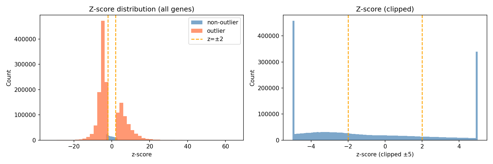
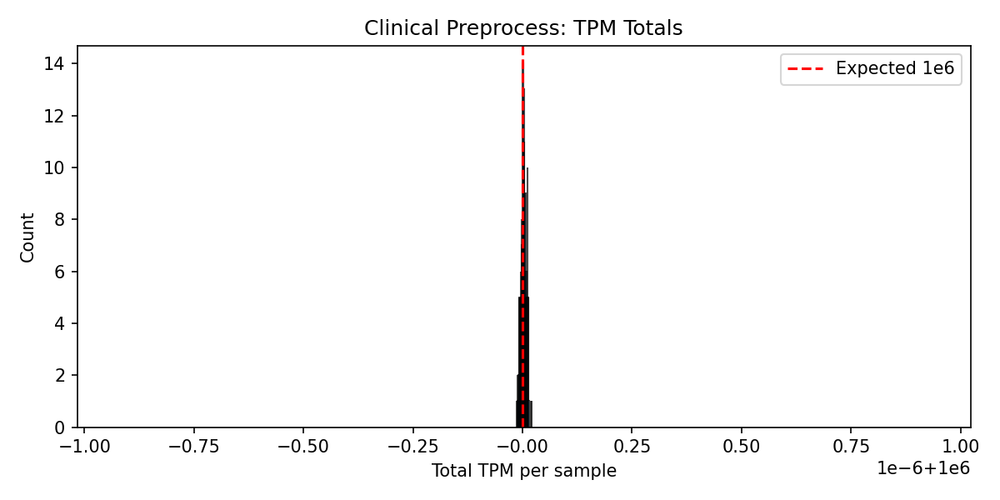
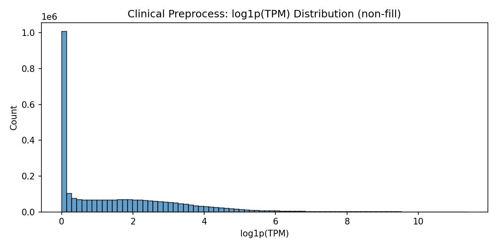
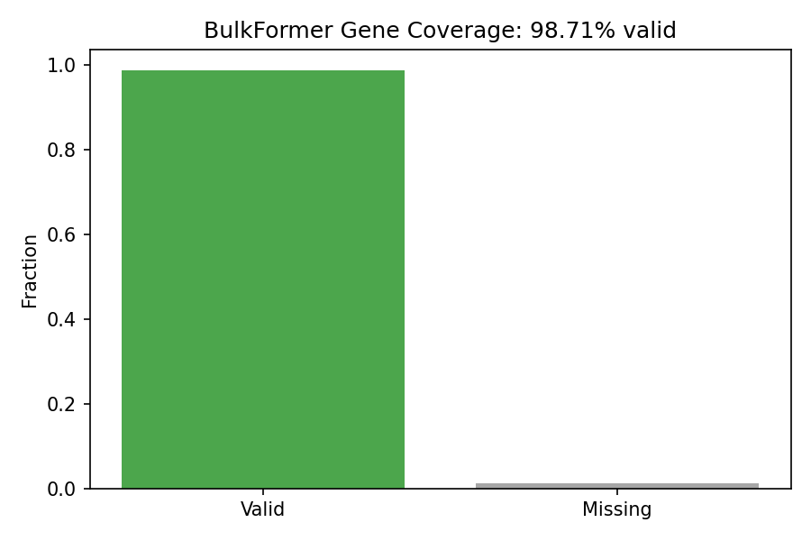

# BulkFormer DX Clinical RNA-seq Report

## Dataset Summary

- **Checkpoint**: `model/BulkFormer_37M.pt`
- **Raw counts**: `data/clinical_rnaseq/raw_counts.tsv` (genes x samples, Ensembl IDs with versions)
- **Gene annotation**: `data/clinical_rnaseq/gene_annotation_v29.tsv` (gene_id, start, end for TPM)
- **Sample annotation**: `data/clinical_rnaseq/sample_annotation.tsv` (SAMPLE_ID, KNOWN_MUTATION, CATEGORY, TISSUE, etc.)
- **BulkFormer assets**: `data/bulkformer_gene_info.csv`, `data/G_tcga.pt`, `data/G_tcga_weight.pt`, `data/esm2_feature_concat.pt`

## Commands Run

```bash
python -m bulkformer_dx.cli preprocess \
  --counts data/clinical_rnaseq/raw_counts.tsv \
  --annotation data/clinical_rnaseq/gene_annotation_v29.tsv \
  --output-dir runs/clinical_preprocess_37M \
  --counts-orientation genes-by-samples

python -m bulkformer_dx.cli anomaly score \
  --input runs/clinical_preprocess_37M/aligned_log1p_tpm.tsv \
  --valid-gene-mask runs/clinical_preprocess_37M/valid_gene_mask.tsv \
  --output-dir runs/clinical_anomaly_score_37M \
  --variant 37M --device cpu --mc-passes 16 --mask-prob 0.15

python -m bulkformer_dx.cli anomaly calibrate \
  --scores runs/clinical_anomaly_score_37M \
  --output-dir runs/clinical_anomaly_calibrated_37M \
  --alpha 0.05

python -m bulkformer_dx.cli embeddings extract \
  --input runs/clinical_preprocess_37M/aligned_log1p_tpm.tsv \
  --valid-gene-mask runs/clinical_preprocess_37M/valid_gene_mask.tsv \
  --output-dir runs/clinical_embeddings_37M \
  --variant 37M --device cpu
```

## Key QC Tables

### Preprocess

| Metric | Value |
| --- | ---: |
| Samples | 146 |
| Input genes (post-aggregation) | 60788 |
| Collapsed gene columns | 41 |
| BulkFormer valid gene fraction | 98.7% |
| BulkFormer valid genes | 19751 / 20010 |
| Annotation length strategy | genomic_span_from_start_end |

### Anomaly Score

| Metric | Value |
| --- | ---: |
| MC passes | 16 |
| Mask prob | 0.15 |
| Mean cohort abs residual | 0.860 |
| Valid genes | 19751 |

### Calibration

| Metric | Value |
| --- | ---: |
| Samples | 146 |
| Scored genes | 2668794 |
| Alpha | 0.05 |
| Count-space method | none |

#### How Calibration Works

Two approaches are implemented in `bulkformer_dx/anomaly/calibration.py`:

1. **Empirical (BY)**  
   - For each gene, the cohort distribution of `anomaly_score` is used.  
   - P-value = fraction of cohort ≥ that sample’s score (upper tail).  
   - Benjamini–Yekutieli correction per sample.  
   - Very conservative: yields **0 significant genes per sample** at α=0.05 (min BY q-value = 1.0).

2. **Normalized absolute (z-score)**  
   - \(z = (Y - \mu) / (\sigma + \epsilon)\) where \(Y\) = observed log1p(TPM), \(\mu\) = `mean_predicted_expression` (per-sample model prediction).  
   - **σ is fit on the cohort**: per-gene MAD of `mean_signed_residual` across samples, scaled by 1.4826.  
   - Two-sided normal p-values, BY correction.  
   - **Distribution caveat**: p-values assume Gaussian residuals. If residuals are heavy-tailed or skewed, the normal assumption can inflate outlier counts.

#### Outliers per Sample (37M, α=0.05)

| Metric | Value |
| --- | ---: |
| Mean absolute outliers per sample | ~10,394 |
| Median absolute outliers per sample | ~10,489 |
| Mean empirical outliers (α=0.05) | 0 |

Full table: `reports/figures/calibration_outliers_per_sample_37M.tsv`

#### Distribution Figures

- **Z-score distribution**: `figures/calibration_zscore_dist_37M.png`  
- **Per-gene residual histograms** (absolute approach, outliers highlighted): `figures/calibration_gene_histograms_37M/`  
- Empirical anomaly_score histograms: run `python scripts/calibration_analysis.py --variant 37M --empirical-histograms`

### Embeddings

| Metric | Value |
| --- | ---: |
| Samples | 146 |
| Embedding dim | 131 |
| Output | runs/clinical_embeddings_37M/sample_embeddings.tsv |

## Output Artifacts

| Path | Description |
| --- | --- |
| runs/clinical_preprocess_37M/ | tpm.tsv, log1p_tpm.tsv, aligned_log1p_tpm.tsv, valid_gene_mask.tsv |
| runs/clinical_anomaly_score_37M/ | cohort_scores.tsv, gene_qc.tsv, ranked_genes/<sample>.tsv |
| runs/clinical_anomaly_calibrated_37M/ | absolute_outliers.tsv, calibration_summary.tsv, ranked_genes/<sample>.tsv |
| runs/clinical_embeddings_37M/ | sample_embeddings.tsv (samples x 131 dims) |
| runs/clinical_annotated/ | cohort_scores_annotated.tsv, calibration_summary_annotated.tsv, sample_embeddings_annotated.tsv |

## Figures

### Calibration



Per-gene residual histograms (absolute approach, outliers in coral): `figures/calibration_gene_histograms_37M/`

### Preprocess







## Sample Embeddings Format

The `sample_embeddings.tsv` file is a tab-separated table with:
- **sample_id**: Sample identifier (matches raw_counts column names)
- **dim_0** ... **dim_130**: 131-dimensional BulkFormer sample embedding (mean aggregation over valid genes)

The annotated version `sample_embeddings_annotated.tsv` adds sample metadata columns (KNOWN_MUTATION, CATEGORY, TISSUE, etc.) from `sample_annotation.tsv`.

## Gene ID Aggregation

Raw counts use Ensembl IDs with versions (e.g. `ENSG00000001497.16_2`). The preprocess pipeline:
1. Normalizes IDs via `normalize_ensembl_id()`: strips version suffix (split on first `.`)
2. Collapses duplicates via `_collapse_duplicate_columns()`: sums counts per base Ensembl ID

41 gene columns were collapsed in this run.

## Outlier Inflation Note

The normalized absolute-outlier path at alpha=0.05 yields **~9,000–11,000 significant genes per sample**, which may be too permissive. Consider:

- **Stricter alpha**: `--alpha 0.01` or `0.001` for fewer false positives
- **147M model**: May have better-calibrated residuals (see `reports/bulkformer_dx_clinical_report_147M.md`)
- **Top-k ranking**: Focus on top-ranked genes by anomaly score rather than binary significance

## Troubleshooting Notes

- On macOS with `torch-sparse` unavailable, the model loader falls back to `edge_index + edge_weight` for graph convolution.
- Data assets (G_tcga.pt, etc.) are symlinked from `data/demo/` when not present in `data/`.
- Sample count (146) is lower than raw_counts columns (230) because some samples may have been filtered or not present in the expression matrix after alignment.
