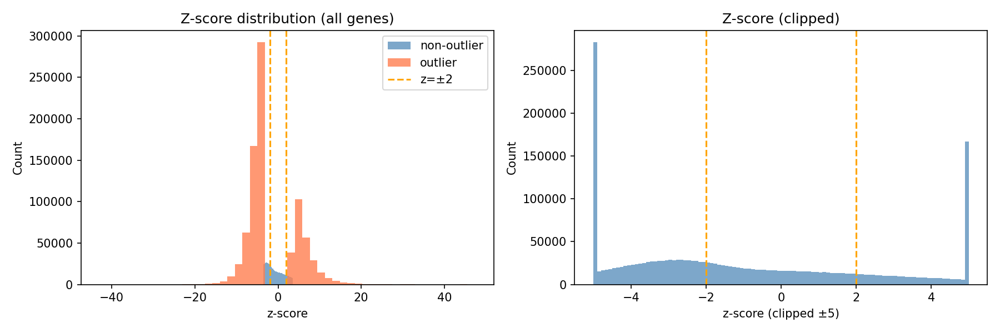

# BulkFormer DX Clinical RNA-seq Report (147M)

## Overview

This report documents the clinical RNA-seq pipeline run with **BulkFormer-147M** (12 layers, 640 dim). The 147M model is more expressive than 37M and may yield different anomaly/calibration behavior.

## Outlier Inflation Concern (37M)

With the 37M model, the normalized absolute-outlier path (`z = (Y-mu)/(sigma+eps)`, BY correction) produced **~9,000–11,000 significant genes per sample** at alpha=0.05, which is likely too permissive. Mitigations:

1. **Stricter alpha**: Use `--alpha 0.01` (or 0.001) for fewer false positives.
2. **Larger model**: 147M may have better-calibrated residuals and sigma estimates.
3. **Empirical path**: The empirical BY path (upper-tail fraction) is more conservative; consider using it for primary calls.
4. **Top-k ranking**: Focus on top-ranked genes by anomaly score rather than binary significance.

The 147M pipeline uses **alpha=0.01** by default in `scripts/run_clinical_147M.sh`.

## Commands

Preprocess is shared with 37M. For 147M-only steps:

```bash
# Anomaly score (147M is ~10–15x slower on CPU; use batch-size 4, mc-passes 8)
python -m bulkformer_dx.cli anomaly score \
  --input runs/clinical_preprocess_37M/aligned_log1p_tpm.tsv \
  --valid-gene-mask runs/clinical_preprocess_37M/valid_gene_mask.tsv \
  --output-dir runs/clinical_anomaly_score_147M \
  --variant 147M \
  --device cpu \
  --batch-size 4 \
  --mc-passes 8 \
  --mask-prob 0.15

# Calibrate with stricter alpha
python -m bulkformer_dx.cli anomaly calibrate \
  --scores runs/clinical_anomaly_score_147M \
  --output-dir runs/clinical_anomaly_calibrated_147M \
  --alpha 0.01

# Embeddings
python -m bulkformer_dx.cli embeddings extract \
  --input runs/clinical_preprocess_37M/aligned_log1p_tpm.tsv \
  --valid-gene-mask runs/clinical_preprocess_37M/valid_gene_mask.tsv \
  --output-dir runs/clinical_embeddings_147M \
  --variant 147M \
  --device cpu \
  --batch-size 4

# Merge annotation
python scripts/merge_clinical_annotation.py --variant 147M
```

Or run the full script:

```bash
ALPHA=0.01 bash scripts/run_clinical_147M.sh
```

## Runtime Notes

- **147M on CPU**: ~45–90 min for anomaly score (8 MC passes, batch 4). Use `--device mps` or `--device cuda` if available.
- **37M on CPU**: ~7 min for anomaly score (16 MC passes, batch 16).

## Key QC Tables (147M)

### Anomaly Score

| Metric | Value |
| --- | ---: |
| MC passes | 8 |
| Mask prob | 0.15 |
| Valid genes | 19751 |
| Samples | 146 |

### Calibration (alpha=0.01)

| Metric | Value |
| --- | ---: |
| Scored genes | 2,097,123 |
| Alpha | 0.01 |
| Mean absolute outliers per sample | ~5,650 |
| Median absolute outliers per sample | ~5,597 |
| Mean empirical outliers (α=0.05) | 0 |

Full table: `reports/figures/calibration_outliers_per_sample_147M.tsv`

#### How Calibration Works

Same two approaches as 37M (see main report):

1. **Empirical (BY)** – Cohort distribution of `anomaly_score`, upper-tail p-value, BY correction. Very conservative (0 significant per sample).
2. **Normalized absolute (z-score)** – \(z = (Y - \mu) / (\sigma + \epsilon)\); **σ fit on cohort** (MAD of residuals per gene). Two-sided normal p-values, BY correction. Caveat: normal assumption may inflate outliers if residuals are non-Gaussian.

#### Distribution Figures

- **Z-score distribution**: `figures/calibration_zscore_dist_147M.png`
- **Per-gene residual histograms** (absolute approach): `figures/calibration_gene_histograms_147M/`
- Empirical histograms: `python scripts/calibration_analysis.py --variant 147M --empirical-histograms`

### Embeddings

| Metric | Value |
| --- | ---: |
| Samples | 146 |
| Embedding dim | 643 |
| Output | runs/clinical_embeddings_147M/sample_embeddings.tsv |

## Output Artifacts (147M)

| Path | Description |
| --- | --- |
| runs/clinical_anomaly_score_147M/ | cohort_scores, gene_qc, ranked_genes |
| runs/clinical_anomaly_calibrated_147M/ | absolute_outliers, calibration_summary (alpha=0.01) |
| runs/clinical_embeddings_147M/ | sample_embeddings.tsv (146 x 643 dims) |
| runs/clinical_annotated_147M/ | Annotated tables with sample metadata |

## Calibration Figures



Per-gene residual histograms: `figures/calibration_gene_histograms_147M/`

## Model Comparison

| Metric | 37M | 147M |
| --- | ---: | ---: |
| Layers | 1 | 12 |
| Hidden dim | 128 | 640 |
| Embedding dim | 131 | 643 |
| Params | ~37M | ~147M |
| Anomaly score (CPU) | ~7 min | ~45–90 min |
| Alpha | 0.05 | 0.01 |
| Mean absolute outliers/sample | ~10,394 | ~5,650 |
