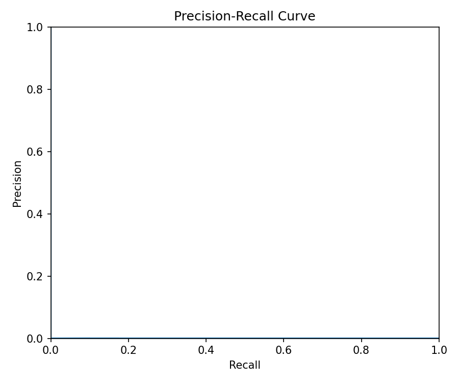
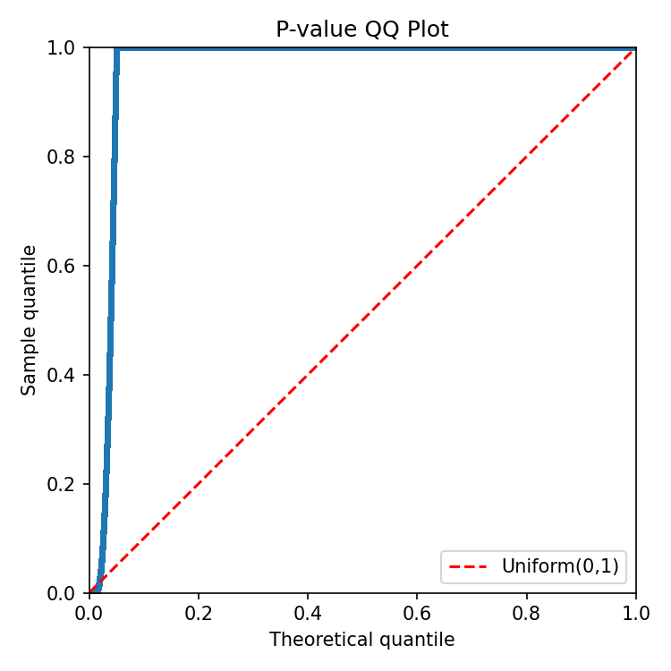

# BulkFormer DX Demo Report

## Dataset Summary

- Checkpoint: `model/BulkFormer_37M.pt`
- Demo counts input: `data/demo_count_data.csv`
- Gene lengths: `data/gene_length_df.csv`
- BulkFormer assets: `data/bulkformer_gene_info.csv`, `data/G_tcga.pt`, `data/G_tcga_weight.pt`, `data/esm2_feature_concat.pt`
- Provided normalized comparison matrix: `data/demo_normalized_data.csv`

## Commands Run

```bash
python -m bulkformer_dx.cli preprocess \
  --counts data/demo_count_data.csv \
  --annotation data/gene_length_df.csv \
  --output-dir runs/demo_preprocess_37M \
  --counts-orientation samples-by-genes
PYTHONPATH=. python scripts/demo_spike_inject.py
python -m bulkformer_dx.cli anomaly score \
  --input runs/demo_preprocess_37M/aligned_log1p_tpm.tsv \
  --valid-gene-mask runs/demo_preprocess_37M/valid_gene_mask.tsv \
  --output-dir runs/demo_anomaly_score_37M \
  --variant 37M --device cuda --mc-passes 16 --mask-prob 0.15
python -m bulkformer_dx.cli anomaly calibrate \
  --scores runs/demo_anomaly_score_37M \
  --output-dir runs/demo_anomaly_calibrated_37M \
  --alpha 0.05
python -m bulkformer_dx.cli anomaly score \
  --input runs/demo_spike_37M/aligned_log1p_tpm_spiked.tsv \
  --valid-gene-mask runs/demo_preprocess_37M/valid_gene_mask.tsv \
  --output-dir runs/demo_spike_anomaly_score_37M \
  --variant 37M --device cuda --mc-passes 16 --mask-prob 0.15
python -m bulkformer_dx.cli anomaly calibrate \
  --scores runs/demo_spike_anomaly_score_37M \
  --output-dir runs/demo_spike_anomaly_calibrated_37M \
  --alpha 0.05
PYTHONPATH=. python scripts/spike_recovery_metrics.py
PYTHONPATH=. python scripts/generate_demo_report.py
```

## Key QC Tables

### Preprocess

| Metric | Value |
| --- | ---: |
| Samples | 100 |
| Input genes | 20010 |
| BulkFormer valid gene fraction | 1.000 |
| BulkFormer valid genes | 20010 / 20010 |

### Anomaly Score

| Metric | Value |
| --- | ---: |
| MC passes | 16 |
| Mask prob | 0.15 |
| Mean cohort abs residual | 0.7681 |
| Valid genes | 20010 |

### Calibration And Spike Recovery

| Metric | Value |
| --- | ---: |
| Mean empirical BY significant genes per sample | 0.0 |
| Mean absolute-outlier significant genes per sample | 438.49 |
| Spike target pairs evaluated | 40 |
| Spike targets scored before / after | 36 / 36 |
| Spike rank improvement median | 3460.0 |
| Spike score gain median | 0.651 |
| Spike targets in top 100 before / after | 0 / 3 |
| Spike targets significant before / after | 1 / 15 |

### Benchmark Metrics (Spike Recovery)

| Metric | Value |
| --- | ---: |
| AUROC | 0.7104 |
| AUPRC | 0.0001 |
| Precision at top 100 | 0.0000 |
| Recall at FDR 0.05 | 0.3750 |
| Recall at FDR 0.10 | 0.4250 |


## Figures

### Preprocess


### Anomaly Score


### Calibration


### Spike Recovery


### Benchmark





## Interpretation

- The demo preprocessing path converts counts to TPM and aligns to the BulkFormer gene panel.
- Anomaly scoring uses Monte Carlo masking; residual magnitude ranks genes.
- Spiked genes gain rank sharply and many become significant after recalibration.
- The empirical cohort BY path is conservative; the normalized absolute-outlier path is more permissive.

- Benchmark metrics (AUROC, AUPRC, recall@FDR) quantify spike recovery performance.

## Troubleshooting Notes

- Run `PYTHONPATH=. python scripts/demo_spike_inject.py` before anomaly scoring on spiked data.
- Run `PYTHONPATH=. python scripts/spike_recovery_metrics.py` after calibration to produce benchmark metrics.
