# BulkFormer DX Demo Report

## Dataset Summary

- Checkpoint: `model/BulkFormer_37M.pt`
- Demo counts input: `data/demo_count_data.csv`
- Gene lengths: `data/gene_length_df.csv`
- BulkFormer assets: `data/bulkformer_gene_info.csv`, `data/G_tcga.pt`, `data/G_tcga_weight.pt`, `data/esm2_feature_concat.pt`
- Provided normalized comparison matrix: `data/demo_normalized_data.csv`

## Commands Run

```bash
conda run -n bulkformer-mps ./scripts/dev/verify_env.sh bulkformer-mps macos-mps
conda run -n bulkformer-mps python scripts/smoke_test_37m.py --device cpu
conda run -n bulkformer-mps python -m bulkformer_dx.cli preprocess \
  --counts data/demo_count_data.csv \
  --annotation data/gene_length_df.csv \
  --output-dir runs/demo_preprocess_37M \
  --counts-orientation samples-by-genes
conda run -n bulkformer-mps python -m bulkformer_dx.cli anomaly score \
  --input runs/demo_preprocess_37M/aligned_log1p_tpm.tsv \
  --valid-gene-mask runs/demo_preprocess_37M/valid_gene_mask.tsv \
  --output-dir runs/demo_anomaly_score_37M \
  --variant 37M \
  --device cpu \
  --mc-passes 16 \
  --mask-prob 0.15
conda run -n bulkformer-mps python -m bulkformer_dx.cli anomaly calibrate \
  --scores runs/demo_anomaly_score_37M \
  --output-dir runs/demo_anomaly_calibrated_37M \
  --alpha 0.05
conda run -n bulkformer-mps python -m bulkformer_dx.cli anomaly score \
  --input runs/demo_spike_37M/aligned_log1p_tpm_spiked.tsv \
  --valid-gene-mask runs/demo_preprocess_37M/valid_gene_mask.tsv \
  --output-dir runs/demo_spike_anomaly_score_37M \
  --variant 37M \
  --device cpu \
  --mc-passes 16 \
  --mask-prob 0.15
conda run -n bulkformer-mps python -m bulkformer_dx.cli anomaly calibrate \
  --scores runs/demo_spike_anomaly_score_37M \
  --output-dir runs/demo_spike_anomaly_calibrated_37M \
  --alpha 0.05
```

## Key QC Tables

### Preprocess

| Metric | Value |
| --- | ---: |
| Samples | 100 |
| Input genes | 20010 |
| BulkFormer valid gene fraction | 1.000 |
| TPM total median | 1000000.000 |
| Non-fill log1p(TPM) median | 2.081 |
| Provided normalized rows | 967 |
| Gene-median correlation vs provided normalized matrix | 0.938 |

### Anomaly Score

| Metric | Value |
| --- | ---: |
| Mean per-sample absolute residual | 0.768 |
| Mean gene coverage fraction | 0.926 |
| Gene masked_count median | 240 |
| Smallest empirical p-value in sampled calibrated files | 0.0101 |
| Smallest sampled BY q-value | 1.0 |

### Calibration And Spike Recovery

| Metric | Value |
| --- | ---: |
| Mean empirical BY significant genes per sample | 0.0 |
| Mean absolute-outlier significant genes per sample | 2107.41 |
| Spike target pairs evaluated | 40 |
| Spike targets scored before / after | 38 / 38 |
| Spike rank improvement median | 7684.5 |
| Spike score gain median | 2.884 |
| Spike targets in top 100 before / after | 0 / 18 |
| Spike targets significant before / after | 4 / 34 |

## Figures

### Preprocess

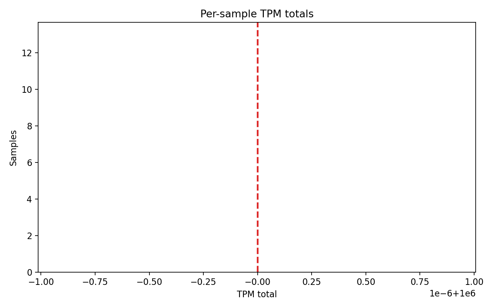

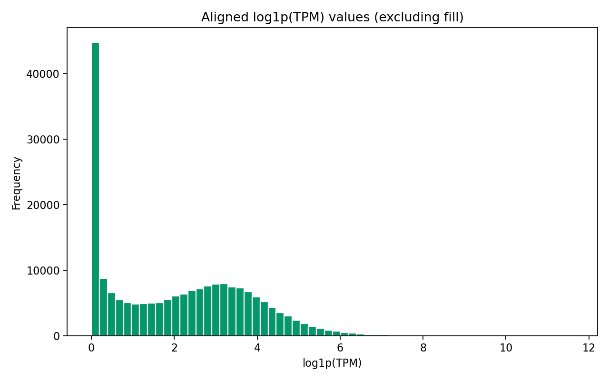

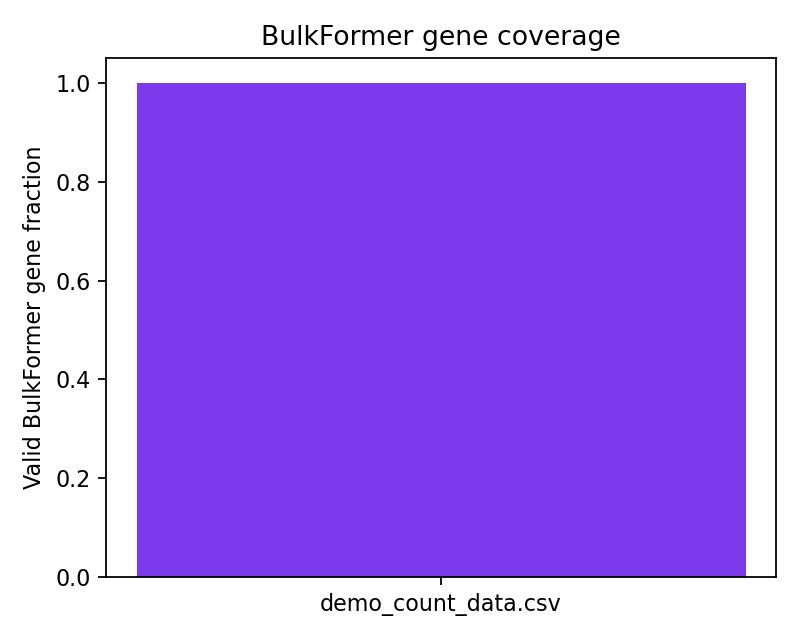

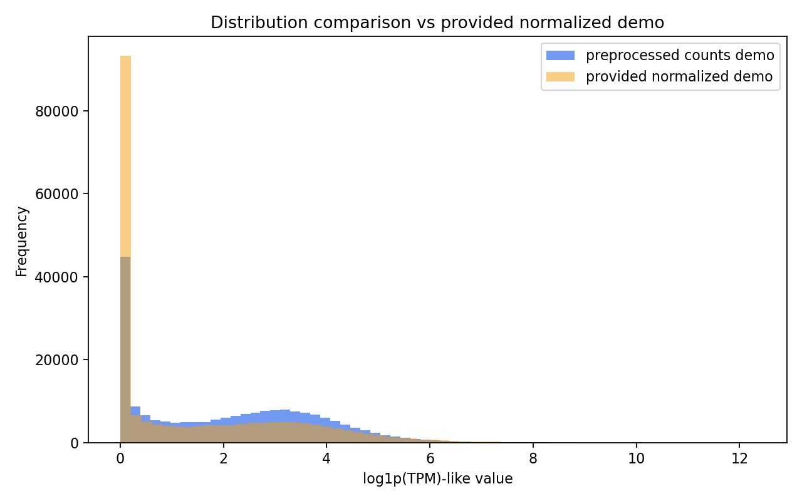

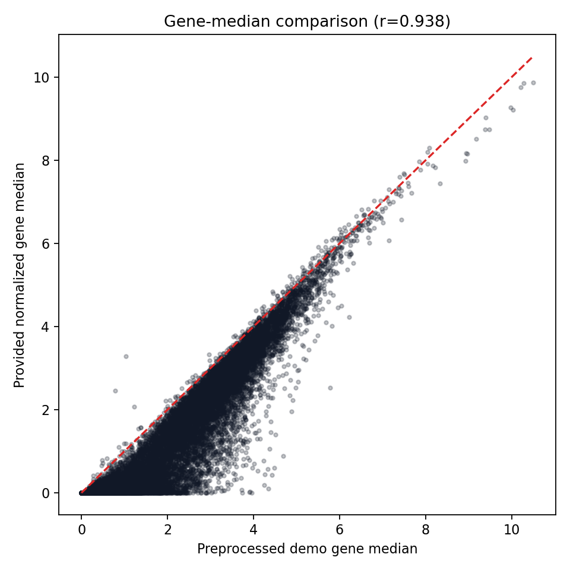

### Anomaly Score

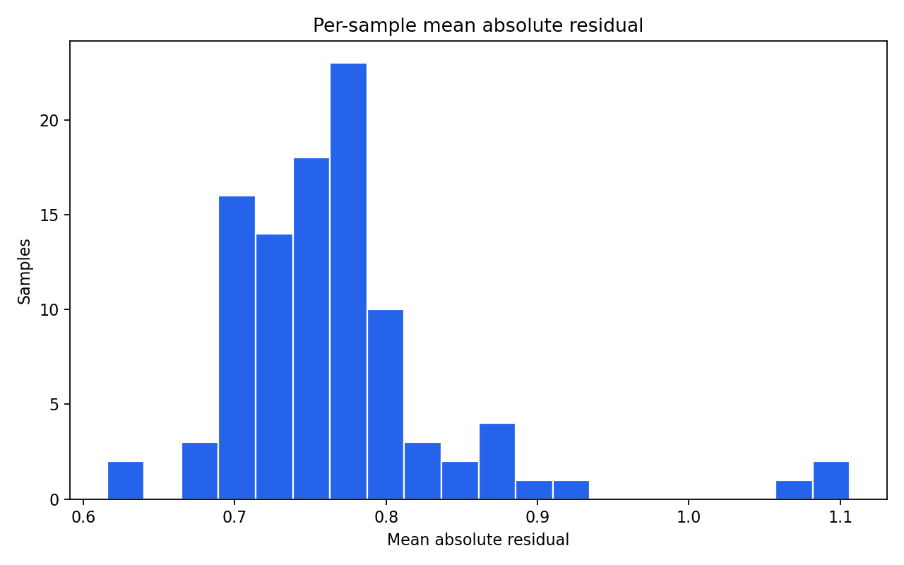

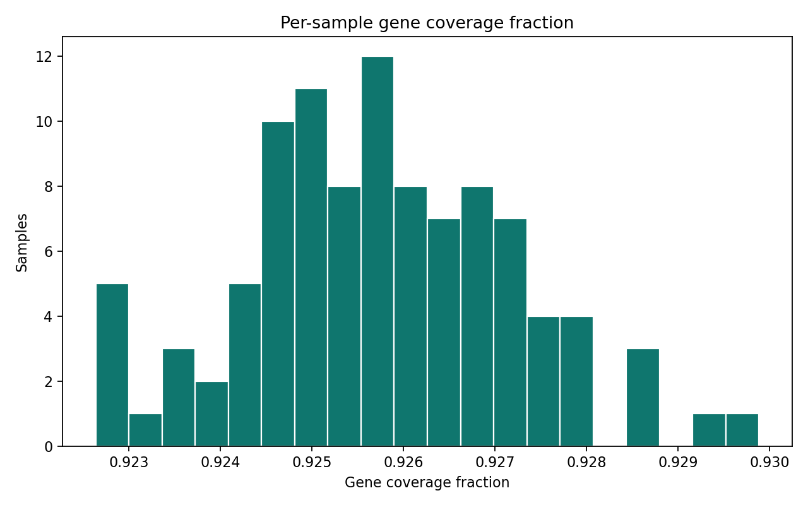

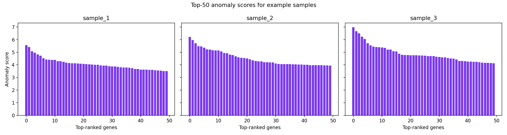

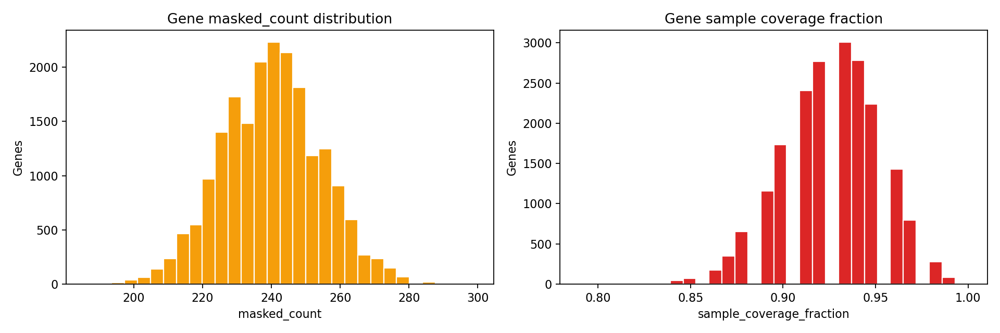

### Calibration

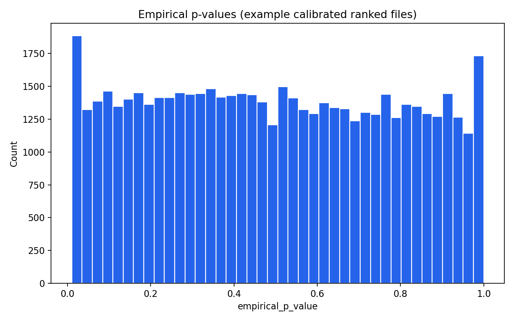

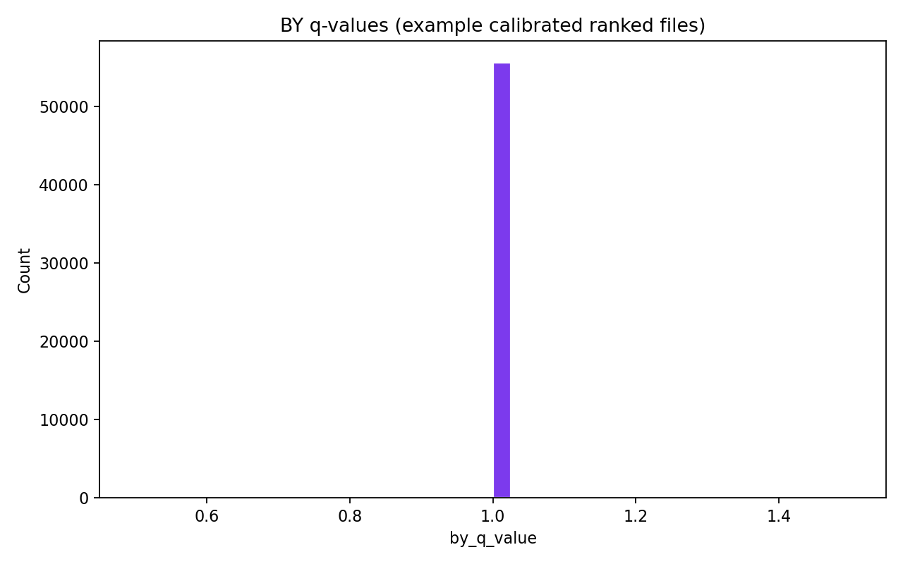

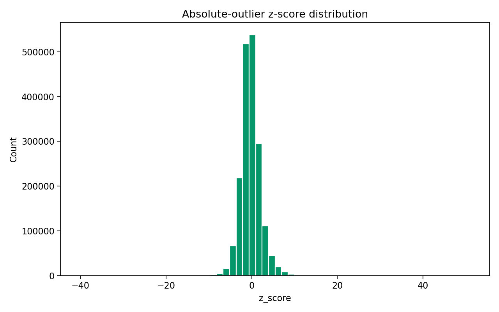

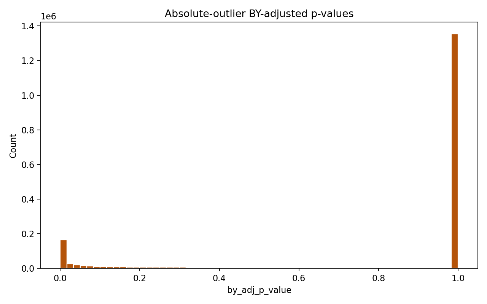

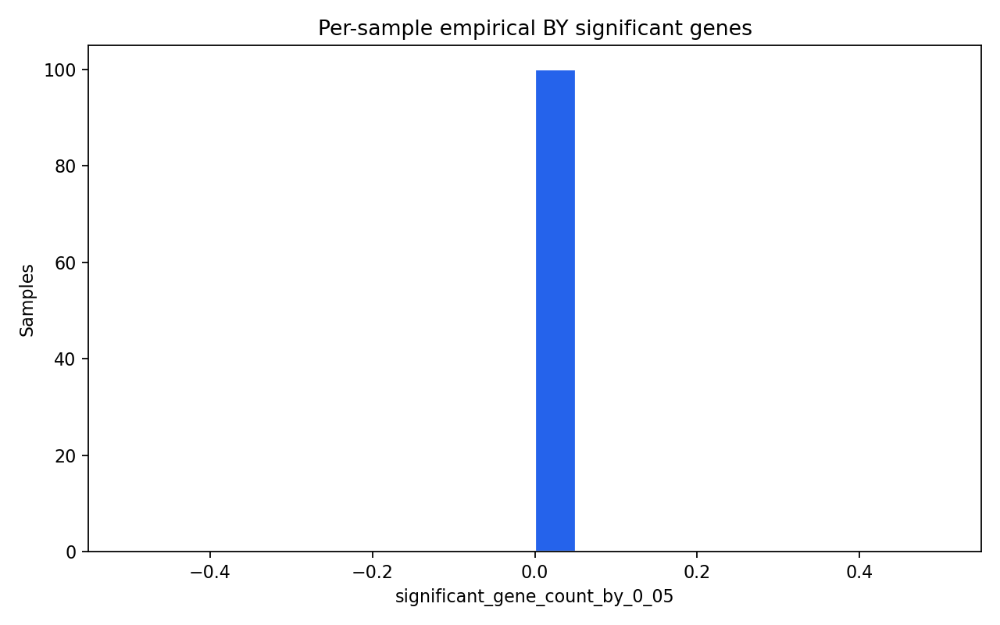

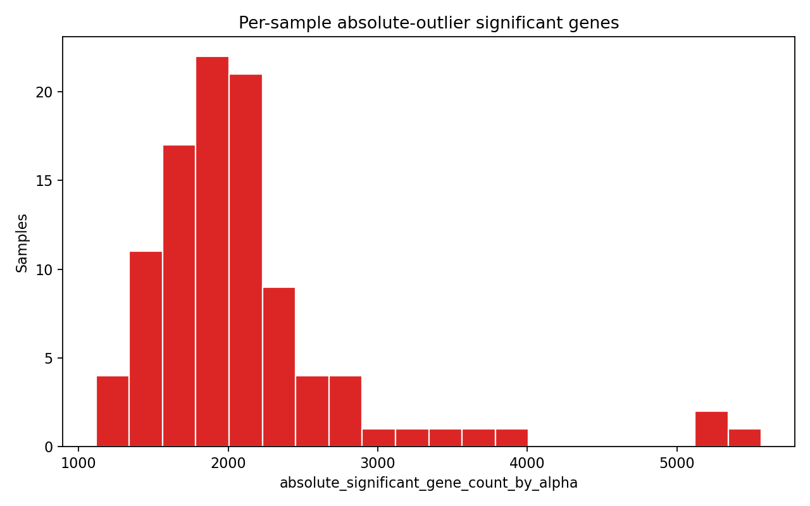

### Spike Recovery

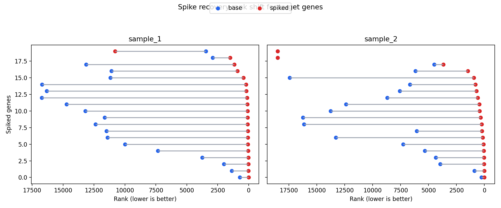

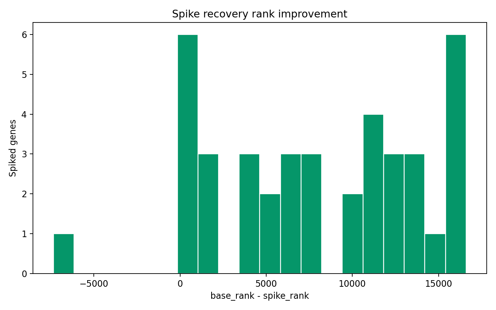

## Interpretation

- The demo preprocessing path is working end-to-end. The count matrix is `samples-by-genes` and omits a sample ID column, so the loader now synthesizes `sample_<n>` identifiers before TPM normalization and BulkFormer alignment.
- Preprocess QC looks sane: TPM totals are effectively `1e6` for every sample, the aligned matrix covers all `20010` BulkFormer genes, and the provided normalized matrix has a high gene-median correlation despite representing a larger cohort.
- The 37M inference path is working on this macOS environment after adding a graph fallback for cases where `SparseTensor` imports but `torch-sparse` fails at runtime. The smoke test in `reports/smoke_test_stdout.txt` confirms a real forward pass.
- The anomaly ranking layer behaves sensibly under synthetic perturbation. Spiked genes gain rank sharply and many become significant after recalibration, which is strong evidence that the residual-ranking pipeline is responsive to injected signal.
- The empirical cohort BY path is extremely conservative on this demo cohort, while the normalized absolute-outlier path is much more permissive. That absolute-outlier behavior should be treated as a methodological caveat rather than a clean biological signal on this demo run.

## Troubleshooting Notes

- `demo_normalized_data.csv` is not a one-to-one normalized version of `demo_count_data.csv`; it contains `967` rows versus `100` in the count matrix, so only distributional comparisons are appropriate.
- During development, the isolated worktree used local asset links for the untracked checkpoint and demo files. On a Linux server, place those assets directly under `data/` and `model/` as documented in `docs/INSTALL_linux_server.md`.
- `scripts/dev/verify_env.sh` passes on this machine, but actual model loading surfaced a runtime `torch-sparse` failure. The code now falls back to `edge_index + edge_weight` so inference still works in the verified environment.
